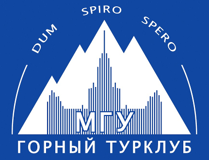

# Горный поход 2 к.с. под руководством Вельтищева М.Н.

Район: Тянь-Шань (Киргизский хребет)

Горный Турклуб МГУ, Москва

# Сводная информация

- Сроки похода: 29 июня&nbsp;&mdash; 14 июля 2024 г
- Руководитель: Вельтищев Михаил Николаевич, 2x5ГУ, 3ГР ([dichlofos-mv@yandex.ru](mailto:dichlofos-mv@yandex.ru))
- Тип: горный
- Категория сложности: вторая
- Маршрутная книжка `11/3-204`, [фотокопия прилагается](TODO)
- Ходовых дней: 15
- Протяжённость маршрута: 134 км (GPS, без коэффициентов)
- Максимальная высота: 4444 м
- Максимальная высота ночёвки: 3840 м
- Турклуб: [Горный Турклуб МГУ](https://www.geolink-group.com/tourclub)
- Шифр TLIB: TODO `/TLIB`
- Отчёт в~[каталоге Вестры](https://westra.ru/passes/Reports/???)
- Отчёт на сайте [Горного Турклуба МГУ](https://www.geolink-group.com/tourclub/trips/2024mv2/)
- Последнее обновление: 07.01.2025
- Версия: 1.02
- На Кубке Москвы 2025 года, согласно протоколам ФСТ-ОТМ, поход занял TODO [??? место](https://fst-otm.net/TODO_f9.pdf)

# Нитка маршрута

пос. Иссык-Ата — р.~Иссык-Ата — пер. Иссык-Ата (1Б) — пер.~Аламедин Восточный (1А) — р. Аламедин —
б/о Теплый Ключ — пер. Ат-Джайлоо (1Б) — пер. Фрунзе (1Б) — пер. Байчечекей (1Б) — а/л Ала-Арча —
пер. Джаламыш (1Б) — р. Джаламыш — пер. Ашутор (н/к) — пер. Малышка (1А) — пос. Берюлю.

# Отчёт
- Исходный [текст отчёта](https://github.com/dichlofos/kirgizsky-2024/blob/main/source_report_kirgizsky_2024.md)
- Версия для чтения в формате [Markdown](https://github.com/dichlofos/kirgizsky-2024/blob/main/report_kirgizsky_2024.md)

- TODO [Копия отчёта](https://yadi.sk/404) в формате PDF + трек с точками, отправленные на Кубок Москвы 2025.
- TODO [Итоговый судейский протокол Кубка Москвы](https://fst-otm.net/file/rezult/marshrut/km2021/km2021_gory_2ks_f7.pdf) от 24.02.2021 в формате PDF
- TODO По результатам Кубка Москвы 2025 поход занял ?-е место, набрав `23.25` баллов.
- TODO Маршрутная книжка: [фотокопия](https://yadi.sk/a/wZOVdya2Xrp3Qg)
- TODO [Финальная версия отчёта](https://disk.yandex.ru/d/kCn6YyCqb8mZug) для хранения в архиве.
- TODO Шифр TLIB: `????-TLIB`

# Описания перевалов

Описания перевалов следует брать из сложенных сюда же отчётов (каталог `reports`).

# Фотоматериалы
- Обработанные фотографии к отчёту: каталог `images`
- Фото TODO:
  - [Часть 1](https://yadi.sk/xxxx)
  - [Часть 2](https://yadi.sk/yyyy)
- Каталог `to_print`: нарезка фото и текстов для печати перед походом

# Треки

Каталог `tracks`:
- полный трек с точками (`tracks/veltishchev/kirgizsky_2ks_2024_veltishchev_corrected.gpx`)
- чужие треки (Анна Берзова, Екатерина Бирючева)
- Каталоги `tracks/veltishchev/etrex` и `tracks/veltishchev/fenix` содержат
снятые на местности треки на навигаторы Garmin ETrex и часы Garmin Fenix 7
соответственно

# Замечание об авторских правах

Отчёты, предоставленные здесь, принадлежат их авторам. Приведены для ознакомления
и размещение их здесь не имеет цели нарушить чьи-либо авторские права, тем более,
что они были скопированы из открытых источников.

Тем не менее, если это кого-то смущает, напишите мне, и я выпилю их из репозитория.
