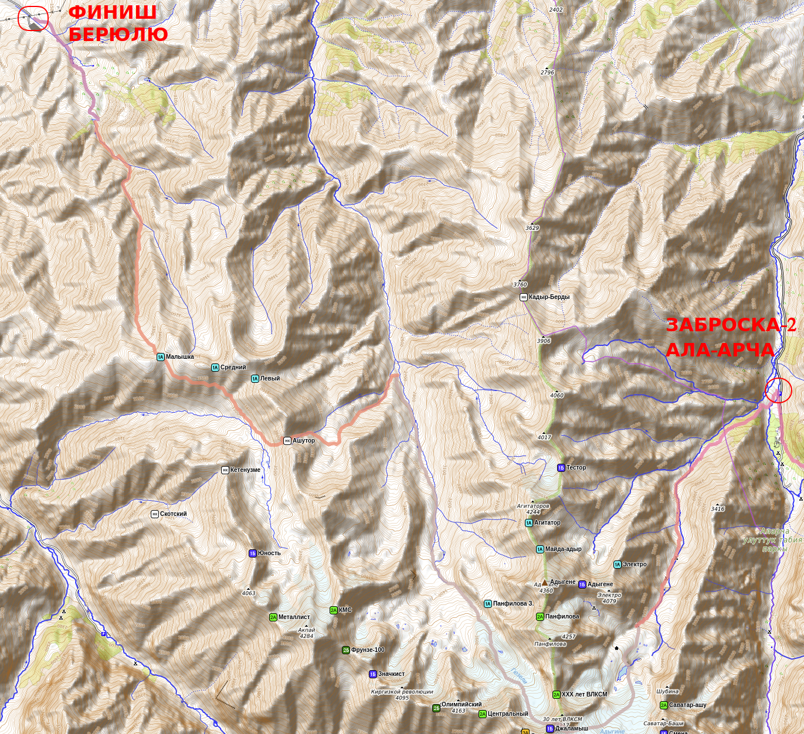
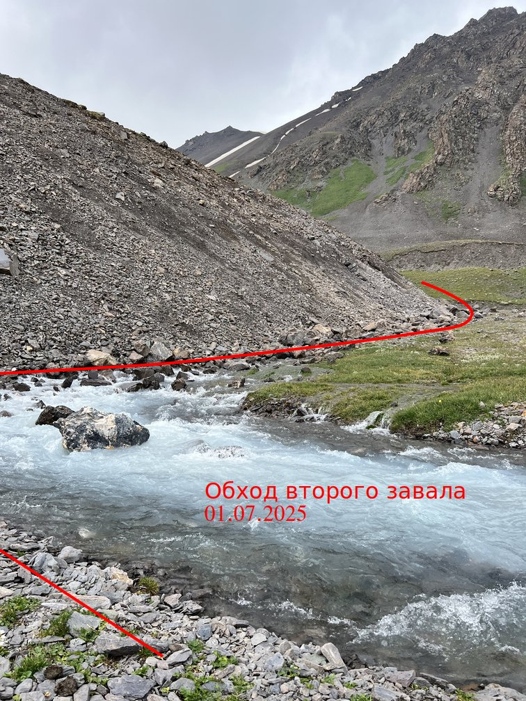
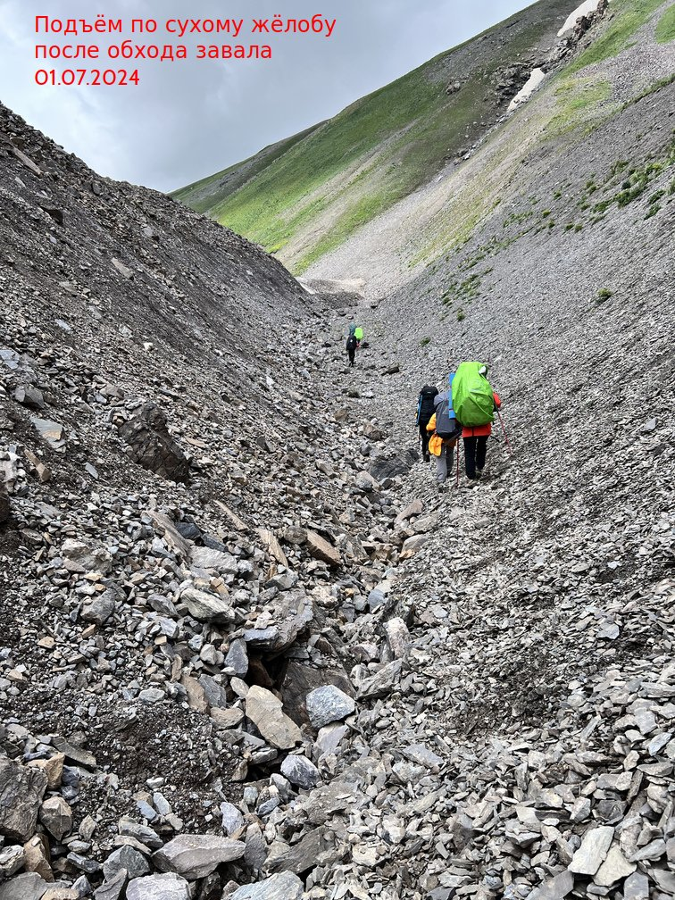
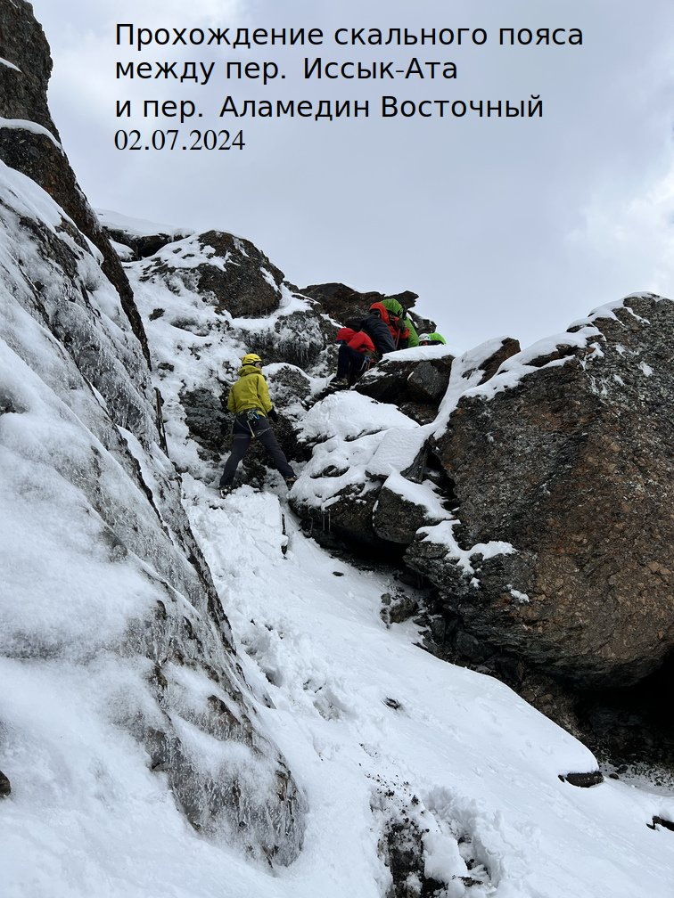
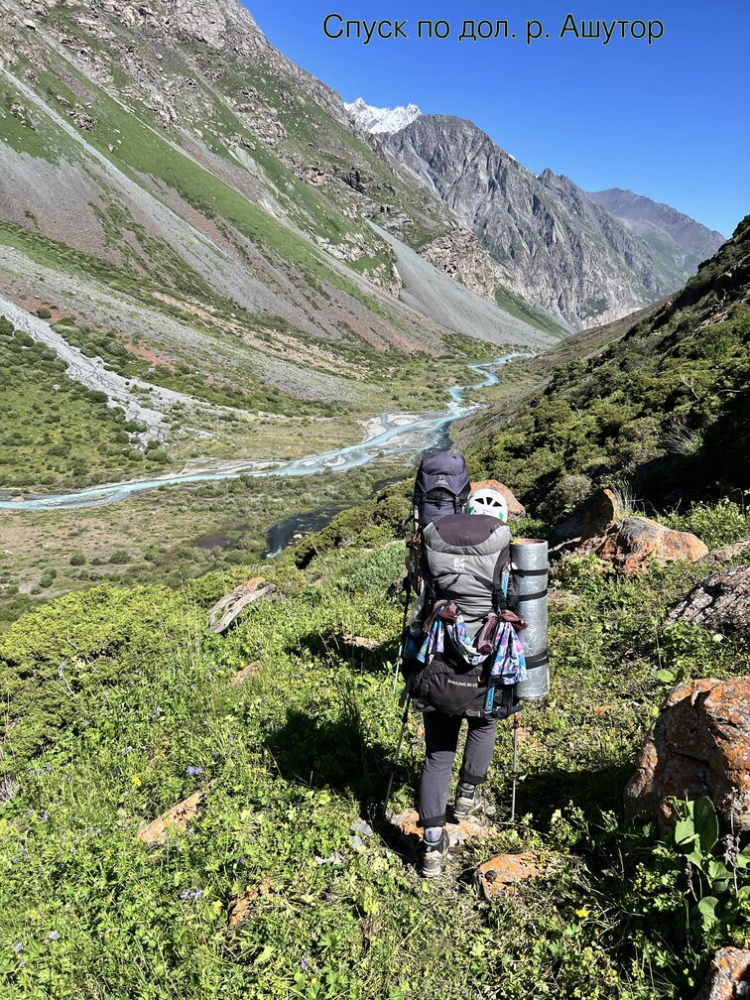
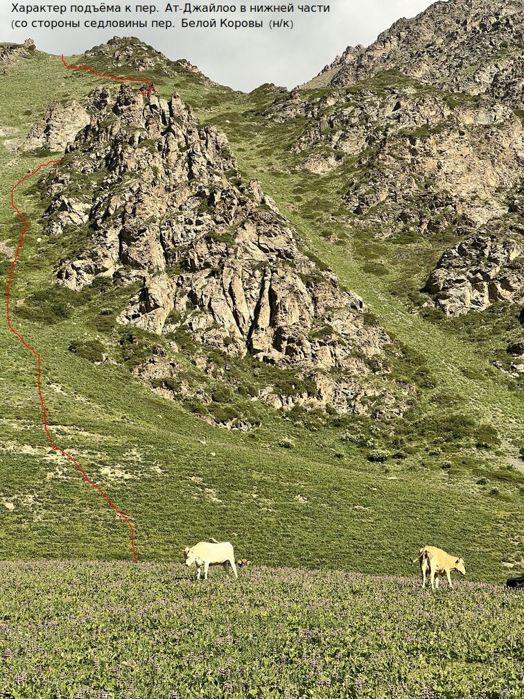
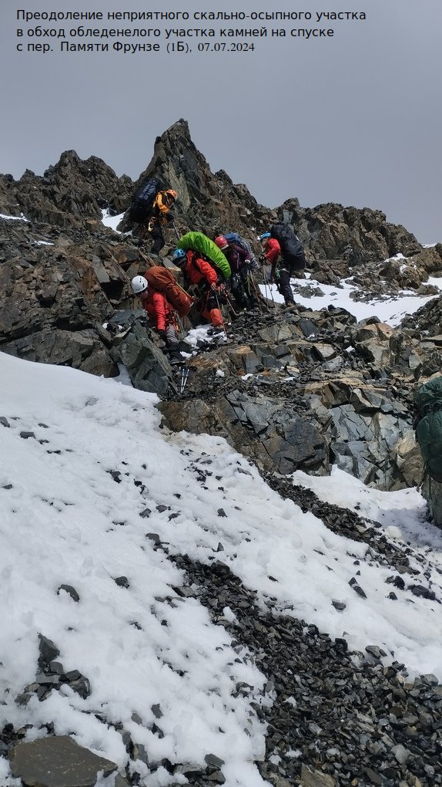
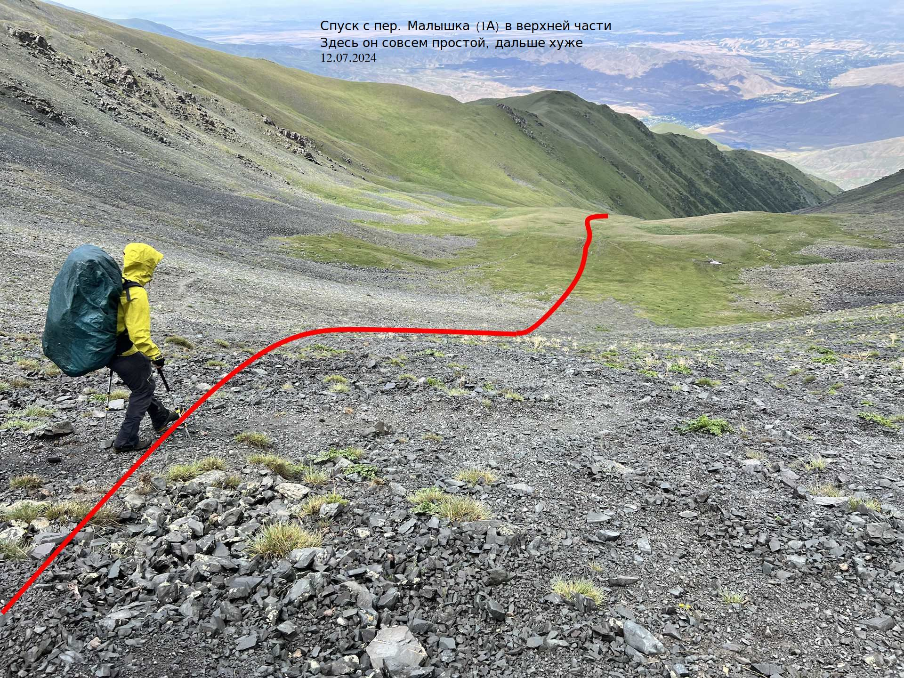

# Сводная информация

- Сроки похода: 29 июня&nbsp;&mdash; 14 июля 2024 г
- Руководитель: Вельтищев Михаил Николаевич, 5ГУ, 3ГР ([dichlofos-mv@yandex.ru](mailto:dichlofos-mv@yandex.ru))
- Тип: горный
- Категория сложности: вторая
- Маршрутная книжка `11/3-204`, [фотокопия прилагается](https://disk.yandex.ru/d/NnAH4j6ammx5aA)
- Ходовых дней: 14
- Протяжённость маршрута: 134 км (GPS, без коэффициентов)
- Максимальная высота: 4444 м
- Максимальная высота ночёвки: 3840 м
- Турклуб: [Горный Турклуб МГУ](https://www.geolink-group.com/tourclub)
- Шифр TLIB: TODO `/TLIB`
- Отчёт в&nbsp;[каталоге Вестры](https://westra.ru/passes/Reports/???)
- Отчёт на сайте [Горного Турклуба МГУ](https://www.geolink-group.com/tourclub/trips/2024mv2/)
- Последнее обновление: 18.01.2025
- Версия: 1.02
- На Кубке Москвы 2025 года, согласно протоколам ФСТ-ОТМ, поход занял TODO [??? место](https://fst-otm.net/TODO_f9.pdf)

<!-- TOC -->

- [Сводная информация](#%D1%81%D0%B2%D0%BE%D0%B4%D0%BD%D0%B0%D1%8F-%D0%B8%D0%BD%D1%84%D0%BE%D1%80%D0%BC%D0%B0%D1%86%D0%B8%D1%8F)
- [Справочные сведения](#%D1%81%D0%BF%D1%80%D0%B0%D0%B2%D0%BE%D1%87%D0%BD%D1%8B%D0%B5-%D1%81%D0%B2%D0%B5%D0%B4%D0%B5%D0%BD%D0%B8%D1%8F)
    - [Проводящая организация](#%D0%BF%D1%80%D0%BE%D0%B2%D0%BE%D0%B4%D1%8F%D1%89%D0%B0%D1%8F-%D0%BE%D1%80%D0%B3%D0%B0%D0%BD%D0%B8%D0%B7%D0%B0%D1%86%D0%B8%D1%8F)
    - [Географический регион пройденного маршрута](#%D0%B3%D0%B5%D0%BE%D0%B3%D1%80%D0%B0%D1%84%D0%B8%D1%87%D0%B5%D1%81%D0%BA%D0%B8%D0%B9-%D1%80%D0%B5%D0%B3%D0%B8%D0%BE%D0%BD-%D0%BF%D1%80%D0%BE%D0%B9%D0%B4%D0%B5%D0%BD%D0%BD%D0%BE%D0%B3%D0%BE-%D0%BC%D0%B0%D1%80%D1%88%D1%80%D1%83%D1%82%D0%B0)
    - [Общие справочные сведения о маршруте](#%D0%BE%D0%B1%D1%89%D0%B8%D0%B5-%D1%81%D0%BF%D1%80%D0%B0%D0%B2%D0%BE%D1%87%D0%BD%D1%8B%D0%B5-%D1%81%D0%B2%D0%B5%D0%B4%D0%B5%D0%BD%D0%B8%D1%8F-%D0%BE-%D0%BC%D0%B0%D1%80%D1%88%D1%80%D1%83%D1%82%D0%B5)
    - [Нитка маршрута](#%D0%BD%D0%B8%D1%82%D0%BA%D0%B0-%D0%BC%D0%B0%D1%80%D1%88%D1%80%D1%83%D1%82%D0%B0)
    - [Обзорная карта района](#%D0%BE%D0%B1%D0%B7%D0%BE%D1%80%D0%BD%D0%B0%D1%8F-%D0%BA%D0%B0%D1%80%D1%82%D0%B0-%D1%80%D0%B0%D0%B9%D0%BE%D0%BD%D0%B0)
        - [Сегмент 1 от старта к заброске 1](#%D1%81%D0%B5%D0%B3%D0%BC%D0%B5%D0%BD%D1%82-1-%D0%BE%D1%82-%D1%81%D1%82%D0%B0%D1%80%D1%82%D0%B0-%D0%BA-%D0%B7%D0%B0%D0%B1%D1%80%D0%BE%D1%81%D0%BA%D0%B5-1)
        - [Сегмент 2 от заброски к заброске 2](#%D1%81%D0%B5%D0%B3%D0%BC%D0%B5%D0%BD%D1%82-2-%D0%BE%D1%82-%D0%B7%D0%B0%D0%B1%D1%80%D0%BE%D1%81%D0%BA%D0%B8-%D0%BA-%D0%B7%D0%B0%D0%B1%D1%80%D0%BE%D1%81%D0%BA%D0%B5-2)
        - [Сегмент 3 от заброски 2 к финишу](#%D1%81%D0%B5%D0%B3%D0%BC%D0%B5%D0%BD%D1%82-3-%D0%BE%D1%82-%D0%B7%D0%B0%D0%B1%D1%80%D0%BE%D1%81%D0%BA%D0%B8-2-%D0%BA-%D1%84%D0%B8%D0%BD%D0%B8%D1%88%D1%83)
    - [Высотный профиль маршрута](#%D0%B2%D1%8B%D1%81%D0%BE%D1%82%D0%BD%D1%8B%D0%B9-%D0%BF%D1%80%D0%BE%D1%84%D0%B8%D0%BB%D1%8C-%D0%BC%D0%B0%D1%80%D1%88%D1%80%D1%83%D1%82%D0%B0)
    - [Определяющие и предопределяющие препятствия](#%D0%BE%D0%BF%D1%80%D0%B5%D0%B4%D0%B5%D0%BB%D1%8F%D1%8E%D1%89%D0%B8%D0%B5-%D0%B8-%D0%BF%D1%80%D0%B5%D0%B4%D0%BE%D0%BF%D1%80%D0%B5%D0%B4%D0%B5%D0%BB%D1%8F%D1%8E%D1%89%D0%B8%D0%B5-%D0%BF%D1%80%D0%B5%D0%BF%D1%8F%D1%82%D1%81%D1%82%D0%B2%D0%B8%D1%8F)
    - [Состав группы](#%D1%81%D0%BE%D1%81%D1%82%D0%B0%D0%B2-%D0%B3%D1%80%D1%83%D0%BF%D0%BF%D1%8B)
    - [Ссылки на материалы отчета](#%D1%81%D1%81%D1%8B%D0%BB%D0%BA%D0%B8-%D0%BD%D0%B0-%D0%BC%D0%B0%D1%82%D0%B5%D1%80%D0%B8%D0%B0%D0%BB%D1%8B-%D0%BE%D1%82%D1%87%D0%B5%D1%82%D0%B0)
    - [Сведения о выпускающей МКК](#%D1%81%D0%B2%D0%B5%D0%B4%D0%B5%D0%BD%D0%B8%D1%8F-%D0%BE-%D0%B2%D1%8B%D0%BF%D1%83%D1%81%D0%BA%D0%B0%D1%8E%D1%89%D0%B5%D0%B9-%D0%BC%D0%BA%D0%BA)
- [Описание туристско-спортивного маршрута](#%D0%BE%D0%BF%D0%B8%D1%81%D0%B0%D0%BD%D0%B8%D0%B5-%D1%82%D1%83%D1%80%D0%B8%D1%81%D1%82%D1%81%D0%BA%D0%BE-%D1%81%D0%BF%D0%BE%D1%80%D1%82%D0%B8%D0%B2%D0%BD%D0%BE%D0%B3%D0%BE-%D0%BC%D0%B0%D1%80%D1%88%D1%80%D1%83%D1%82%D0%B0)
    - [Идея проведения похода и подготовка к нему](#%D0%B8%D0%B4%D0%B5%D1%8F-%D0%BF%D1%80%D0%BE%D0%B2%D0%B5%D0%B4%D0%B5%D0%BD%D0%B8%D1%8F-%D0%BF%D0%BE%D1%85%D0%BE%D0%B4%D0%B0-%D0%B8-%D0%BF%D0%BE%D0%B4%D0%B3%D0%BE%D1%82%D0%BE%D0%B2%D0%BA%D0%B0-%D0%BA-%D0%BD%D0%B5%D0%BC%D1%83)
        - [Маршрут](#%D0%BC%D0%B0%D1%80%D1%88%D1%80%D1%83%D1%82)
        - [Техническая и физическая подготовка](#%D1%82%D0%B5%D1%85%D0%BD%D0%B8%D1%87%D0%B5%D1%81%D0%BA%D0%B0%D1%8F-%D0%B8-%D1%84%D0%B8%D0%B7%D0%B8%D1%87%D0%B5%D1%81%D0%BA%D0%B0%D1%8F-%D0%BF%D0%BE%D0%B4%D0%B3%D0%BE%D1%82%D0%BE%D0%B2%D0%BA%D0%B0)
    - [Характеристика района похода](#%D1%85%D0%B0%D1%80%D0%B0%D0%BA%D1%82%D0%B5%D1%80%D0%B8%D1%81%D1%82%D0%B8%D0%BA%D0%B0-%D1%80%D0%B0%D0%B9%D0%BE%D0%BD%D0%B0-%D0%BF%D0%BE%D1%85%D0%BE%D0%B4%D0%B0)
    - [Туристские возможности района](#%D1%82%D1%83%D1%80%D0%B8%D1%81%D1%82%D1%81%D0%BA%D0%B8%D0%B5-%D0%B2%D0%BE%D0%B7%D0%BC%D0%BE%D0%B6%D0%BD%D0%BE%D1%81%D1%82%D0%B8-%D1%80%D0%B0%D0%B9%D0%BE%D0%BD%D0%B0)
    - [Транспортная доступность](#%D1%82%D1%80%D0%B0%D0%BD%D1%81%D0%BF%D0%BE%D1%80%D1%82%D0%BD%D0%B0%D1%8F-%D0%B4%D0%BE%D1%81%D1%82%D1%83%D0%BF%D0%BD%D0%BE%D1%81%D1%82%D1%8C)
    - [Возможности организации закупки и заброски](#%D0%B2%D0%BE%D0%B7%D0%BC%D0%BE%D0%B6%D0%BD%D0%BE%D1%81%D1%82%D0%B8-%D0%BE%D1%80%D0%B3%D0%B0%D0%BD%D0%B8%D0%B7%D0%B0%D1%86%D0%B8%D0%B8-%D0%B7%D0%B0%D0%BA%D1%83%D0%BF%D0%BA%D0%B8-%D0%B8-%D0%B7%D0%B0%D0%B1%D1%80%D0%BE%D1%81%D0%BA%D0%B8)
    - [Запасные варианты и выходы с&nbsp;маршрута](#%D0%B7%D0%B0%D0%BF%D0%B0%D1%81%D0%BD%D1%8B%D0%B5-%D0%B2%D0%B0%D1%80%D0%B8%D0%B0%D0%BD%D1%82%D1%8B-%D0%B8-%D0%B2%D1%8B%D1%85%D0%BE%D0%B4%D1%8B-%D1%81%D0%BC%D0%B0%D1%80%D1%88%D1%80%D1%83%D1%82%D0%B0)
    - [Страховка](#%D1%81%D1%82%D1%80%D0%B0%D1%85%D0%BE%D0%B2%D0%BA%D0%B0)
    - [График движения фактический](#%D0%B3%D1%80%D0%B0%D1%84%D0%B8%D0%BA-%D0%B4%D0%B2%D0%B8%D0%B6%D0%B5%D0%BD%D0%B8%D1%8F-%D1%84%D0%B0%D0%BA%D1%82%D0%B8%D1%87%D0%B5%D1%81%D0%BA%D0%B8%D0%B9)
- [Техническое описание прохождения группой маршрута](#%D1%82%D0%B5%D1%85%D0%BD%D0%B8%D1%87%D0%B5%D1%81%D0%BA%D0%BE%D0%B5-%D0%BE%D0%BF%D0%B8%D1%81%D0%B0%D0%BD%D0%B8%D0%B5-%D0%BF%D1%80%D0%BE%D1%85%D0%BE%D0%B6%D0%B4%D0%B5%D0%BD%D0%B8%D1%8F-%D0%B3%D1%80%D1%83%D0%BF%D0%BF%D0%BE%D0%B9-%D0%BC%D0%B0%D1%80%D1%88%D1%80%D1%83%D1%82%D0%B0)
    - [Перевал Иссык-Ата 1Б](#%D0%BF%D0%B5%D1%80%D0%B5%D0%B2%D0%B0%D0%BB-%D0%B8%D1%81%D1%81%D1%8B%D0%BA-%D0%B0%D1%82%D0%B0-1%D0%B1)
        - [День 1. 29 июня 2024 года.](#%D0%B4%D0%B5%D0%BD%D1%8C-1-29-%D0%B8%D1%8E%D0%BD%D1%8F-2024-%D0%B3%D0%BE%D0%B4%D0%B0)
        - [День 2. 30 июня 2024 года.](#%D0%B4%D0%B5%D0%BD%D1%8C-2-30-%D0%B8%D1%8E%D0%BD%D1%8F-2024-%D0%B3%D0%BE%D0%B4%D0%B0)
        - [День 3. 1 июля 2024 года](#%D0%B4%D0%B5%D0%BD%D1%8C-3-1-%D0%B8%D1%8E%D0%BB%D1%8F-2024-%D0%B3%D0%BE%D0%B4%D0%B0)
        - [День 4. 2 июля 2024 года](#%D0%B4%D0%B5%D0%BD%D1%8C-4-2-%D0%B8%D1%8E%D0%BB%D1%8F-2024-%D0%B3%D0%BE%D0%B4%D0%B0)
        - [Выводы по пер. Иссык-Ата 1Б](#%D0%B2%D1%8B%D0%B2%D0%BE%D0%B4%D1%8B-%D0%BF%D0%BE-%D0%BF%D0%B5%D1%80-%D0%B8%D1%81%D1%81%D1%8B%D0%BA-%D0%B0%D1%82%D0%B0-1%D0%B1)
    - [Перевал Аламедин Восточный 1А](#%D0%BF%D0%B5%D1%80%D0%B5%D0%B2%D0%B0%D0%BB-%D0%B0%D0%BB%D0%B0%D0%BC%D0%B5%D0%B4%D0%B8%D0%BD-%D0%B2%D0%BE%D1%81%D1%82%D0%BE%D1%87%D0%BD%D1%8B%D0%B9-1%D0%B0)
        - [День 4. 2 июля 2024 года продолжение](#%D0%B4%D0%B5%D0%BD%D1%8C-4-2-%D0%B8%D1%8E%D0%BB%D1%8F-2024-%D0%B3%D0%BE%D0%B4%D0%B0-%D0%BF%D1%80%D0%BE%D0%B4%D0%BE%D0%BB%D0%B6%D0%B5%D0%BD%D0%B8%D0%B5)
        - [Выводы по пер. Аламедин Восточный 1А](#%D0%B2%D1%8B%D0%B2%D0%BE%D0%B4%D1%8B-%D0%BF%D0%BE-%D0%BF%D0%B5%D1%80-%D0%B0%D0%BB%D0%B0%D0%BC%D0%B5%D0%B4%D0%B8%D0%BD-%D0%B2%D0%BE%D1%81%D1%82%D0%BE%D1%87%D0%BD%D1%8B%D0%B9-1%D0%B0)
        - [День 5. 3 июля 2024 года](#%D0%B4%D0%B5%D0%BD%D1%8C-5-3-%D0%B8%D1%8E%D0%BB%D1%8F-2024-%D0%B3%D0%BE%D0%B4%D0%B0)
        - [День 6. 4 июля 2024 года](#%D0%B4%D0%B5%D0%BD%D1%8C-6-4-%D0%B8%D1%8E%D0%BB%D1%8F-2024-%D0%B3%D0%BE%D0%B4%D0%B0)
    - [Пер. Ат-Джайлоо 1Б](#%D0%BF%D0%B5%D1%80-%D0%B0%D1%82-%D0%B4%D0%B6%D0%B0%D0%B9%D0%BB%D0%BE%D0%BE-1%D0%B1)
        - [День 7. 5 июля 2024 года](#%D0%B4%D0%B5%D0%BD%D1%8C-7-5-%D0%B8%D1%8E%D0%BB%D1%8F-2024-%D0%B3%D0%BE%D0%B4%D0%B0)
        - [Пер. Белой Коровы н/к](#%D0%BF%D0%B5%D1%80-%D0%B1%D0%B5%D0%BB%D0%BE%D0%B9-%D0%BA%D0%BE%D1%80%D0%BE%D0%B2%D1%8B-%D0%BD%D0%BA)
        - [Перевал Ат-Джайлоо 1Б](#%D0%BF%D0%B5%D1%80%D0%B5%D0%B2%D0%B0%D0%BB-%D0%B0%D1%82-%D0%B4%D0%B6%D0%B0%D0%B9%D0%BB%D0%BE%D0%BE-1%D0%B1)
        - [День 8. 6 июля 2024 года](#%D0%B4%D0%B5%D0%BD%D1%8C-8-6-%D0%B8%D1%8E%D0%BB%D1%8F-2024-%D0%B3%D0%BE%D0%B4%D0%B0)
        - [Выводы по пер. Ат-Джайлоо 1Б](#%D0%B2%D1%8B%D0%B2%D0%BE%D0%B4%D1%8B-%D0%BF%D0%BE-%D0%BF%D0%B5%D1%80-%D0%B0%D1%82-%D0%B4%D0%B6%D0%B0%D0%B9%D0%BB%D0%BE%D0%BE-1%D0%B1)
    - [Перевал Памяти Фрунзе 1Б](#%D0%BF%D0%B5%D1%80%D0%B5%D0%B2%D0%B0%D0%BB-%D0%BF%D0%B0%D0%BC%D1%8F%D1%82%D0%B8-%D1%84%D1%80%D1%83%D0%BD%D0%B7%D0%B5-1%D0%B1)
        - [День 9. 7 июля 2024 года](#%D0%B4%D0%B5%D0%BD%D1%8C-9-7-%D0%B8%D1%8E%D0%BB%D1%8F-2024-%D0%B3%D0%BE%D0%B4%D0%B0)
        - [Выводы по пер. Памяти Фрунзе 1Б](#%D0%B2%D1%8B%D0%B2%D0%BE%D0%B4%D1%8B-%D0%BF%D0%BE-%D0%BF%D0%B5%D1%80-%D0%BF%D0%B0%D0%BC%D1%8F%D1%82%D0%B8-%D1%84%D1%80%D1%83%D0%BD%D0%B7%D0%B5-1%D0%B1)
    - [Перевал Байчечекей 1Б](#%D0%BF%D0%B5%D1%80%D0%B5%D0%B2%D0%B0%D0%BB-%D0%B1%D0%B0%D0%B9%D1%87%D0%B5%D1%87%D0%B5%D0%BA%D0%B5%D0%B9-1%D0%B1)
        - [День 10. 8 июля 2024 года](#%D0%B4%D0%B5%D0%BD%D1%8C-10-8-%D0%B8%D1%8E%D0%BB%D1%8F-2024-%D0%B3%D0%BE%D0%B4%D0%B0)
        - [Выводы по пер. Байчечекей](#%D0%B2%D1%8B%D0%B2%D0%BE%D0%B4%D1%8B-%D0%BF%D0%BE-%D0%BF%D0%B5%D1%80-%D0%B1%D0%B0%D0%B9%D1%87%D0%B5%D1%87%D0%B5%D0%BA%D0%B5%D0%B9)
        - [День 11. 9 июля 2024 года](#%D0%B4%D0%B5%D0%BD%D1%8C-11-9-%D0%B8%D1%8E%D0%BB%D1%8F-2024-%D0%B3%D0%BE%D0%B4%D0%B0)
        - [День 12. 10 июля 2024 года](#%D0%B4%D0%B5%D0%BD%D1%8C-12-10-%D0%B8%D1%8E%D0%BB%D1%8F-2024-%D0%B3%D0%BE%D0%B4%D0%B0)
    - [Перевал Джаламыш 1Б](#%D0%BF%D0%B5%D1%80%D0%B5%D0%B2%D0%B0%D0%BB-%D0%B4%D0%B6%D0%B0%D0%BB%D0%B0%D0%BC%D1%8B%D1%88-1%D0%B1)
        - [День 13. 11 июля 2024 года](#%D0%B4%D0%B5%D0%BD%D1%8C-13-11-%D0%B8%D1%8E%D0%BB%D1%8F-2024-%D0%B3%D0%BE%D0%B4%D0%B0)
        - [Выводы по пер. Джаламыш](#%D0%B2%D1%8B%D0%B2%D0%BE%D0%B4%D1%8B-%D0%BF%D0%BE-%D0%BF%D0%B5%D1%80-%D0%B4%D0%B6%D0%B0%D0%BB%D0%B0%D0%BC%D1%8B%D1%88)
    - [Перевал Ашутор н/к](#%D0%BF%D0%B5%D1%80%D0%B5%D0%B2%D0%B0%D0%BB-%D0%B0%D1%88%D1%83%D1%82%D0%BE%D1%80-%D0%BD%D0%BA)
        - [День 14. 12 июля 2024 года](#%D0%B4%D0%B5%D0%BD%D1%8C-14-12-%D0%B8%D1%8E%D0%BB%D1%8F-2024-%D0%B3%D0%BE%D0%B4%D0%B0)
        - [Выводы по пер. Ашутор](#%D0%B2%D1%8B%D0%B2%D0%BE%D0%B4%D1%8B-%D0%BF%D0%BE-%D0%BF%D0%B5%D1%80-%D0%B0%D1%88%D1%83%D1%82%D0%BE%D1%80)
    - [Перевал Малышка 1А](#%D0%BF%D0%B5%D1%80%D0%B5%D0%B2%D0%B0%D0%BB-%D0%BC%D0%B0%D0%BB%D1%8B%D1%88%D0%BA%D0%B0-1%D0%B0)
        - [Выводы по пер. Малышка](#%D0%B2%D1%8B%D0%B2%D0%BE%D0%B4%D1%8B-%D0%BF%D0%BE-%D0%BF%D0%B5%D1%80-%D0%BC%D0%B0%D0%BB%D1%8B%D1%88%D0%BA%D0%B0)
        - [День 15. 13 июля 2024 года](#%D0%B4%D0%B5%D0%BD%D1%8C-15-13-%D0%B8%D1%8E%D0%BB%D1%8F-2024-%D0%B3%D0%BE%D0%B4%D0%B0)
- [Материальное обеспечение группы](#%D0%BC%D0%B0%D1%82%D0%B5%D1%80%D0%B8%D0%B0%D0%BB%D1%8C%D0%BD%D0%BE%D0%B5-%D0%BE%D0%B1%D0%B5%D1%81%D0%BF%D0%B5%D1%87%D0%B5%D0%BD%D0%B8%D0%B5-%D0%B3%D1%80%D1%83%D0%BF%D0%BF%D1%8B)
    - [Снаряжение](#%D1%81%D0%BD%D0%B0%D1%80%D1%8F%D0%B6%D0%B5%D0%BD%D0%B8%D0%B5)
        - [Расход топлива](#%D1%80%D0%B0%D1%81%D1%85%D0%BE%D0%B4-%D1%82%D0%BE%D0%BF%D0%BB%D0%B8%D0%B2%D0%B0)
    - [Ремнабор](#%D1%80%D0%B5%D0%BC%D0%BD%D0%B0%D0%B1%D0%BE%D1%80)
        - [Рюкзак](#%D1%80%D1%8E%D0%BA%D0%B7%D0%B0%D0%BA)
        - [Горелка Kovea Alpine Master](#%D0%B3%D0%BE%D1%80%D0%B5%D0%BB%D0%BA%D0%B0-kovea-alpine-master)
    - [Аптечка](#%D0%B0%D0%BF%D1%82%D0%B5%D1%87%D0%BA%D0%B0)
    - [Продуктовая раскладка](#%D0%BF%D1%80%D0%BE%D0%B4%D1%83%D0%BA%D1%82%D0%BE%D0%B2%D0%B0%D1%8F-%D1%80%D0%B0%D1%81%D0%BA%D0%BB%D0%B0%D0%B4%D0%BA%D0%B0)
    - [Расчет веса рюкзака](#%D1%80%D0%B0%D1%81%D1%87%D0%B5%D1%82-%D0%B2%D0%B5%D1%81%D0%B0-%D1%80%D1%8E%D0%BA%D0%B7%D0%B0%D0%BA%D0%B0)
- [Финансовые затраты](#%D1%84%D0%B8%D0%BD%D0%B0%D0%BD%D1%81%D0%BE%D0%B2%D1%8B%D0%B5-%D0%B7%D0%B0%D1%82%D1%80%D0%B0%D1%82%D1%8B)
- [Итоги, выводы и рекомендации](#%D0%B8%D1%82%D0%BE%D0%B3%D0%B8-%D0%B2%D1%8B%D0%B2%D0%BE%D0%B4%D1%8B-%D0%B8-%D1%80%D0%B5%D0%BA%D0%BE%D0%BC%D0%B5%D0%BD%D0%B4%D0%B0%D1%86%D0%B8%D0%B8)
- [Использованные отчеты и материалы](#%D0%B8%D1%81%D0%BF%D0%BE%D0%BB%D1%8C%D0%B7%D0%BE%D0%B2%D0%B0%D0%BD%D0%BD%D1%8B%D0%B5-%D0%BE%D1%82%D1%87%D0%B5%D1%82%D1%8B-%D0%B8-%D0%BC%D0%B0%D1%82%D0%B5%D1%80%D0%B8%D0%B0%D0%BB%D1%8B)
- [Приложение 1. Инструментарий](#%D0%BF%D1%80%D0%B8%D0%BB%D0%BE%D0%B6%D0%B5%D0%BD%D0%B8%D0%B5-1-%D0%B8%D0%BD%D1%81%D1%82%D1%80%D1%83%D0%BC%D0%B5%D0%BD%D1%82%D0%B0%D1%80%D0%B8%D0%B9)
- [Приложение 2. Маршрутные точки](#%D0%BF%D1%80%D0%B8%D0%BB%D0%BE%D0%B6%D0%B5%D0%BD%D0%B8%D0%B5-2-%D0%BC%D0%B0%D1%80%D1%88%D1%80%D1%83%D1%82%D0%BD%D1%8B%D0%B5-%D1%82%D0%BE%D1%87%D0%BA%D0%B8)

<!-- /TOC -->

\newpage

# 1. Справочные сведения
## 1.1. Проводящая организация
Поход был организован и проведен группой туристов Горного турклуба МГУ им. М.В. Ломоносова

Адрес турклуба: г. Москва, Ленинские горы, д. 1, стр. 37

Сайт турклуба: [http://www.geolink-group.com/tourclub](http://www.geolink-group.com/tourclub)

Электронная почта руководителя: [dichlofos-mv@yandex.ru](mailto:dichlofos-mv@yandex.ru)

## 1.2. Географический регион пройденного маршрута
Административный:
Киргизская Республика, Чуйская область

Географический:
Тянь Шань – Киргизский хребет (Киргизский Ала-Тоо)

## 1.3. Общие справочные сведения о маршруте

| Характеристика | Значение         |
| -------------- | -----------------|
| Вид туризма | Горный |
| Категория маршрута | вторая |
| Количество участников | 8 |
| Сроки проведения | 29 июня — 14 июля |
| Продолжительность активной части | 14 дней |
| Протяженность | 134 км (GPS, без коэффициента) |
| Максимальная высота | 4444 метров |
| Максимальная высота ночёвки | 3840 метров |

## 1.4. Нитка маршрута

**Заявленная:**
пос. Иссык-Ата — р.&nbsp;Иссык-Ата — пер.&nbsp;Иссык-Ата&nbsp;(1Б) — пер.&nbsp;В.Аламедин&nbsp;(1А) — р.&nbsp;Аламедин&nbsp;—
б/о&nbsp;Теплый&nbsp;Ключ&nbsp;— пер. Ат-Джайлоо (1Б) — пер. Фрунзе&nbsp;(1Б) — пер. Байчечекей&nbsp;(1Б) — а/л&nbsp;Ала-Арча&nbsp;—
пер.&nbsp;Джаламыш (1Б) — р.&nbsp;Джаламыш — пер.&nbsp;Ашутор (н/к) — пер.&nbsp;Малышка (1А) — пос.&nbsp;Берюлю.

**Пройденная:**
Совпадает с заявленной.

## 1.5. Обзорная карта района

Для удобства восприятия [nakarte.me](https://nakarte.me/#m=12/42.56054/74.56919&l=Otm/K/Wp&nktl=RFUdUbyd5_8xsIrIMHNO0g)

### Сегмент 1 (от старта к заброске 1)

### Сегмент 2 (от заброски к заброске 2)

### Сегмент 3 (от заброски 2 к финишу)

\newpage

## 1.6. Высотный профиль маршрута

## 1.7. Определяющие и предопределяющие препятствия

|Препятствие|Кат. тр.|Высота|Хар-ка|Путь и способ прохождения|Ссылка|
|-----|-|-|-|--------|-|
|пер. Иссык-Ата|1Б|3910|сн-ос|На подъём закрытый ледник крутизной до 30&deg;, заснеженная осыпь на спуск крутизной до 35&deg;|[p.o:12076](https://pereval.online/object/12076)
|пер. Аламедин Восточный|1А|4004|ос|Подъём и спуск по осыпному склону крутизной до 30&deg;, в&nbsp;нижней части плоский закрытый ледник|[p.o:9726](https://pereval.online/object/9726)
|пер. Ат-Джайлоо|1Б|3900|сн-лд-ос|На подъём осыпной склон крутизной до 30&deg;, на спуск&nbsp;&ndash; обледенелая осыпь в&nbsp;верхней части, закрытый ледник в&nbsp;нижней|[p.o:9793](https://pereval.online/object/9793)|
|пер. Памяти Фрунзе|1Б|4444|сн-ос|Пологий закрытый ледник на подъём, осыпной склон до 35&deg; на спуск|[p.o:11169](https://pereval.online/object/11169)|
|пер. Байчечекей|1Б|4400|сн-лд-ос|Подъём по снежно-ледовому склону крутизной до 40 градусов, спуск по осыпи крутизной до 35 градусов|[p.o:9861](https://pereval.online/object/9861)|
|пер. Джаламыш|1Б|4090|сн-ос|На подъём осыпной склон крутизной до 30&deg;, на спуск закрытый ледник крутизной до 30&deg;|[p.o:10122](https://pereval.online/object/10122)|
|пер. Малышка|1А|3480|тр-ос|На подъём: тропа, на спуск&nbsp;&ndash; травянисто-каменистый склон крутизной до 30&deg;|[p.o:10900](https://pereval.online/object/10900)|

\newpage

## 1.8. Состав группы

|№|Ф.И.О|Г.р.|Туристский опыт|Должность в&nbsp;походе|
|-|-------|-|-----|-----|
|1|Вельтищев Михаил Николаевич|1984|5 ГУ (Памир), 2x4 ГУ (Кавказ, Матча); 3ГР&nbsp;(Кавказ)|Руководитель, реммастер|
|2|Гальперин Константин Юрьевич|1998|1 ГУ|Снаряженец, финансист|
|3|Новикова Елена Всеволодовна|1998|ПВД, 1&nbsp;ПУ&nbsp;(Хибины), выс. опыт до 4800 (Приэльбрусье)|Эколог|
|4|Румянцев Иван Николаевич|1989|1 ГУ|Штурман
|5|Рябченко Олеся Александровна|2004|2&nbsp;ПУ (Осетия, Хибины), 1&nbsp;ПР&nbsp;(Дагестан)|Медик
|6|Сироткина Ксения Владимировна|1998|1 ГУ (Алтай, Северо-Чуйский хр.)|Фотограф
|7|Тулупов Юрий Викторович|2000|ПВД, выс. опыт до 3000|Хронометрист
|8|Шерварлы Ксения Григорьевна|1997|1ГУ|Завхоз, хронометрист

Сокращения: Г – горный, У – участие.

Все участники прошли маршрут полностью.

## 1.9. Ссылки на материалы отчета

- Мастер-версия отчёта для чтения: [github.com/dichlofos/kirgizsky-2024/blob/master/report_kirgizsky_2024.md](https://github.com/dichlofos/kirgizsky-2024/blob/master/report_kirgizsky_2024.md), перегенерируется с&nbsp;помощью скрипта `generate_all.sh`
- Исходный код отчёта: [github.com/dichlofos/kirgizsky-2024/blob/master/source_report_kirgizsky_2024.md](https://github.com/dichlofos/kirgizsky-2024/blob/master/source_report_kirgizsky_2024.md) (туда вносятся все исправления и дополнения, в&nbsp;том числе после отправки отчёта в&nbsp;МКК)
- Репозиторий на GitHub с&nbsp;материалами отчёта: [github.com/dichlofos/kirgizsky-2024/](https://github.com/dichlofos/kirgizsky-2024/) (треки, фото, отчёты, использованные при подготовке, карты)

## 1.10. Сведения о выпускающей МКК
Группа выпущена на маршрут МКК Клуба туристов МГУ им. М.В. Ломоносова
в составе

- Зеленцов Дмитрий Юрьевич
- Котляров Никита Владимирович
- Бирючева Екатерина Олеговна

Полномочия МКК по выпуску – до четвёртой к.с. включительно.

# 2. Описание туристско-спортивного маршрута

**Принятые в&nbsp;тексте соглашения и сокращения**:

- Координаты точек даются в&nbsp;системе координат `WGS84`
- ПХД &ndash; по ходу движения
- ЧХВ &ndash; чистое ходовое время
- ГХВ &ndash; грязное ходовое время (т.е. с&nbsp;учётом привалов)
- ЛП &ndash; левый приток
- ПП &ndash; правый приток
- д.р. &ndash; долина реки
- в., вер. &ndash; вершина
- верх. &ndash; верховья (реки)
- Термины &laquo;левый&raquo; и &laquo;правый&raquo; означают
&laquo;орографически левый&raquo; и &laquo;орографически правый&raquo;, если не указано обратное

## 2.1. Идея проведения похода и подготовка к нему

Идея посетить Киргизский хребет у руководителя сидела в&nbsp;голове очень давно,
ещё с 2020 года. Но по разным причинам она откладывалась (то пандемия, то ещё какая-нибудь
неприятность). В&nbsp;этом году потребность посетить достаточно высокий район
в начале сезона была продиктована также желанием руководителя акклиматизироваться
перед длинным походом 5 к.с. по Памиру. Сроки похода определялись этим же обстоятельством:
нужно было успеть вернуться в&nbsp;Москву, немного разгрести дела по работе и снова улететь
в горы. Поэтому мы поставили себе задачу упаковать по возможности побольше интересных
препятствий в&nbsp;двухнедельный поход. А район Киргизского хребта для таких задач подходит
идеально: высокая транспортная доступность, не безумно дорого, да ещё и заброски
можно сделать две, а не одну, как обычно, таким образом, вес рюкзаков не будет большим.

Любовь руководителя к снежно-ледовым препятствиям определила нитку маршрута: если в&nbsp;описании
перевала фигурировали слова "снежный" или "ледовый", оно рассматривалось к планированию,
а если "скальный" или "осыпной", то приоритет данного препятствия резко понижался.

### Маршрут

Киргизский хребет, с одной стороны, прекрасен своей компактностью, с другой стороны, есть
достаточно протяжённые долины без подходящих "перемычек" между ними. Поэтому при рассмотрении
вариантов ниток сразу стало понятно, что будет выбрано либо глобальное движение с запада на восток,
либо в&nbsp;обратную сторону. Исходя из логики, что сначала в&nbsp;нитке должны присутствовать более
простые и более низкие препятствия (для упрощения акклиматизации), было выбрано направление
с востока на запад, начиная от пос. Иссык-Ата и заканчивая в&nbsp;районе пос. Берюлю или
его окрестностей. На пути, соответственно, было две точки забора заброски: база
отдыха Тёплый Ключ и район альплагеря Ала-Арча.

С аварийными выходами из районатоже не было проблем: по тропам
везде можно спуститься вниз по долинам в&nbsp;цивилизацию.

В отличие от маршрута прошлого года, нитку решено было собирать из нескольких
частей, вдохновляясь отчётам группы МФТИ под руководством Анны Берзовой,
МГТУ им. Баумана под руководством Игоря Болотина и группы Горного Турклуба МГУ под
руководством Екатерины Бирючевой.

В лучших традициях хороших маршрутов, радиальные части в&nbsp;маршруте полностью
отсутствуют (за исключением плана заноса части снаряжения по плану акклиматизации).

Сроки похода не оставляли много возможностей для большого количества дней запаса
или днёвок, поэтому мы предпочли отдых вынести за скобки маршрута, если дни
запаса не будут потрачены.

### Техническая и физическая подготовка

К походу второй категории сложности хотелось, чтобы ребята не только умели работать
с верёвками, но и личная техника присутствовала на каком-то разумном уровне.
Потому что нельзя рассчитывать на то, что везде можно провесить перила,
надо ещё научиться на ногах стоять.

Поэтому мы участвовали практически всем составом в&nbsp;соревнованиях "Лёд
и Мёрзлые Скалы", а также проводили довольно много технических тренировок
с интервалом 1 раз в&nbsp;2 недели с таким запасом прочности,
чтобы в&nbsp;горных условиях провешивание 2-4 верёвок перил не вызвало бы
значимых трудностей.

Также в&nbsp;рационе продолжающих туристов присутствовали элементы тренировочных
спасработ и контрольные выходы для проверки выносливости.

Беговые тренировки были зачастую индивидуальными с отчётом руководителю
в виде ссылок на беговой трекер. Такой формат позволяет экономить время
и бегать в&nbsp;любимом районе, не тратя время на посещение МГУ (тем более,
что часть участников похода живут не в&nbsp;Москве).

Со всеми этими задачами коллектив справлялся неплохо и с энтузиазмом.
Команда заняла вполне достойное третье место на Кросс-походе в&nbsp;Полушкино
по классу Б+, что для первого раза выступления по данному классу вообще
неплохо. Это позволяло выпускаться на маршрут без дополнительных вопросов
со стороны МКК.

## 2.2. Характеристика района похода

Киргизский хребет расположен на юге от Бишкека, входит в&nbsp;горную систему Тянь-Шаня.
Длина горной системы&nbsp;&ndash; 375 км. Хребет растянулся от горы Джамбула до Боамского
ущелья реки Чу. Высота до 4875 м (пик Семенова-Тянь-Шаньского).

Северный склон более пологий и длинный, чем южный. На склонах до высоты 2500 м&nbsp;&ndash;
степи, леса (хвойные, арча), выше&nbsp;&ndash; субальпийские и альпийские луга.
С высоты 3700 м&nbsp;&ndash; снежники и ледники (общая площадь оледенения 223 квадратных километров).
Горы&nbsp;&ndash; острого, альпийского типа, много технически сложных стен. Наличие большого
количества простых перевалов, в&nbsp;том числе и через главный&nbsp;&ndash; Киргизский хребет,
позволяет проводить здесь туристские походы любой категории сложности&nbsp;&ndash; от 1 до 6.

Район интересен для пешеходных, горных походов, тренировок по альпинизму и скалолазанию.
Зеленые долины подходят и для легкого треккинга, в&nbsp;настоящее время ведется
активная работа по разработке троп для развития массового туризма.

Характер перевалов Киргизского хребта&nbsp;&ndash; самый разнообразный: осыпные, снежные,
ледовые, скальные. Климат района, в&nbsp;целом континентальный, однако сложность и
расчлененность рельефа вызывают значительные контрасты в&nbsp;температурах
и уровнях влажности.

Геологическая природа района: магматические, метаморфические, осадочные
и смешанные породы. Граниты, диориты и габбро распространены в&nbsp;центральной
части хребта, образуют основу многих вершин, создают характерный рельеф.
Часто встречаются и сланцевые породы, в&nbsp;влажную погоду они становятся очень
скользкими, особенно опасны для передвижения по ним. Осадочные карбонатные
породы характерны для южных склонов Киргизского хребта, а песчаники
и конгломераты образуются здесь в&nbsp;результате накопления обломков других пород.
Песчаники состоят преимущественно из кварца, а конгломерат включает крупные
фрагменты различных минералов. “Живые” и подвижные осыпи хорошо различаются по цвету:
камнеопасные склоны чаще всего черные или темно-серые, иногда с вкраплениями
конгломерата. Залежавшиеся осыпи покрыты слоем лишайника, из-за чего имеют бурый,
рыжеватый оттенок.

Растительность в&nbsp;соседних долинах может разительно отличаться: если в&nbsp;долинах
Иссык-Аты и Аламедина основная растительность&nbsp;&ndash; низкорослые кустарники, арча,
лиственные деревья, то в&nbsp;долине Ала-Арчи можно встретить огромные Тянь-Шаньские ели.

Высокогорья, альпийские луга, леса и степи предоставляют разнообразные среды
обитания для множества животных. В&nbsp;районе Киргизского хребта пасутся архары
и дикие лошади, встречаются снежные барсы, волки, медведи, корсаки, распространены
орлы, сипы, грифы. Из всего многообразия животного мира на маршруте мы встречали
только огромных рыжих сурков, чей свист заменял нам пение птиц. Тропы на многие
перевалы продолжены животными, в&nbsp;основном архарами, дикими баранами.

В Киргизии водится много ядовитых змей и пауков, в&nbsp;том числе опаснейший паук
Средней Азии&nbsp;&ndash; Чёрная вдова. К счастью, пауки теплолюбивы, а наш маршрут пролегает
в холодных горах, поэтому риск повстречаться с ним в&nbsp;горах невелик.

**Потенциально опасные участки**

Маршрут был спланирован таким образом, чтобы избежать больших бродов
рек по возможности. Мы предполагали, что погодные условия в&nbsp;наши сроки похода
могут быть не самыми благоприятными, а бродить реки "по уши" и потом сушиться
под снегом или дождём может быть не очень уютно. К счастью, низовья долин
обитаемы и поэтому там нет проблем с мостами.

Базовым источником опасности в&nbsp;любых горных районах являются осыпные
склоны. На нашем маршруте их было достаточно много, таким образом,
нужно было контролировать возможный сход камней с крутых участков, особенно
в дождливую плохую погоду. Во время снегопадов, напротив,
камни (как это ни удивительно) становились более смороженными и менее подвижными
(вплоть до полного сцементирования в&nbsp;монолит),
с другой стороны при движении без кошек возникала дополнительная опасность
выхода на обледенелые участки, присыпанные сверху мелкой крошкой. Такие участки
зондировались при спусках с помощью треккинговых палок и обходились
по более крупным камням, которые более качественно держатся.

Везде на участках, где движение могло вызывать сход камней из-под ног,
применялось движение плотной группой или двумя плотными группами
с разнесением по времени и в&nbsp;пространстве. В&nbsp;качестве средства
самостраховки использовались треккинговые палки или ледорубы
(на более крутых участках склонов). На особо крутых участках провешивали
перильные верёвки.

Что касается снежно-ледовых склонов, каковых на нашем маршруте было
в изобилии, то здесь основные опасности представлены ледовыми трещинами,
а также возможностью срыва на крутых участках. На закрытых ледниках
передвижение шло в&nbsp;связках, с самостраховкой ледорубом или треккинговыми палками,
а также с применением точек промежуточной страховки на бурах или станций,
в зависимости от ситуации.

Лавинная опасность потенциально была возможна с учётом того, что поход проходил
в самом начале сезона. Но на практике по нашей траектории следования
заметной лавинной опасности мы не наблюдали: или крутизна склона была недостаточной
для схода снега, или толщина свежего слоя недостаточна для схода. Крупных снегопадов
за время похода мы не встретили.

На перевалах дополнительную опасность могут представлять боковые кулуары,
откуда внезапно вылетают камни. В&nbsp;случае движения днём, а не ранним утром, есть вероятность
попадания под "обстрел" (в описаниях до нас подобная неприятность не упоминалась).
Поэтому приходилось устраивать ранние подъёмы и по возможности все технические участки
проходить утром, пока оно смёрзлось и никуда не сыплется.

В отличие от Кавказа, можно отметить, что крутые травяные склоны на нашем маршруте
практически отсутствовали, осыпей гораздо больше в&nbsp;процентном отношении.

## 2.3. Туристские возможности района

Район весьма популярен для альпинистов, в&nbsp;том числе благодаря наличию альплагеря.
Однако мы были удивлены тем, что не встретили ни одной туристической группы,
за исключением отдыхающих внизу в&nbsp;долинах.

С эстетической точки зрения это хорошо: чем меньше людей в&nbsp;горах,
тем меньше там мусора остаётся. Несмотря на наличие многочисленных плакатов
о недопустимости загрязнения, в&nbsp;долинах, где много отдыхающих, мусор
и другие следы жизнедеятельности человека, к сожалению, присутствовали.

Что касается маршрутов, то здесь можно организовывать маршруты любой категории сложности,
вплоть до 6й, так как диапазон категорий перевалов колеблется от некатегорийных
до 3Б (а также много вершин, пригодных для альпинистских маршрутов, также разной
степени сложности).

## 2.4. Транспортная доступность

Транспортная доступность района очень хорошая. Подъезд производится
по асфальтированным дорогам, по которым проедет всё, что угодно. Время от
аэропорта Бишкека (Манас) до пос. Иссык-Ата составило порядка 3 часов
с учётом заезда по пути в&nbsp;супермаркет для закупки там бутылок, которые впоследствии
будут использоваться как фляжки для воды.

## 2.5. Возможности организации закупки и заброски

Мы не рекомендуем осуществлять закупку продуктов в&nbsp;Киргизии. По деньгам это будет
с большой вероятностью дороже, чем в&nbsp;Москве, а выбор продуктов меньше. К тому же,
возникает проблема упаковки: в&nbsp;Москве это можно делать спокойно и без суеты.

Что касается газа и организации заброски, то мы воспользовались услугами Юрия Траченко
и его фирмы [Kyrgyz Adventure](https://kyrgyzadvent.com/). С точки зрения продуманности
и организации&nbsp;&ndash; полный восторг. Наш турклуб регулярно пользуется услугами Юрия.
Приятно, что можно не просто заказать трансфер, а ещё и проконсультироваться по поводу
некоторых деталей маршрута, т.к. Юрий хорошо знает район.

Газ у Юры Траченко стоит порядка 900 р за баллон, организация заброски нашей группы,
завоз забросок в&nbsp;две промежуточных точки маршрута и выброска группы 8 человек нам
обошлась в&nbsp;40.000 р., считаем эту сумму приемлемой.

\newpage

## 2.8. Запасные варианты и выходы с&nbsp;маршрута

1. Аварийный выход до пер. Иссык-Ата&nbsp;&ndash; в&nbsp;пос. Иссык-Ата, до пер. Аламедин Восточный&nbsp;&ndash;
на юг к автомобильной дороге вниз по долине, за пер. Аламедин Восточный&nbsp;&ndash; вниз по
д.р.Аламедин (по маршруту).
2. До пер. Ат-Джайлоо возврат на базу отдыха Тёплый Ключ, до пер. Байчечекей&nbsp;&ndash; спуск
в д.р.Чункурчак.
3. За пер. Байчечекей и до пер. Джаламыш&nbsp;&ndash; спуск в&nbsp;альплагерь Ала-Арча.
4. За пер. Джаламыш спуск по р. Джаламыш.
5. За пер. Малышка спуск в&nbsp;пос. Берюлю.
6. При спуске с пер. Ашутор после 12:00 местного времени выход по пер. Кетензуме (н/к)
и пер. Скотский (н/к) согласно отчёту Игоря Болотина 2016&nbsp;г.

## 2.9. Страховка

Страховку оформляли в&nbsp;страховой компании Энергогарант,
страховой пакет SPORT-3, покрывает необходимые нам мероприятия,
предусматривает в&nbsp;случае необходимости эвакуацию вертолётом.

О движении по маршруту мы сообщали раз в&nbsp;два дня куратору из числа
товарищей по Горному клубу МГУ. Куратор группы, в&nbsp;свою очередь,
выкладывал сообщения группы на сайт турклуба, где с&nbsp;ними могли ознакомиться
члены МКК, а также все желающие, в&nbsp;том числе друзья и родственники участников.

Отправка СМС велась с&nbsp;помощью спутникового телефона системы «Турайя»
с сим-картой МТС в&nbsp;режиме международного роуминга. Проблем с использованием
спутникового телефона не наблюдалось, за исключением 1-2 недоставленных СМС.
По этой причине, возможно, следует отправлять СМС каждый день либо требовать
подтверждения (что следует заранее согласовать с куратором группы
во избежание недоразумений).

\newpage

## 2.10. График движения (фактический)

В графике движения способ перемещения везде пешком, если не указано иное.

Вариация приведена по GPS-треку с учётом проведённого сглаживания
интерполяцией через 3 точки при минимальной дельте расстояния 30 метров
с округлением до 10 метров.

|Дата|День|Участок маршрута|Км|H+|H-|H-макс|Н-сон|Вар (GPS)|
|--|-|--------|--|----|--|--|--|----|
|29.06|1|г.Бишкек, аэропорт Манас&nbsp;&ndash; пос.Иссык-Ата&nbsp;(авто)|80|||1850|||
|29.06|1|пос.Иссык-Ата&nbsp;&ndash; д.р.Иссык-Ата|4.2|200|0|2150|2150|+330&nbsp;&ndash;30|
|30.06|2|м.н.&nbsp;&ndash; оз.Ортокуль&nbsp;Ниж.|10.8|850|0|3000|3000|+930&nbsp;&ndash;80|
|01.07|3|м.н.&nbsp;&ndash; подход под пер.Иссык-Ата (+ рад. выход к лед. Перевальный, занос заброски)|11.7 (10.2&nbsp;зач)|430&nbsp;+350|-350|3776|3430|+910&nbsp;&ndash;481|
|02.07|4|м.н.&nbsp;&ndash; лед. Перевальный (Минджылки)&nbsp;&ndash; пер.Иссык-Ата (1Б)&nbsp;&ndash; пер. Аламедин Восточный&nbsp;&ndash; лед. Прогонный&nbsp;&ndash; верх. р. Ашутор|9.8|700|750|4000|3290|+670&nbsp;&ndash;820|
|03.07|5|м.н.&nbsp;&ndash; д.р.Ашутор&nbsp;&ndash; д.р.Аламедин до слияния с р.Салык|18.0|0|1260|3280|2020|+210&nbsp;&ndash;1470|
|04.07|6|м.н.&nbsp;&ndash; Теплый ключ (заброска)&nbsp;&ndash; ОЛ берег р.Аламедин&nbsp;&ndash; д.р.Ат-джайлоо|13.5|680|350|2560|2560|+970&nbsp;&ndash;430|
|05.07|7|м.н.&nbsp;&ndash; подход под пер.Ат-Джайлоо|4.2|1050|0|3620|3620|+1070&nbsp;&ndash;10|
|06.07|8|м.н.&nbsp;&ndash; пер.Ат-Джайлоо&nbsp;&ndash; подход под пер.Фрунзе|2.2|300|180|3900|3700|+300&nbsp;&ndash;180|
|07.07|9|м.н.&nbsp;&ndash; пер.Памяти Фрунзе&nbsp;&ndash; подход под пер. Байчечекей|4.5|730|670|4440|3780|+730&nbsp;&ndash;670|
|08.07|10|м.н.&nbsp;&ndash; пер.Байчечекей&nbsp;&ndash; &laquo;Томские ночёвки&raquo;|4.5|800|750|4420|3840|+810&nbsp;&ndash;760|
|09.07|11|м.н.&nbsp;&ndash; а/л Ала-Арча&nbsp;&ndash; д.р.Адыгене|12.2|600|1740|3840|2650|+620&nbsp;&ndash;1820|
|10.07|12|м.н.&nbsp;&ndash; верх.р.Адыгене|4.4|850|0|3500|3500|+850&nbsp;&ndash;0|
|11.07|13|м.н.&nbsp;&ndash; оз.Адыгене&nbsp;&ndash; лед.Адыгине&nbsp;&ndash; пер.Джаламыш&nbsp;&ndash; лед.Гюзели&nbsp;&ndash; верх.р.Джаламыш|14.4|600|1380|4090|2680|+610&nbsp;&ndash;1430|
|12.07|14|м.н.&nbsp;&ndash; пер.Ашутор&nbsp;&ndash; пер.Малышка&nbsp;&ndash; д.р.Берюлю|14.9|1200|2000|3660|1810|+1200&nbsp;&ndash;2070|
|13.07|15|м.н.&nbsp;&ndash; пос.Берюлю|3.4|0|350|1810||+0&nbsp;&ndash;360|
|13.07|15|пос. Берюлю&nbsp;&ndash; г. Бишкек (авто)|85||||1000||

Итого активными способами передвижения (по&nbsp;GPS с учётом методики сглаживания, указанной выше):
134&nbsp;км (в зачёт 130 км), набор высоты 9960&nbsp;м, сброс высоты 10340&nbsp;м по общему треку.

\newpage

# 3. Техническое описание прохождения группой маршрута

## 3.1. Перевал Иссык-Ата (1Б)

| Характеристика | Значение |
| ------------- | ------------------ |
| Категория трудности | 1Б (иногда 1А) |
| Высота | 3900 |
| Координаты | `N 42.42199 E 74.77702` GPS |
| Ориентация склонов | С — Ю |
| Характер склонов | сн-ос |
| Расположение | Киргизский хребет |
| Дата и направление | 02.07.2024 в&nbsp;напр. пер. Аламедин Восточный|
| Снята записка | - |

### День 1. 29 июня 2024 года.

*г. Москва, аэропорт Шереметьево&nbsp;&ndash; г. Бишкек, аэропорт Манас&nbsp;&ndash; пос. Иссык-Ата – д.р.Иссык-Ата*

**ЧХВ дня**: 1ч 16м. Погода хорошая.

Вылет из Москвы утренним рейсом из Шереметьево до Бишкека. В&nbsp;15:05 местного времени
начинаем проходить погранконтроль и ждём багаж. Это не очень быстро происходит
и всего через каких-то 40 минут мы уже ищем нашу машину на парковке рядом
с выходом из аэропорта. В&nbsp;16:00 успешно погрузились, выехали в&nbsp;сторону пос. Иссык-Ата.

В 16:30 делаем короткую остановку поменять немного местных денег и в&nbsp;17:20 вторую остановку
рядом с крупным супермаркетом минут на 20.

В 19:00 выгружаемся в&nbsp;Иссык-Ате. Быстро потрошим рюкзаки и формируем сумки с забросками.
По рекомендации Юры Траченко для заброски используем ПВХ-мешки: они прочнее, чем клетчатые ПВХ-сумки.
Отзваниваемся Юре Траченко и в&nbsp;Центр о начале маршрута. Нам желают удачи, с этим напутствием
и накидываем рюкзаки.

План на сегодня очень простой: отойти немного от посёлка, встать и выспаться. Ибо в&nbsp;силу раннего вылета
и сдвига по времени уже чувствуется усталость.

В 19:18 группа выходит на маршрут и начинает подъём по ОЛ берегу р. Иссык-Ата, сначала по асфальту,
затем через 3 мин сворачиваем на хорошую набитую тропу вправо, идущую по пологому травянистому склону.
Через 30 мин ЧХВ делаем первый привал. Вокруг растёт чабрец. Считаем это добрым знаком.

Уходим с привала и через 20 минут ЧХВ упираемся в&nbsp;размытое глубокое русло притока Иссык-Аты.
В "лоб" перейти сложно и неприятно, делаем небольшой крюк вправо ПХД, где уже есть удобный переход по камням.

Далее тропа подходит ближе к реке, вокруг заросли арчи. Кое-где встречаются подтопленные участки,
но если специально не лезть в&nbsp;болото, можно пройти с сухими ногами.

В 20:44 (46 минут ЧХВ) встаём на ночёвку с левой ПХД стороны от тропы на травянистой поляне. Слева ПХД
видна одна из построек ГЭС, освещаемая фонарём на столбе. Поляна небольшая, но для наших двух палаток
удаётся найти два ровных местечка.

Варим чай, быстро перекусываем запасами еды из цивилизации и ложимся спать, чтобы не терять время.
Завтрашний день будет гораздо бодрее.

### День 2. 30 июня 2024 года.

*м.н. – оз. Ортокуль Нижнее в&nbsp;дол. р. Иссык-Ата*

ЧХВ дня: 3ч 47м.

План дня прост и понятен: ломить вверх по долине р. Иссык-Ата до первого озера
(на карте оно никак не называется, для удобства будем называть его **Ортокуль Нижнее**).
Из долины деваться некуда, штурман скучает.

Позволяем себе в&nbsp;первый день не слишком жестить. Подъём дежурных в&nbsp;5:00,
всей группы в&nbsp;5:30.

Погода позволяет спокойно подсушить палатки и не спеша собраться, отбалансировать
рюкзаки по весу согласно раскладке снаряжения. Но нет причины волноваться,
так как мы всё равно не можем подниматься выше озера, а с нашей характерной скоростью
мы там будем к после обеда. Поэтому, опять же, можем себе позволить неспешность.

Итак, в&nbsp;8:17 выходим от места ночёвки. Продолжаем движение по тропе вдоль ОЛ берега р. Иссык-Ата.
Через 40 мин ЧХВ достигаем очередного притока Иссык-Аты и чтобы его перейти, опять делаем
небольшой крюк вверх по его течению. Переход по камням, проблем не вызывает,
далее опять движемся по тропе.

В 10:26 встречаем развилку троп. Нижняя из троп идёт ближе к руслу реки через низменность,
но зато вроде бы без значимого набора высоты. Верхняя обходит эту низменность правее ПХД,
делая крюк поверху, но выше не особо просматривается из-за перепада высот. Мы решаем
пройти по нижней тропе и жалеем об этом: полуболото, крупные камни с дырками
между ними, множество мелких ручейков. Перемещение идёт медленно, а тропа теряется.
В общем, выглядит правильным обходить правой тропой, пусть и ценой небольшого набора высоты.

Через 15-20 минут ЧХВ выбираемся на более удобный рельеф. Далее продолжаем движение
по травянисто-каменистому склону. Тропа теряется, но идти в&nbsp;целом удобно и легко.

В 11:40 выходим к мосту через р. Иссык-Ата. Мост очень хороший и фундаментальный,
со стальной фермой и брёвнами. Нечасто в&nbsp;Азии такие мосты увидишь, но тут цивилизация
близка, людей ходит много, поэтому не удивляемся.

Сразу за мостом решаем, что пора бы и отобедать, тем более, что подъём идёт достаточно
бодро и по плану. Садимся обедать у больших камней рядом.

В 13:22 выходим с обеда. Продолжаем движение по ОП берегу р. Иссык-Ата. Через 8 мин ЧХВ
замечаем опасный участок: с осыпных склонов слева ПХД периодически сыплет камнями.
К счастью, большинство их попадает в&nbsp;карман и до тропы не доходит, но некоторые особо
борзые всё-таки долетают. Участок обстрела совсем небольшой, но бдительность не помешает.

Наблюдаем это безобразие некоторое время. Видим, что интервалы между падениями есть.
Накидываем каски, выдыхаем, сосредотачиваемся и плотной группой очень быстро проходим наиболее
опасный фрагмент длиной метров 40-50, дальше уже более спокойным темпом продолжаем движение
и через несколько минут делаем привал.

В 14:00 выходим далее вверх по долине, под ногами мелкоосыпной склон, сцементированный травой.
Идти комфортно. Встречаем большую группу туристов, совершающих радиальный выход к озеру без
снаряжения. Предупреждаем их о падающих камнях ниже по ходу их движения.

Постепенно открываются красивые виды. Трава, широкая долина, зелено и симпатично.
Погода тоже радует.

В 15:10 достигаем озера и встаём лагерем на левом ПХД берегу. Приходится немного поискать удобное место
для лагеря: у нижней оконечности озера берега сужаются и сильно дует, нам это не нравится.
Прогулявшись вдоль берега, находим более подходящее место, чуть менее ветренное, недалеко от берега.
Решаем, что оно достаточно сухое и что уровень воды в&nbsp;озере вряд ли поднимется существенно,
чтобы затопить лагерь (поскольку озеро большое).

Дневной план выполнен, с этими чувствами в&nbsp;21:00 учиняем отбой.

### День 3. 1 июля 2024 года
*м.н.&nbsp;&ndash; верх. р. Иссык-Ата под пер. Иссык-Ата + радиально занос заброски
к пер. Иссык-Ата*

ЧХВ дня: 5ч 50 мин, из них 2ч 30м на радиальный выход (занос заброски).

Общий подъём 5:40, дежурных в&nbsp;5:00.

План на сегодня состоит из двух частей: подход под пер. Иссык-Ата на высоту, на которой нас не будет
слишком сильно горняшить, а затем занести заброску, чтобы на следующий день идти быстрее.

Выходим из лагеря в&nbsp;7:20. Двигаемся вверх вдоль озера по ОП берегу. Тропы нет, под ногами
малоподвижные камушки. У верхней оконечности озера пробираемся по стыку камней и воды
по большим камням вправо. Из-под осыпного завала вытекает вода. Завал обходим по низу,
двигаясь вправо ПХД.

Далее заворачиваем левее в&nbsp;жёлоб, образованный руслом реки и двумя осыпными склонами.
Далее двигаться вдоль русла реки не очень удобно, вдали видны прижимы осыпного склона
(см. фото). Поэтому решаем, что надо выбраться повыше. Заворачиваем влево на мелко-осыпной
склон крутизной 30-35 градусов, двигаясь плотной группой. Далее, когда травы под ногами
становится больше, лезем "в лоб", набирая метров 20.

Так выбираемся на плоскость, заросшую травой, там делаем привал. Тут нас свистом встречают сурки.
Из пустоты возникает тропа, идём по ней, траверсируя склон без набора высоты не очень далеко от русла,
на холмы слева ПХД не лезем (да и выглядят они менее приятно, чем травянистый склон). Так подходим к нижней
оконечности оз. Ортокуль. Этот участок проходим близко к воде по большим камням, заросшим лишайником.

Озеро красивое, понятно, почему туда все ходят. Ещё бы погоду получше давали, а у нас облачно,
но хоть без дождя.

За озером набор плавный, под ногами трава и небольшие камушки. Несколько раз пересекаем
древние моренные валы, где-то тропа есть, где-то и без неё нормально.
Так продолжаем движение, пока опять не упираемся в&nbsp;очередной осыпной завал, из-под которого опять
вытекает вода (тут у читателя может возникнуть ощущение де жа вю). Точно так же преодолеваем его
прямо рядом с водой (тут нужно поглядывать наверх и надеть каску, потому что осыпной склон крутой
и с него может что-нибудь поехать).

Таким образом мы, не замочив ног, переходим на ОЛ берег р. Иссык-Ата. Правда, начиная с этого момента
ярко выраженного русла уже нет, основной поток течёт под землёй. Мы же следуем по линии падения воды,
поднимаясь по осыпному жёлобу, образованному мореной и основным склоном. В&nbsp;жёлобе, опять-таки, следует
поглядывать налево, а прижиматься ближе к правому краю, т.к. левый ПХД склон неприятный и камнеопасный.

Здесь встречаем первый снежник. Выше по жёлобу он хорошо засыпан трухой, передвигаться по нему легко.
Как только выбираемся из жёлоба, начинают показывать горы: впереди ледники и симпатичные вершинки,
правда местами закрытые облаками.

По древним пологим моренным валам через 25 мин ЧХВ от перехода через завал подходим к относительно
ровной и безопасной площадке. Счётчик высоты показывает 3420, а значит, выше ночевать сегодня уже не стОит,
ведь мы хотели поход с хорошей и приятной акклиматизацией. Время прибытия в&nbsp;лагерь 11:40.

Cтавим лагерь и обедаем. Зачем-то делаем это очень долго, целых 4 часа. Затем,
одев каски, взяв треккинговые палки и часть снаряжения и еды, отправляемся на акклиматизационный выход
выше по долине, чтобы занести всё это поближе к перевалу.

Рюкзаки лёгкие, эпизодически делаем микро-привалы, чтобы группа собралась. Погода не очень, поэтому
растягиваться в&nbsp;условиях возможного нарушения прямой видимости не стоит.

Подъем представляет собой движение по мелкой и средней осыпи в&nbsp;сторону ледника Минджылки (Перевальный),
сначала по сухому руслу, затем, когда подъём становится ещё более пологим, движение идёт
придерживаясь правой части склона (на карте также отмечена альтернативная тропа левее ПХД,
но это небольшой крюк). Крутизна склона не превышает 25-30 градусов, чаще 15-20.

На подходе к точке разворота забираемся на правый гребень, ещё не засыпанный снегом (для этого
делаем незначительный, но резкий галс вправо метров на 180-200). Думаем, что с него
наиболее удобно выходить на ледник, ведущий к перевалу. Дальше заброску нести нельзя, связываться в&nbsp;связки
мы не хотим сегодня (это будет завтра), да и кто ж по леднику в&nbsp;такое время суток ходит без острой необходимости.
Перепад 400 метров&nbsp;&ndash; и так отличное подспорье, чтобы завтра забежать сюда побыстрее.

Из лагеря вышли в&nbsp;15:40, в&nbsp;17:20 достигли гребня. Делаем укрытие из камней для нашего
барахла, обсуждаем тактику прохождения перевала.

В 17:33 начинаем спуск, в&nbsp;18:08 пришли в&nbsp;лагерь (спуск занял 35 минут ГХВ), ужинаем.
В 21:00 отбой, завтра перевал, надо выспаться.

{width=16cm}

\newpage

### День 4. 2 июля 2024 года
*м.н.&nbsp;&ndash; пер. Иссык-Ата (1Б)&nbsp;&ndash; верх. р. Иссык-Ата Юж&nbsp;&ndash; пер. Аламедин Восточный (1А)&nbsp;&ndash; верх. р. Ашутор*

ЧХВ дня: 10ч 15м.

Подъём в&nbsp;5:30. В&nbsp;6:40 выходим в&nbsp;направлении перевала по маршруту вчерашней радиалки.
Рельеф&nbsp;&ndash; мелкая и средняя осыпь, но теперь уже присыпанная снегом (за ночь выпало около 7 см).
Чтобы было проще подниматься, тропим, поочерёдно сменяя лидера. Странно, но от выпавшего снега
камни не становятся более скользкими, это радует.

Погода в&nbsp;основном облачная, но иногда проглядывает солнце.

Ориентировочно через ходку одного из участников начинает горняшить.
Решительно разгружаем ему рюкзак, несмотря на протесты. Это помогло.
В 7:05 продолжаем движение по ОЛ склону кулуара, не доходя метров 20 до его дна,
затем постепенно переходим на ОП его склон, в&nbsp;удобном месте делаем полноценный привал.

В 7:26 продолжаем движение, через 10 минут выходим на более пологий склон и в&nbsp;8:24
достигаем высоты 3800 и подходим к сделанной вчера заброске (здесь проще было сделать
длинную ходку, т.к. разбор заброски всё равно займёт какое-то время и все успеют отдохнуть).

Тут связываемся в&nbsp;две связки по 4 человека.
Трещин на ледниках много не предвидится, распутывать особо нечего,
поэтому считаем это разумным.

В 9:02 выходим на штурм перевала. Идём по закрытому леднику. Глубина снега от 15 до 50 см.
Тропим без остановок, потому что движение идёт медленно и все, кроме тропящего, успевают отдохнуть.
Направление движения&nbsp;&ndash; строго под перевальный взлёт, практически по азимуту, благо склон пологий.
Слева ПХД на склоне видим что-то типа засыпанного почти везде снегом бергшрунда, поэтому под конец ходки
даём небольшой крюк вправо.

В 9:55 лидер первой связки подходит под перевальный взлёт. Седловина с этой точки видна не полностью,
но основная часть склона просматривается хорошо: снежный склон крутизной не более 30 градусов.
Трещин и разломов непосредственно на пути движения не видим.

В 10:12, через 12 минут ЧХВ, лидер выходит на перевал, через 6 минут вся группа собирается на перевале.
Записку класть особо некуда: седловина хоть и широкая, но всё настолько засыпано снегом,
что где искать тур, совершенно неясно. Погода делает нам подарок, выкатив солнце из-за облаков,
делаем перевальную фотку.

При необходимости на перевале можно поставить лагерь, вкопав палатки под скальный гребешок,
но с обратной стороны нужно делать ветрозащиту (стенку), ибо дует. Вода присутствует
только в&nbsp;твёрдом состоянии, зато, судя по количеству снега, круглогодично.

После этого, даже не распаковывая перевальную шоколадку. приступаем к спуску (потом съедим,
а пока погода хорошая&nbsp;&ndash; надо двигаться дальше). Спуск с перевала представляет собой осыпной склон,
изрядно заваленный снегом. Но назвать его снежным тоже язык не поворачивается, в&nbsp;более типичный сезон
здесь будет более классический скально-осыпной спуск.

По этой причине кошки не надеваем, а аккуратно начинаем в&nbsp;связках спускаться по неглубокому
жёлобу, наиболее засыпанному снегом: так совсем не скользко и безопасно. Вокруг всё хорошо
заморожено, поэтому камнеопасность отсутствует. Склон в&nbsp;верхней части крутоват, 30-35 градусов.
Для спуска используем треккинговые палки, а не ледорубы, крутизна позволяет.

Чтобы было ещё веселей, сразу за седловиной дует напористый ветер. У одного из участников
срывает накидку у рюкзака и уносит вдаль. "Очень жаль",&nbsp;&ndash; проносится в&nbsp;мозгу у руководителя,
так как унесло её куда-то на скалы и вернуть без шансов.

В 10:37 обе связки спускаются на пологий склон под перевальным взлётом. Обедать ещё рано,
но съедаем шоколадки и перекусываем чем-то из обеда, а то ещё непонятно, когда будет удобное
место и время для него&nbsp;&ndash; впереди ещё один перевал.

### Выводы по пер. Иссык-Ата (1Б)

Можем считать, что перевал соответствует категории 1Б по нижней границе сложности,
его можно рекомендовать для прохождения всем без исключения. Можем даже назвать его учебным:
специальной техники не требуется, а навыки хождения в&nbsp;связках (а в&nbsp;нашем случае и тропёжку) отработать
можно. В&nbsp;нашем случае большое количество снега позволило пройти его даже без кошек, но в&nbsp;более позднее
время летом ситуация может быть иной и требовать применения кошек.

Спуск с перевала в&nbsp;нашем случае упростился за счёт снега. Понижать категорию до 1А, на наш взгляд,
не стОит.

## 3.2. Перевал Аламедин Восточный (1А)

| Характеристика | Значение |
| ------------- | ------------------ |
| Категория трудности | 1А |
| Высота | 4004 (GPS) |
| Координаты | `N 42.41164 E 74.76315` GPS |
| Ориентация склонов | ЮВ&nbsp;&ndash; СЗ  |
| Характер склонов | сн-ос |
| Дата и направление | 01.07.2024 в&nbsp;напр. лед. Прогонный|

Описание даётся от истока р. Иссык-Ата Юж.

### День 4. 2 июля 2024 года (продолжение)

Из цирка пер. Иссык-Ата седловины перевала Аламедин Восточный ещё не видно, нужно траверсировать склон
или обходить ещё ниже (этот вариант следует считать предпочтительным, если хочется избежать
преодоления скальных поясов, пунктирная тропа на карте OSM соответствует этому обходу).
Но мы считаем, что траверсами тоже надо учиться ходить, поэтому выбираем траверс уровня 3800
в сторону пер. Аламедин Восточный.

В 10:50 начинаем движение траверсом средне-осыпного склона, пока что в&nbsp;связках. Впрочем,
особой надобности в&nbsp;них уже скорее нет: ледника с этой стороны нет, а значит, и трещин тоже.
Кошки не особо нужны, но лидер во избежание неприятностей идёт в&nbsp;кошках. Крутизна склона
на траверсе достигает 35 градусов, снег осыпной, но завален снегом. Топчем ступеньки,
дела идут хорошо.

Через час хода упираемся в&nbsp;скальный пояс, состоящий из скал и огромных камней.
Поначалу всё это кажется непроходимым, руководитель отправляется на разведку и достаточно быстро
находит "пролаз", относительно безопасный для прохождения. Он представляет собой
10-метровый зигзагообразный участок с выходом в&nbsp;заснеженный кулуарчик. В&nbsp;нижней части
"ключа" пришлось кинуть треккинговые палки вниз и осторожно спрыгнуть в&nbsp;снег с высоты порядка полутора метров
(не самое приятное занятие, если делать это с рюкзаком, но для этого-то мы личную технику и
голеностоп и тренируем, чтоб в&nbsp;подобных ситуациях не печалиться). Для остальных участников
организуем гимнастическую страховку, принимая сначала рюкзак, затем участника.

Ещё через десяток метров нужно осторожно пройти траверсом по узкой полке, но тут уже каждый
проходит сам, придерживаясь правой рукой за скальные основания. Проходим медленно,
но уверенно.

Сразу после сложного участка под скалами имеется небольшая полочка, где можно перевести дух.
Кроме того, оттуда уже открывается вид на наш следующий перевал. Несмотря на то, что скалы,
засыпанные снегом, не самое лучшее место для лазания, участок очень понравился группе.
На разведку и преодоление участка ушло 50 мин ГХВ.

В 12:52 продолжаем движение траверсом по осыпному склону крутизной 25-30 градусов.
Через 8 минут взбираемся на ребро, с которого отчётливо виден путь на пер. Аламедин Восточный
до самой седловины. На пути видны небольшие выходы скал, но в&nbsp;основном&nbsp;&ndash; свежезамороженная
осыпь, преимущественно мелкая (ФОТО).

В 13:42 делаем небольшой привал на склоне крутизной порядка 20 градусов, через 20 мин ЧХВ
выходим к перевальному взлёту, а ещё через 23 минуты группа собирается на седловине пер. Аламедин Восточный.

Седловина перевала достаточно узкая. При крайней необходимости можно поставить палатки,
ровные места найти можно. Однако практически нет ветровой защиты, а вода присутствует
только в&nbsp;твёрдом состоянии.

Спуск с перевального взлёта пер. Аламедин Восточный представляет собой мелко-осыпной склон,
в нашем случае присыпанный снегом, крутизной порядка 20-30 градусов. Спускаемся с треккинговыми
палками. Снег уже успел раскиснуть и стал ещё менее скользким, чем утром. Это радует.

Перевальный взлёт упирается в&nbsp;широченный ледник: выглядит он как огромное снежное поле с глубоким
снегом. Трещин не видно, но это не значит, что их точно нет, поэтому связываемся.
В 15:02 выходим вниз по леднику строго по линии падения воды в&nbsp;связках по 4. Снега до 30 см,
но идти не так сложно, потому что вниз.

В 15:35 ледник успешно пересекли, тут развязываемся и организуем перекус, доедаем остатки обеда.

В 16:03 выходим с привала по средне-осыпному склону крутизной до 15 градусов. На этом техническая
часть сегодняшнего дня заканчивается, но хорошо бы спуститься куда-то до травы, благо время есть.
Бодрячком бежим вниз по осыпи, присыпанной снегом. Осыпь практически неподвижная, поэтому спуск
идёт хорошо. Через 1 час 20 минут ЧХВ подходим к краю концевой морены, там
спускаемся с неё по склону крутизной до 30 градусов.

Здесь проходим ещё 15 минут вдоль ОП берега р. Ашутор и видим подходящее место, ставим лагерь
в 19:05.

В 21:00 отбой. Ибо перевалы&nbsp;&ndash; перевалами, а отбой&nbsp;&ndash; по расписанию!

### Выводы по пер. Аламедин Восточный (1А)

Этот перевал, с учётом закрытого ледника на спуске, можно назвать необычной 1А, требующей организации связок
на коротком промежутке (30 мин ЧХВ).

В остальном всё достаточно типично: осыпные склоны на подъём, крутизна приемлемая. Но если кто-то желает
организовать поход 1 к.с., не беря с собой ни страховочных систем, ни верёвки, мы бы рекомендовали
не ходить данный перевал, несмотря на его категорию. Киргизский хребет не Архыз,
не надо такие перевалы ходить без снаряжения.

Глубина снега в&nbsp;нашем случае была приемлемой, но гамаши или бахилы не помешают, если рассматривать походы в&nbsp;июле.
В нашем случае раскисания снега было не избежать, так как это был уже второй перевал за день,
но при других вариантах маршрута было бы разумно проскочить ледниковую часть по холодку,
чтобы меньше проваливаться.

{width=17cm}

{width=17cm}

{width=17cm}

{width=17cm}

### День 5. 3 июля 2024 года
*м.н.&nbsp;&ndash; д.р. Ашутор&nbsp;&ndash; д.р. Аламедин*

**ЧХВ дня**: 6ч 32м.

Подъём в&nbsp;5:45. Сегодня день ожидается "беговой".

Выходим из лагеря в&nbsp;7:05, начинаем спуск по ОП берегу р. Ашутор. Погода на удивление сказочная:
ясное небо, ветра нет. Спуск проходит по пологому склону, местами засыпанному камнями и изрядно
заросшему травой. Двигаться преимущественно легко, изредка обходим россыпи камней.

Через пару ходок по 25 минут, ориентируясь на трек и карту, принимаем решение перебродить Ашутор
на ОЛ берег. Ниже по течению виднеется красивое озеро.

В 7:58 начинаем бродить реку, в&nbsp;8:22 группа собирается на целевом берегу, в&nbsp;8:26 продолжаем
движение вниз уже по ОЛ берегу.

Проходим два красивых озера, образовавшихся в&nbsp;углублениях морены. Выглядят красиво, но для купания,
пожалуй, рановато и ещё прохладно. Местами попадаются туры, отмечающие тропу.

В 9:04 проходим спуск с концевой морены, из-под неё вытекает Ашутор. Через этот завал
переходим на ОП берег Ашутора, продолжаем спуск далее по правому берегу по травяному склону
крутизной 10-25 градусов, перемежаемому вкраплениями каменных россыпей.

В 10:05 делаем привал в&nbsp;очень живописном месте с видом на слияние р. Аламедин и р. Ашутор,
далее продолжаем спуск по среднеосыпному склону, так делаем ещё пару ходок по 25-30 мин.

В 11:24 обстоятельства вынуждают нас сделать остановку. У одного из участников пошла кровь
из носа (похоже на какие-то спецэффекты от горняшки), общее его состояние тоже не самое лучшее,
несмотря на отличную физическую подготовку. Укладываем человека в&nbsp;тень арчи, ждём, пока отпустит.
Возможно, влияет резкий спуск. Значительно разгружаем участника, оставляя ему рюкзак комфортного
веса (тем более, что в&nbsp;конце кольца рюкзаки у всех лёгкие, а силы ещё остались).

На остановку потратили 32 минуты, в&nbsp;11:56 продолжаем спуск. В&nbsp;12:38 пересекаем селевую промоину,
которую следует пересекать поперёк без потери высоты. Качество тропы в&nbsp;этих местах
варьируется от набитой "магистрали" до полного её отсутствия в&nbsp;местах, где попадаются
селевые выносы.

В 12:42 делаем небольшой привал, чтобы собрать группу. Через 6 минут привала продолжаем движение
и ещё через 22 мин ЧХВ спустились к слиянию р. Алтынтор и р. Аламедин, здесь встаём на обед.
Место для обеда неплохое, плоское, погода отличная, можно сушить вещи, отдыхать, пережидать жару.

В 15:00 выходим с обеда и продолжаем спуск вдоль ОП берега р. Аламедин, идём преимущественно по тропе,
но в&nbsp;некоторых местах тропа ныряет в&nbsp;арчу. Приходится перепрыгивать ручьи, прижимающие путь спуска
слева. Довольно много колючего кустарника, но т.к. по этой траектории частенько ходят коровы,
проход в&nbsp;целом неплохой. Кое-где проще идти прямо по заболоченным участкам и по руслам ручьёв.

Ниже по течению тропа постепенно улучшается, в&nbsp;15:35 идём уже по образцовой коровьей тропе
в 30 метрах от реки. Под ногами трава и вкрапления мелкой осыпи.

Делаем так ещё 3 ходки по 25-30 минут. В&nbsp;17:20 думаем, не встать ли здесь, и есть ли смысл сегодня спускаться
ниже. Но решаем, что всё-таки ещё надо ходочку сделать, в&nbsp;итоге в&nbsp;18:06 обнаруживаем неплохое место:
ровное, вокруг сосны,&nbsp;&ndash; одним словом, красивое, правда есть небольшие нюансы по очистке поляны
от отходов коровьей жизнедеятельности.

В 21:00 отбой в&nbsp;предвкушении завтрашнего налёта на еду в&nbsp;заброске.

{width=17cm}

{width=17cm}

\newpage

### День 6. 4 июля 2024 года
*м.н. – д.р. Адамедин&nbsp;&ndash; б/о Тёплый Ключ&nbsp;&ndash; ОЛ берег р. Аламедин&nbsp;&ndash; верх. ОЛ притока р. Аламедина*

**ЧХВ дня**: 5ч 07м.

Сегодняшний день переключит нас с первого кольца на второе.
Мы спустимся вниз, заберём заброску и начнём записывать второе
кольцо, более техническое.

Подъём в&nbsp;5:30, в&nbsp;7:04 выходим из лагеря по ровной тропе без камней.
Встречаем двух киргизов навстречу, рассказываем им про мёртвую лошадь у озера.
Те огорчаются, с этой мыслью мы их и оставляем, продолжаем спуск.

В 8:00 переходим приток Аламедина Салык. Удаётся перейти по камням, но это
требует некоторой ловкости, чтобы не намочить ноги, некоторые участники
не рискуют и переходят в&nbsp;бродильной обуви.

К 9:00 спускаемся в&nbsp;Тёплый ключ, видим нужную юрту, встречаем кого-то из хозяев,
нам показывают наши мешки с заброской, мы благодарим хозяев за хранение,
оставляем магарыч в&nbsp;виде кордалеты и конфеты для местных детишек.

В 9:20, быстренько раскидав мешки по рюкзакам, стартуем второе кольцо.
Переход Аламедина в&nbsp;этом месте прекрасен: большой стальной мост,
проплаченный местными металлургами, и даже табличка пояснительная имеется.
Также радуют плакаты про то, что в&nbsp;горах не надо мусорить, но, к сожалению,
не все это понимают.

Таки образом переходим на ОЛ берег р. Аламедин и далее нам нужно двигаться в&nbsp;направлении,
противоположном утреннему спуску.

Сегодняшний день объявляется днём расслабления и отдыха, тем более что погода хорошая
и вообще жарко. Поэтому в&nbsp;9:35 останавливаемся под раскидистым деревом,
чтобы нормально перебалансировать вес рюкзаков, спокойно сварить кофе и немного выдохнуть
в междукольцевом пространственно-временном континууме. На эти процедуры тратим 1ч35м.

В 11:05 выдвигаемся по тропе вверх по р. Аламедин. Несмотря на новый вес рюкзаков, прём
вверх, как танки, даже привалы иногда забываем делать, но когда находим очень крутое
место для привала, не стесняемся посидеть там подольше. Таким образом через 1ч 20 мин ЧХВ
становимся на обед. Потому что подъём&nbsp;&ndash; подъёмом, а обед&nbsp;&ndash; по расписанию, сегодня можем
себе такое позволить.

Обедаем, опять же, в&nbsp;тени деревьев на берегу притока Аламедина. Очень красиво, солнце
светит и позволяет учинить стирку и прочие гигиенические процедуры по полной программе.
Отвисаем так 2 часа.

В 14:35 выходим с обеда, вскоре сворачиваем направо на тропу в&nbsp;сторону водопада Тикитор,
там фоткаемся минут 5-10 и в&nbsp;15:06 уходим от водопада обратно по тропе и на развилке
троп поворачиваем направо. Тропа уходит круто вверх по ребру, формально идёт вдоль ручья,
но близко к воде не подойдёшь. Поэтому водой предусмотрительно заправились внизу у водопада,
тем более, что жара всё ещё ощущается.

Из-за крутого набора ходки делаем не по времени, а по набору высоты, ориентировочно каждые 100-120
метров набора приваливаемся. Тропа идёт по лесу, очень красиво. Проходим кладбище альпинистов,
вспоминаем о вечном и о технике безопасности. На этом кольце она нам пригодится по полной программе.

В 16:30 выбираемся из зоны леса в&nbsp;зону травы. Тут тропа начинает иметь разветвления,
стараемся выбирать наиболее торный вариант. Пересекаем овраг с ручьём, отмечаем, что
тут неплохое место для водозабора, но склоны крутые и стоять негде.
Делаем короткую разведку вперёд по тропе, обнаруживаем, что если подняться чуть выше,
то там место достаточно ровное и плоское, пригодное для лагеря.

В 17:30 ставимся лагерем, за водой обратно к ручью отправляем бригаду с рюкзаком бутылок,
от лагеря ходу метров 400, не больше.

В 21:00, как обычно, отбой. Завтра денёк будет посложнее, надо выспаться.

## 3.3. Пер. Ат-Джайлоо (1Б)

### День 7. 5 июля 2024 года
*м.н.&nbsp;&ndash; пер. Белой Коровы (н/к)&nbsp;&ndash; – подход под пер. Ат-Джайлоо (1Б)*

**ЧХВ дня**: 3ч 41м.

Подъём в&nbsp;5:45, выход в&nbsp;7:52. Начинаем подниматься по травянистому склону крутизной 5-15 градусов.
Погода радует достаточно ясным небом.

Через 20 мин ЧХВ останавливаемся на травянистой седловине с пасущимися коровами.

Эта седловина в каталоге Вестры (как выяснилось уже после похода) также имееет название Ат-Джайлоо (н/к),
а при подготовке похода и глядя в оффлайн-карту, мы думали, что она безымянная.
Решили, что так быть не должно, сложили тур и назвали этот перевал Перевалом Белой Коровы (н/к),
оставили записку. Категория очевидна: некатегорийный, тропа на спуск на карте отмечена,
идёт по травянистому склону.

Чтобы избежать дальнейшей путаницы в названиях, мы будем далее по тексту называть этот перевал
именно перевалом Белой Коровы.

### 3.3.1. Пер. Белой Коровы (н/к)

| Характеристика | Значение |
| ------------- | ------------------|
| Высота    | 2790 |
| Координаты|`N 42.53844 E 74.64491` GPS |
| Характер склонов| тр |
| Ориентация| С&nbsp;&ndash; Ю |
| Дата и направление|05.07.2024 |
| Другие названия | Ат-Джайлоо (н/к) |

Данный перевал соединяет долины рек Ат-Джайлоо и Кутургансу. Поскольку на седловине паслись коровы
и среди них была одна белая, решили его так и назвать. Отметим, что для ночёвки
седловина не очень пригодна по той причине, что небольшое имеющееся там озеро
не проточное и загрязнено коровами. Впрочем, это и не нужно, т.к. наше место ночёвки
в этом плане гораздо лучше, хотя, может быть, и не столь живописно.

С седловины открывается красивый вид в&nbsp;долину р. Аламедин.

Прощаемся с этой долиной и в&nbsp;9:23 уходим от седловины вправо ПХД под углом 90 градусов,
идём по тропе, заросшей травой,
крутизна градусов 10. Далее тропа становится мелкоосыпной, но всё ещё идётся неплохо,
а склон становится круче (до 25 градусов). Через пару ходок, в&nbsp;10:59 встаём на привал,
выбравшись на травянистое ребро с редкими выходами скал. Иногда приходится продираться
сквозь какие-то колючие кусты (шиповник).

В 11:17 выходим на гребень, видим источник воды, вспоминаем отчёты и припоминаем, что дальше
с водой могут быть трудности. Решаем тут встать на обед. Также теоретически здесь можно
найти ровное место под одну или две не очень больших палатки.

В 12:50 выходим по гребню вверх, погода окончательно портится, идёт мелкий дождь.
Трава постепенно сменяется осыпным склоном. Гребень имеет крутизну порядка 20 градусов,
подниматься достаточно удобно. Погода бодрит, что способствует хорошему темпу набора высоты.

Подъём идёт по наиболее естественной траектории, часто по дну "оврагов",
чтобы избежать неприятного траверсирования скользких камней. Когда идёшь по дну,
оно никуда не едет и более стабильно.

В 14:55 делаем последнюю на сегодняшний день ходку. Чувствуем, что приближается сильный дождь
с грозой, ищем место для лагеря. Находим подходящее место на невысоком плоском ригеле.
Места под палатки приходится очищать от камней и выравнивать, в&nbsp;это время начинает идти
сильный снег вперемешку с градом.

С учётом выпавшего снега проблема поиска воды решилась сама собой. Топим снег,
варим ужин. Источников жидкой воды в месте ночёвки обнаружено не было. На следующий
день воду нашли на первой ходке между камнями на морене.

Высота 3600, ночёвка будет вполне комфортной с точки зрения акклиматизации. В&nbsp;21:00 отбой.

")

{width=14cm}

{width=14cm}

### 3.3.2. Перевал Ат-Джайлоо (1Б)

| Характеристика | Значение |
| ------------- | ------------------ |
| Категория трудности | 1Б |
| Высота | 3900 |
| Координаты седловины | `N 42.54776 E 74.60787` GPS|
| Ориентация склонов | СЗ — ЮВ |
| Характер склонов | сн-лд-ос |
| Дата и направление | 06.07.2024 дол. р. Атджайлоо&nbsp;&ndash; лед. Кургактор Нижний |

### День 8. 6 июля 2024 года

**ЧХВ дня**: 5ч 47м.

Подъём в&nbsp;5:40, выход из лагеря в&nbsp;7:22. Продолжаем движение вверх по в&nbsp;меру ухабистой
мелкой и средней осыпи, покрытой 5-7 см слоем снега. Через 15 минут ЧХВ делаем короткую
остановку, чтобы свериться с направлением и далее продолжаем движение по осыпи.
Крутизна до 20 градусов, типичная&nbsp;&ndash; около 10-15 градусов.

Погода неплохая, по крайней мере светит солнце.

Так как утренняя снеготопка не дала достаточного количества воды,
ненадолго останавливаемся, чтобы набрать из-под камней воду в&nbsp;бутылки. Выше будет холоднее,
её может и не быть, лучше иметь хотя бы небольшой запас.

В 8:11 после дозаправки водой подбираемся к перевальному взлёту. Представляет собой
среднюю и мелкую осыпь вперемешку со скальными выходами. И всё это присыпано снегом. Красота.
Очевидна повышенная камнеопасность, на всякий случай поглядываем по сторонам, где
откуда что может поехать, т.к. снег под солнцем подтаивает.

Приятным подъём не назовёшь. Склон едет под ногами, приходится идти плотной группой,
чтобы не спускать камни на ближнего своего. Снег тоже не везде добавляет удобства.
Идём аккуратно, чтобы ничего не ехало.

В 9:43 группа собирается на седловине. Седловина узкая, не особо ровная,
для ночёвки не особо располагает (впрочем, мы такого и не планировали). Разведываем
путь спуска. Склон крутоват для спуска ногами, решаем, что надо бы провесить перила.

Надеваем кошки и системы, достаём буры и прочее. и расходную кордалету.

Видим удобный кусок скалы, вокруг которого можно учинить первую станцию на расходной
петле. В&nbsp;9:58 сооружаем станцию. Спуск представляет собой снежно-ледовый склон
крутизной до 35 градусов с торчащими изо льда камнями. Слева ПХД на расстоянии примерно
метров 20, если считать от линии падения воды, видим трещину (бергшрунд). Значит,
будем держаться при спуске правее, чтобы в&nbsp;неё не попасть.

В 10:03 лидер пошёл, через 10 минут организована первая станция на льду (на бурах).

В 11:20 вся группа спустилась на первую ледовую станцию, лидер тем временем
провешивает вторую верёвку.

В 11:30 лидер делает вторую станцию.

В 12:46 замыкающий разбирает ледовую станцию и спускается с использованием
проушины Абалакова, часть группы внизу.

Третья верёвка была задействована примерно на половину длины,
дальше склон стал настолько пологий, что можно идти пешком.
Однако при использовании 50м верёвок (у нас были 60м) может потребоваться
и три полных в&nbsp;аналогичных условиях.

В 13:10 вся группа собирается внизу, готовим связки.

В 13:23 выходим на ледник двумя связками по 4 человека. Ледник закрытый,
глубина снега до 75 см, снег раскис, тропёжка выматывает, но деваться некуда.

В 13:40 ледник пройден, можно разбирать связки. У ручья быстро обедаем,
так как видно, что погода может испортиться.

В 14:43 выходим с обеда. Погода на перевале отвратительная, всё затянуто тучами.
Начинаем искать подходящее место для ночёвки.

В 15:10 приходим в&nbsp;подходящее место и делаем площадки на снегу
(вокруг много осыпных склонов, но на них строить гораздо сложнее).

В 15:26 получаем первые результаты в&nbsp;виде двух площадок, где уже можно как-то разместить
пару палаток, а ещё через час готовы площадки с крылечками из камней, а палатки растянуты
и варится ужин.

День оказался не очень длинным, но вполне интересным, перевал признан симпатичным.
Техническая работа понравилась, ведь у многих участников это первые "настоящие" верёвки
на рельефе в&nbsp;горах.

В 21:00 отбой.

### Выводы по пер. Ат-Джайлоо (1Б)

Перевал вполне соответствует своей категории, 2.5 верёвки на спуск
на определяющей стороне.

Мы допускаем, что подъём в&nbsp;обратном направлении возможен без провешивания перил
(например, прохождение в&nbsp;связках с использованием ледобурной дорожки)
при хорошей личной технике.

Также подъём будет проще при наличии очень большого количества снега, исключающего
вероятность срыва.

Рекомендуется прохождение в&nbsp;раннее время утром, чтобы успеть пройти
закрытую часть ледника до его раскисания.

Подъём по заледеневшей осыпи мы бы рекомендовали без кошек крайне нежелателен.

"){height=15cm}

"){width=14cm}

\newpage

## 3.4. Перевал Памяти Фрунзе (1Б)

| Характеристика | Значение |
| ------------- | ------------------ |
| Категория трудности | 1Б |
| Высота | 4444 |
| Координаты| `N 42.54435 E 74.58698` GPS |
| Ориентация склонов | В&nbsp;— З |
| Характер склонов| сн-ос |
| Дата и направление | 07.07.2024 со стороны лед. Кургактор Верхний |

### День 9. 7 июля 2024 года
*м.н. – пер. Фрунзе (1Б) – подход под пер. Байчечекей*

**ЧХВ дня**: 8ч 31м.

Подъём 5:46, выход из лагеря в&nbsp;7:38. Переходим скрытый под снегом ручей и идём вверх по мелкой и средней осыпи.
Крутизна умеренная. Так делаем две ходки суммарно 35 мин ЧХВ. Здесь приходится сделать привал
подольше, чтобы отбалансировать рюкзаки участниц и оптимизировать таким образом скорость подъёма.

После перебалансировки выходим в&nbsp;8:46 по ОЛ берегу ручья, упираемся в&nbsp;сложный участок:
скальные выходы, заледенелые камни, в&nbsp;общем так себе рельеф. Двое наиболее бодрых участников
проходят этот фрагмент с применением лазания и сообщают, что оно неприятное и займёт много времени.

Поэтому оставшейся части группы выдаётся указание спуститься метров на 20 вниз и обойти
неприятный кусок по ОП берегу ручья и забрать левее на осыпной склон. Он тоже не очень приятный:
подвижная средняя осыпь, всё едет, подъём плотной группой. До относительного выполаживания
метров 30-40 перепада.

В 9:07 группа воссоединяется на гребне на ОП берегу ручья. Далее движемся
вверх по осыпному склону, крутизна от 20 до 30 градусов, осыпь подвижная, приходится
идти плотной группой. Удаётся использовать более пологие скальные выступы,
чтобы двигаться по ним, а не по сыпухе (скалы хотя бы не едут вниз).
Тут делаем привал, и ещё через ходку доходим до закрытого ледника.

Надеваем кошки, бахилы, делаем связки. Снег глубокий и уже подкисший.
В 10:40 выходим на ледник крутизной 15-25 градусов. В&nbsp;связках по 4 идём
косым траверсом, ориентируясь на выступы скал чуть правее ПХД
(сначала лидер шёл серпантином, но затем решили, что при такой
крутизне склона можно двигаться более прямолинейно).

Про ледник можно смело сказать, что на нём достаточно сложно ориентироваться
(это подтверждают и другие группы, ходившие данный перевал): он пологий,
и куда идти, не имея ориентира в&nbsp;виде трека, не очень понятно.

Дойдя до скал, быстро обсуждаем дальнейшую тактику подъёма во имя оптимизации,
засим поворачиваем налево ПХД и подходим к более крутому участку, который
воспринимается, как перевальный взлёт, но на самом деле это ещё одна ступень ледника,
а до перевала ещё далеко. Делаем привал.

В 12:07 выходим с привала. Ледник покрыт настом, тропёжка не очень глубокая,
но немного выматывает. Решаем, что подъём пологий, привалы можно не делать.
В 12:52 преодолеваем перегиб склона и видим траекторию движения далее.
Прямо по ходу движения большая мульда, обходим её слева ПХД.

В 13:23 не теряя высоты, обходим мульду, и поглядывая в&nbsp;навигатор,
азимутируем в&nbsp;сторону седловины. Азимут получился неидеальный,
но приемлемый, и к 14:17 группа собирается на седловине.

Седловина плоская, с одной стороны завалено снегом,
с другой стороны начинается осыпной склон со скальными выходами.

Осматриваем путь спуска,
понимаем, что снаряжение, скорее всего, не понадобится, но далеко убирать
верёвки не будем. Чтобы было веселее, фоткаемся на седловине,
едим шоколадку и прочую еду, ибо никогда не знаешь,
когда в&nbsp;следующий раз будет обед.

В 14:44 начинаем спуск с перевального взлёта. Движемся по мелкой осыпи,
лежащей на слое льда. Ощущается крайне неприятно, а после прохода 2-3
человек льда становится ещё больше и приходится идти не след в&nbsp;след,
а менять траекторию. При этом растягиваться тоже нельзя, т.к. камни
подвижные. К счастью, снег частично задерживает их ход.

Склон имеет крутизну до 40 градусов. Спуск идёт крайне медленно и осторожно,
при этом из-за обилия камней кошки надевать не хочется, ибо устойчивости
они не добавляют. Так спускаемся около 150 метров по вертикали.

Отметим также, что спуск происходит левее седловины ПХД,
ближе к вер. Кургактор примерно на 200 м. Плюсом такой траектории
является то, что мы быстрее выходим на пологий ледник, однако взамен
получаем, возможно, чуть более крутой склон.

В 15:36 доходим до участка, где льда становится критично много.
Однако рядом есть скальные выходы, по которым можно аккуратно пролезть
вниз не шибко сложным лазанием, достаточно просто держать равновесие,
когда лезешь с рюкзаком. Участок небольшой, общая длина метров 10-15.

Лидер организует гимнастическую страховку лезущим вслед.
Ниже осыпь начинает укрупняться и теряет подвижность, это упрощает спуск.

В 16:52 наконец-то делаем небольшой привал. Погода не балует,
поэтому решаем ускориться и в&nbsp;17:00 плотной группой продолжаем
спуск по средне-осыпному склону. Крутизна 20-30 градусов.

В 17:39 выходим на открытый ледник. Лёд не скользкий, обильно посыпан трухой,
трещины видны, поэтому бежим по нему вниз даже не надевая кошки.

В 17:57 видимость резко начинает ухудшаться (туман, просматривается метров на 50 вперёд
в лучшем случае). Решаем, что ходить по леднику в&nbsp;тумане&nbsp;&ndash; не самое продуктивное
занятие и разбиваем лагерь в&nbsp;центре морены на льду.

В 18:16 лёд засыпан каменной крошкой, поставлена первая палатка. Радостно варим
ужин, в&nbsp;21:00 отбой. Денёк выдался интенсивным, спуск оказался тяжелее подъёма.

### Выводы по пер. Памяти Фрунзе (1Б)

Соответствует своей категории. Несмотря на то, что мы не провешивали верёвки
на спуск, в&nbsp;случае ещё бОльшего обледенения осыпи это могло бы потребоваться.
Найти удачную точку крепления перил на таком склоне, впрочем, проблематично,
а толщины льда может оказаться недостаточно для того, чтобы вкрутить бур.

Вероятно, рабочей схемой было бы прохождение обледенелого участка в&nbsp;кошках
на три такта (но и это надо делать аккуратно, т.к. бить кошку в&nbsp;лёд, присыпанный
камнями, тоже не всегда получается хорошо).

Возможно, имеет смысл исследование альтернативных вариантов спуска,
правее на 200 метров ПХД в&nbsp;верхней части (до выхода на пологий ледник).

{width=17cm}

\newpage

## 3.5. Перевал Байчечекей (1Б)

| Характеристика | Значение |
| ------------- | ------------------|
| Категория трудности | 1Б |
| Высота | 4400 |
| Координаты| `N 42.52924 E 74.55915` GPS |
| Ориентация склонов | ССВ — ЮЮЗ |
| Характер склонов | сн-лд-ос |
| Дата и направление | 08.07.2024 с лед. Байчечекей на лед. Учитель |

### День 10. 8 июля 2024 года
*м.н. – пер. Байчечекей (1Б) – "Томские стоянки"*

**ЧХВ дня**: 7ч 44м.

Подъём 5:30. Погода плохая, за ночь нападало сантиметров 6 снега, он продолжает
идти вперемешку с мелким дождём.

Выходим из лагеря в&nbsp;7:30, видимость 70 метров, идёт снег. Предпочитаем движение
по центру долины, от лагеря делаем крюк влево, чтобы спускаться по наиболее пологой
части слона. Делаем получасовую ходку.

В 8:11 продолжаем движение, доходим до точки, где пора поворачивать налево,
в сторону ледника Байчечекей. Под ногами средняя осыпь, покрытая снегом.
Внезапно снег выключают, начинает проглядывать солнце. Это немного радует.

В 8:56 после очередного привала начинаем подниматься по морене. Движемся вдоль ручья,
под ногами всё та же сыпуха среднего размера, склон пологий. Ещё через ходку
выбираемся на ледник. Он присыпан небольшим количеством снега,
но связываться пока не видим нужды, поскольку все трещины хорошо видны,
ледник пологий, идти легко.

Ещё через ходку крутизна увеличивается, местами до 20-25 градусов. Как только
толщина снега достигает такой, что она перестаёт легко протыкаться палкой до
льда, делаем привал и связываемся, надеваем кошки.

В 11:03 выходим в&nbsp;связках, вскоре начинают попадаться первые трещины,
но пока что они узкие и поперечные. Через 15 минут хода меняем порядок
связок, но вскоре упираемся в&nbsp;запутанную схему трещин, которую лидер быстро распутать
не смог. Вперёд выходит связка с опытным участником и быстро находит путь
через трещину, сместив траекторию в&nbsp;сторону срединной морены: там, где камни, трещины обычно
не такие большие или их нет вовсе.

Суммарно до начала перевального взлёта обнаружили 5 трещин, все достаточно узкие,
прыгать нигде не пришлось.

В 12:38 собираемся перед перевальным взлётом, быстро кипятим котелок чая и перекусываем.
В это время из кулуара справа по ходу движения сходят два камня. Они катятся по склону
по глубокому снегу, скорость небольшая, увернуться не представляет сложности.
Поэтому сначала немного наблюдаем за траекторией, убеждаемся, что они идут мимо нас,
затем по команде руковода отходим в&nbsp;сторону ещё метров на 20-30, чтобы наверняка прошло мимо
даже при изменении траектории.

Делаем выводы, что оставаться здесь не настолько безопасно, как это казалось с самого начала
(точка схода в&nbsp;кулуаре с нашей позиции видна не была, да и в&nbsp;отчётах предыдущих групп о
подобных неприятностях тоже не сообщалось).

Поэтому быстро собираемся и выходим в&nbsp;сторону
перевального взлёта, представляющего собой снежно-ледовый склон крутизной до 40 градусов.
Хорошо, что снега достаточно много,
подниматься по такому склону приемлемо сложно. Лидер тропит ступени.

Подъём ведём по склону справа от точки перевала, ближе к вершине.

В 14:32 делаем привал на склоне в&nbsp;защищённом от ветра, камней и прочих неприятностей месте.
Здесь обсуждаем дальнейшую тактику. Количество снега под ногами уменьшилось с 20-30 см
до 3-4 и далее видны участки совсем без снега, при этом их крутизна по-прежнему 30-35 градусов.

Погода портится, порывы ветра до 20-25 м/сек. На таком склоне это уже неприятно,
приходится во время порыва группироваться ближе к земле, чтобы не сносило.
Решаем, что на таком склоне уже пора крутить ледобурную дорожку, а то срываться
вниз как-то совсем не хочется. Выходим по склону в&nbsp;сторону седловины

Лидер проходит участок крутого склона, крутит первый бур, уходит дальше
левее, затем делает галс вправо. Цель&nbsp;&ndash; выйти в&nbsp;более заснеженный неглубокий
кулуар, который видим выше по склону, по снегу подниматься сильно проще.
Здесь на пути крутим ещё один бур.

Движение проходит медленно в&nbsp;том числе потому что приходится периодически пережидать
порывы ветра. В&nbsp;15:17 снимаем первую точку замыкающим, в&nbsp;15:23 вторую точку,
а дальше&nbsp;&ndash; проще: в&nbsp;15:32 лидер выходит на седловину правее ПХД первой точки,
а в&nbsp;15:45 на седловину вылезает замыкающий.

Траектория подъёма такова, что она выводит нас не на саму седловину,
а в&nbsp;точку выше неё, поэтому тратим ещё немного времени,
чтобы по гребню траверснуть непосредственно до седловины.
В 15:53 фотографируемся на седловине. Тем временем идёт снег,
ветер дует немилосердно. Но не сфотографироваться на таком замечательном перевале невозможно.

В 16:10 начинаем спуск по покрытой снегом осыпи (всё, как мы любим, такое уже
видели не раз). Как только спускаемся чуть ниже седловины, наступает резкое облегчение
от стихшего ветра: его закрывает от нас седловина, "жизнь налаживается".

Спуск ниже представляет собой мелкоосыпной "лифт", затем средняя осыпь средней
и малой подвижности. Крутизна склона: порядка 35 градусов, есть отдельные крутые
участки. Делаем одну большую ходку 40 мин ЧХВ.

В 16:50 спускаемся на закрытый ледник, связываемся. Кошки не надеваем:
снега довольно много. Идём по плоской части ледника, по дороге встречаем
3 трещины, достаточно хорошо заметные, чтобы туда не падать, ширина тоже
позволяет их перешагнуть.

Основной поток ледника уходит левее ПХД, а мы обходим скальный массив,
торчащий по центру ледника, справа. Крутизна приемлемая, справа ПХД
видим шикарную оконечность ледника с огромными полотенцами из сосулек.
Радуемся, что рядом есть хороший проход и не надо дюльферять через эти сосульки.

В 17:20 спустились с ледника, разбираем связки на привале. В&nbsp;17:36 выходим
вниз далее по средней осыпи примерно по линии падения воды. Вскоре доходим до места
стоянки: поляны с мелкой осыпью между моренным завалом слева ПХД и скалами
справа ПХД. Тут в&nbsp;18:07 ставим лагерь.

В 21:00, как вы уже догадались, отбой. Всем понравилось, хотя
тропёжка и ветерок немного вымотали группу. Одновременно радостно,
поскольку пройдено последнее техническое препятствие этого кольца,
что не может не радовать.

")

### Выводы по пер. Байчечекей

Перевал соответствует достаточно сложной 1Б. При прохождении в&nbsp;обратную сторону
может потребоваться провешивание большого количества верёвок (в некоторых отчётах
мы встречали 4-5 верёвок в&nbsp;описаниях). Однако, на подъём при наличии снега
всё несколько проще.

Нам не показалось, что ночёвка на перевале разумна (хотя и возможна),
так как требует ещё одного дня для прохождения.

Даже с учётом небольшой задержки по погодным условиям в&nbsp;предыдущий день,
вся содержательная техническая работа, требующая максимальной внимательности
(подъём), была совершена поутру, а к 17 вечера даже связки были разобраны,
и к моменту установки лагеря был ещё неплохой запас времени до темноты.

Поэтому считаем наш расклад на втором техническом кольце близким к оптимальному
и вместе с тем, без сверхнагрузок. Вместе с тем, рекомендуется иметь день запаса
на случай совсем уж плохой погоды.

Описанный случай схода единичных камней следует учитывать на будущее.

### День 11. 9 июля 2024 года

**ЧХВ дня**: 5ч 31м.

Сегодня день обещает быть попроще предыдущего, правда будет большая нагрузка
на колени, так как сброс высоты приличный. В&nbsp;5:45 подъём, в&nbsp;7:39 выход из лагеря.

Идём вниз по размеченной турами тропе, склон средне- и мелко-осыпной.
Слева ПХД видим ледниковое озеро с плавающим в&nbsp;нём "мороженым". Красивое.
Фотографируем и ждём отстающих. Тропа неплохая, в&nbsp;8:19 делаем привал.

На турах встречается маркировка зелёной краской. Выходит солнце, делаем
небольшой привал на разутепление. В&nbsp;9:00 проходим мимо мемориала альпинистам,
останавливаемся на минуту в&nbsp;задумчивости о вечном.

Ещё через 20 минут тропа приходит к участку скальных выходов,
рядом течёт ручей. Приходится пролезть около 2.5 метров свободным лазанием,
далее&nbsp;&ndash; придерживаясь за провершенную верёвку.

В 9:33 останавливаемся на привал. Решаем, что нет смысла нести вниз еду, оставшуюся с кольца,
поэтому тратим полчаса на то, чтобы её съесть, заодно рюкзаки полегче станут.

В 10:00 выходим по тропе вниз, через полчаса встречаемся с группой местных жителей
с гидом. Тропа становится грунтовой, практически без камней.
Ещё через пару получасовых ходок тропа уходит резко вниз, крутизна до 35 градусов.

В 11:45 делаем привал, встречаем группу туристов с тем же гидом, что мы видели в&nbsp;дол. р. Иссык-Ата.
В 11:56 спускаемся к асфальту, ещё через 20 минут делаем привал в&nbsp;ёлках на обочине
справа ПХД. Забираем заброску, раскидываем её по рюкзакам.

В 12:15 выходим по левой обочине дороги вниз до переправы через р. Ала-Арча.
В 13:06 переходим на ОЛ берег р. Ала-Арча и встаём вблизи моста на обед
и перепаковку еды. Есть удобный спуск к реке, тут можно искупаться. Вокруг снуют
голодные и явно прикормленные белки, желающие украсть еду.

На всякий случай ставим тент, и не зря: через какое-то время начинается небольшой
дождь. Но это не мешает отдыхать и выдыхать. Всё-таки, второе кольцо успешно закончилось,
начинается третье. Обедаем, перебалансируем рюкзаки, съедаем лишнее, активно жжём
мусор (как свой, так и чужой, оставленный нерадивыми туристами и прочими гражданами).

В 16:14 выходим от места обеда. Идём вверх вдоль ОЛ берега р. Ала-Арча,
потом забираем вправо ПХД, уже вдоль ОП берега р. Адыгене.
Тропа неплохая, максимальная крутизна до 25-30 градусов,
характерная крутизна около 15-20 градусов. В&nbsp;16:38 останавливаемся
на привал в&nbsp;шикарном месте, располагаясь на деревянных скамейках.

В 16:48 выходим по тропе вверх, преодолеваем крутой участок, где приходится
забираться на огромные каменные ступеньки. Далее опять грунтовая тропа.
Несмотря на прошедший дождь, ботинки не скользят. Крутизна по-прежнему порядка 15-25
градусов.

Далее тропа выполаживается, крутизна падает до 5-15 градусов, а ещё через ходку
тропа выходит из лесной зоны. Проходим высокие каменные "ступени". Сгущаются тучи,
предчувствуем дождь. Доходим до переправы через ручей и, не переправляясь,
ищем место для лагеря на травянистом склоне.

В 18:08 дождь льёт стеной, к этому времени успеваем поставить одну палатку,
вторую чутка не успеваем, т.к. поиск ровного места занял какое-то время.
Жертвуем сухостью мембранки руковода во имя качественного укрепления второй палатки.
Ничего, высохнет. Сверкают молнии, гремит гром, красиво и ужасно одновременно.

В 21:00 отбой. Несмотря на дождь, считаем день достаточно удачным. Немного сетуем
на то, что засиделись на обеде и могли бы успеть до дождя.

### День 12. 10 июля 2024 года
*м.н.&nbsp;&ndash; дол. р. Адыгене&nbsp;&ndash; верх. р. Адыгене*

**ЧХВ дня**: 2ч 34м.

Подъём 5:30. Прошедший ливень был очень сильным, часть ночи тоже поливало.
С вечера было довольно много мокрых вещей, которые не успели высохнуть.
Сегодняшний день обещает быть не очень сложным, поэтому ждём, когда выйдет
солнце и сушим всё, что можно.

Ожидания оправдались, солнце вышло.

Выход в&nbsp;9:05. Переходим реку с ОП берега на ОЛ по стальной ферме.
Ферма немного шатается и довольно узкая, но в&nbsp;целом приемлемо
и не очень страшно. Бывает и хуже. Переходим по одному.

В 9:10, вся группа на целевом берегу, выходим вверх по долине
по травянистой тропе вдоль ОЛ берега. Так делаем 4 ходки по 20 минут ЧХВ.

В 11:02 делаем привал и в&nbsp;11:15 начинаем подниматься по концевой морене.
Склон крутизной до 35-40 градусов, образован преимущественно крупной неподвижной
осыпью. Есть места, где для прохождения уже удобнее хвататься руками,
так как "ступеньки" высоковаты для того, чтобы сделать шаг.

Интересно, что тропа в&nbsp;этом месте полностью теряется, хотя до этого была видна неплохо.
Выбираемся на вершину моренного холма, делаем там привал, далее спускаемся
с моренного завала по тропе среди осыпи и продолжаем подниматься вверх по долине.

Через ходку взбираемся на очередную моренную ступеньку. Тропа отмечена турами,
но в&nbsp;некоторых местах прерывается участками средней осыпи.

На ступени видим отличные площадки под две палатки (их зачем-то построили
ближе к горловине, видимо, чтобы сильнее продувало ветром, но возможно
были ещё какие-нибудь причины). Рядом течёт ручей с чистой водой.

За площадками располагается ещё одна ступенька высотой метров 40, рядом
снежники. Решаем, что это неплохое место для обеда и в&nbsp;12:38 начинаем
его варить. Через час, сразу после того, как обед был сварен и съеден,
погода начинает портиться.

Решаем ставить лагерь прямо здесь (13:41), через 7 минут палатки поставлены,
а по ним лупит ливень, град и снег.

В 21:00 (после сытного ужина, разумеется)&nbsp;&ndash; отбой. День оказался вынужденной
полуднёвкой по погодным условиям, но это позволило нам во-первых, как следует
выспаться, во-вторых, на следующий день выйти пораньше.

\newpage

## 3.6. Перевал Джаламыш (1Б)

| Характеристика | Значение |
| ------------- | ------------------|
| Категория трудности | 1Б |
| Высота | 4087 |
| Координаты| `N 42.50071 E 74.41617` GPS |
| Ориентация склонов | CЗ — ЮВ |
| Характер склонов | сн-ос |
| Дата и направление | 11.07.2024 со стороны лед. Адыгине |

### День 13. 11 июля 2024 года
*м.н.&nbsp;&ndash; оз. Адыгене&nbsp;&ndash; пер. Джаламыш (1Б)&nbsp;&ndash; дол. р. Джаламыш&nbsp;&ndash; подход под пер. Ашутор*

**ЧХВ дня**: 9ч 42м.

Подъём 4:34, выход в&nbsp;6:10. Идём по курумнику вверх, преодолеваем моренную ступеньку.
Там делаем короткий привал, чтобы все успели взобраться. Склон достаточно крутой
и местами неприятный.

Идём далее по средней осыпи, спускась с гребня морены к р. Адыгене, переходим
её по камням с ОЛ на ОП берег. Проходим хижину гляциологов.

В 7:12 выходим на открытый ледник, местами обильно засыпанный камнями. Идём без кошек,
крутизна небольшая. Планируем траекторию подъёма, так чтобы было поменьше трещин по пути.

Забираем правее ПХД, крутизна 10-15 градусов. Перешагиваем через несколько
ручьёв, местами они присыпаны снегом, но хорошо видны и потому тут пока что можно идти
без связок.

Однако через ходку, к 8 часам утра приходится остановиться и связаться, так как слой
снега становится больше. В&nbsp;8:20 выходим далее вверх по леднику. Подъём очень пологий,
глубина снега до 20 см, сверху ледяная корка, которая, к счастью, ещё не успела размёрзнуться
и проваливается не сильно.

Подходим под перевальный взлёт, на камнях разбираем связки. Перевальный взлёт&nbsp;&ndash; 150 метров
набора по вертикали средней достаточно крутой осыпи, засыпанной снегом на четверть.
Крутизна порядка 30-35 градусов. За счёт смёрзшихся камней едет под ногами не
слишком сильно, но всё равно большой радости не доставляет. поднимаемся
в 350 метрах правее седловины.

Ближе к седловине снега становится больше, начинается тропёжка глубиной 10-15 см.
Здесь забираем влево ПХД.

В 11:10 выбираемя на седловину. Погода отличная, ветра нет, светит солнце.
Едим шоколадку, тура не видим, записку не оставляем.

В 11:20 с северной стороны наползает туман, но за короткое время,
пока светило солнце, успеваем рассмотреть примерный план спуска вниз.
Спускаемся в&nbsp;связках, видимость слегка улучшается.

Первые 3 метра спуск по мелкой осыпи, далее снег глубиной от 30 до 80 см.
Крутизна до 35 градусов, но при таком количестве снега улететь куда-либо
совершенно нереально.

В 11:50 доходим до небольшого выполаживания, где начинаем проваливаться
местами по пояс. Это начинает доставлять удовольствие, особенно лидеру.
В 12:15, получив дозу удовольствия, делаем привал, но судя по всему, тропёжка
на этом не кончится.

Меняем порядок связок. Лидер за 15 минут (!) протрапливает порядка 30 (тридцати!) метров
по расстоянию, глубина местами выше пояса (порядка 1 м) в&nbsp;отдельных местах. Лидер, получив
избыточное удовольствие, меняется со следующей связкой. Дальше идёт веселее,
и к 12:55 участок глубокого снега успешно пройден.

В 13:15 натыкаемся на трещину, выпускаем вперёд опытного трещиноведа
и спустя 5 минут успешно её проходим.

В 13:48 спускаемся с языка ледника и разбираем связки, далее идём по средней
осыпи.

В 14:10 погода резко портится, включают дождь. Не унываем, садимся обедать,
накрывшись тентом, слегка подперев его палкой. Мерзковато, холодно. Воды
на морене нет, но в&nbsp;такую погоду пить не очень-то и хочется, довольствуемся
остатками с утра.

В 15:41 видим, что погода пока что улучшаться не собирается, а сидеть
на камнях в&nbsp;не очень удобном месте на морене&nbsp;&ndash; удовольствие ниже среднего.
Решительно сворачиваем тент, выходим с обеда и делаем часовую ходку
без остановок.

В 16:40 спускаемся к реке, вытекающей из-под концевой морены.
Там набираем воды, ещё через 10 минут переправляемся по камням
с ОП берега на ОЛ берег и продолжаем спуск. Погода улучшается,
хотя бы дождя нет, и на том спасибо. Вокруг средняя осыпь, местами с травой.

Так как время уже позднее, делаем большие ходки. В&nbsp;18:23 делаем привал
после ходки длиной 1ч 15 мин ЧХВ. Рельеф сменяется на более травяной
с вкраплениями камней.

В 19:16 находим площадки для лагеря на травянистом склоне. Они не идеально
ровные, но сойдёт.

В 21:00, как водится, отбой.

### Выводы по пер. Джаламыш

Перевал соответствует не слишком сложной 1Б, не требующей ничего специального,
кроме организации связок и аккуратного перемещения по осыпным склонам.

Однако, с учётом наличия трещин на леднике Гюзели, понижать категорию до 1А,
на наш взгляд, нельзя.

")

## 3.7. Перевал Ашутор (н/к)

| Характеристика | Значение |
| ------------- | ------------------ |
| Высота | 3640 |
| Координаты | `N 42.56199 E 74.33830` GPS |
| Характер склонов| тр-ос |
| Дата и направление | 12.07.2023 от притока Акпай 2й р. Джаламыш в&nbsp;напр. р. Акпай 1й |
| Снята записка| Турклуб НГУ 1 к.с. под рук. Осмоловской Юлии от 01.02.2024 |

### День 14. 12 июля 2024 года
*м.н.&nbsp;&ndash; пер. Ашутор (нк)&nbsp;&ndash; дол. р. Акпай 1й&nbsp;&ndash; пер. Малышка (1А)&nbsp;&ndash; дол. р. Бурулю*

**ЧХВ дня**: 8ч.

Подъём 4:36, выход 6:37. День обещает быть приличным как по километражу,
так и по перепадам высот.

Выходим из лагеря влево ПХД (на запад) вдоль притока р. Джаламыш,
движемся недалеко от русла. Под ногами трава с вросшими камнями,
кое-где проглядывает тропа.

После привала несколько раз пересекаем ручей, оказываемся в&nbsp;итоге на ОЛ берегу.
Склон далее имеет крутизну не более 15-20 градусов. Через ходку начинается
осыпь, а ручей пересыхает.

Ещё через ходку под ногами уже в&nbsp;основном осыпь, мелкая и средня.
Ручей вновь появляется. Путь выполаживается, выходим в&nbsp;огромный цирк,
в котором видно несколько перевалов.

В цирк мы выходим ближе к его левой части ПХД. А наш перевал расположен
в правой части цирка, надо его пересечь. Здесь понимаем, что можно было бы
чуть-чуть срезать угол, чуть раньше уйдя вправо.

Поворачиваем направо, пересекаем цирк и начинаем подъём. Идём по тропе среди
мелкой малоподвижной осыпью (тропа иногда теряется). Продолжая подъём,
идём зигзагами по склону 25-30 градусов крутизной и к 10:56 выходим на седловину
перевала. Фоткаемся, обнаруживаем записку.

Седловина плоская, сухо. Возможность поставить палатку есть,
но где взять воду&nbsp;&ndash; неясно. Высота небольшая, поэтому снега тут тоже уже нет.

Ради интереса и разведки смотрим, нельзя ли траверсировать через скальный массив
направо ПХД, чтобы не сбрасывать слишком много вниз в&nbsp;долину. Но разведка показывает,
что хорошего траверса не просматривается, поэтому спускаемся вниз с перевального взлёта
порядка 200 метров перепада. Под ногами мелкая осыпь вперемешку с лифтовыми
отрезками. Крутизна до 30 градусов.

В 11:46 делаем привал в&nbsp;живописном ровном месте на траве. Есть источники чистой воды.

Здесь смотрим на часы и понимаем, что мы "уложились в&nbsp;КВ". У нас была договорённость с МКК,
что в&nbsp;случае спуска с пер. Ашутор позднее 12:00 следует упростить маршрут и выходить в
населёнку через пер. Скотский (н/к) и Кетензуме (н/к). Впоследствии выяснилось,
что это время было выбрано с хорошим запасом: мы не только успели пройти следующий
перевал, но ещё и спуститься в&nbsp;самый низ ущелья Бурулю.

### Выводы по пер. Ашутор

Спуск с пер. Ашутор требует аккуратности, у нас даже появились сомнения,
можно ли считать этот перевал некатегорийным. Возможно, правильнее
его рассматривать как несложную 1А, так как, например, склон на спуск
довольно крутой и тропы нет.

## 3.8. Перевал Малышка (1А)

| Характеристика | Значение |
| ------------- | ------------------ |
| Высота | 3480 |
| Координаты | `N 42.58008 E 74.30135` GPS |
| Характер склонов| тр-ос |
| Дата и направление | 12.07.2024 в&nbsp;напр. ущелья Бурулю |

По случаю спуска с перевала организуем перекус, ибо далее предстоит
много работы до вечера. Причём ни одним летним описанием пер.
Малышка мы не располагали. Всё, что у нас было&nbsp;&ndash; это отчёт группы НГУ,
зато невероятной свежести: от февраля 2024 года!

В 12:18 выходим, поворачивая направо и вниз по долине. Вскоре подсекаем
тропу, движемся к пер. Малышка. С этой точки просматриваем тропу на склоне.

Через ходку движемся траверсом по тропе.

В 13:32 продолжаем двигаться по тропе, которая медленно поднимается
по склону длинным косым траверсом. Тем временем погода портится,
гремит гром, наползают тучи с юго-запада и идёт мелкий град.

Идём быстро, так как поливает дождь и вообще достаточно прохладно.

В 13:45 выходим на седловину перевала. Седловина плоская, воды нет,
а на спуск проглядывается тропа по мелко-осыпному склону. Тут может
возникнуть ложное ощущение, что это вообще некатегорийный перевал,
оборудованный тропой с обеих сторон, однако это не так.

Тем временем погода резко улучшается, что не может не радовать.
Светит солнце, становится даже жарко.

Начинаем спуск по линии падения воды. Делаем привал, чтобы починить
мозоли на ногах одного из участников.

В 14:24 идём вниз по долине, сначала по пологому травяному склону,
затем по руслу пересохшего ручья, заросшему довольно высокой
травой. Это не очень приятно, так как камней в&nbsp;траве не видно,
а лежат они при этом не очень устойчиво. Наиболее устойчивое
положение оказывается на самом дне русла, но периодически
приходится прыгать по ступенькам.

Спуск идёт медленно, но кулуар постепенно выполаживается.
Чисто теоретически есть смысл разведки альтернативного спуска
по вершине ребра правее ПХД. Тратим две ходки по 25 минут.

В 16:22 выходим с очередного привала, но вскоре останавливаемся,
чтобы разгрузить отстающего участника. Вышли на травянистую тропу,
несколько раз переходим туда-сюда ручей по камням.

Вокруг становится красиво, склоны вокруг становятся круче
и превращаются в&nbsp;достаточно узкое ущелье. Кое-где видны следы хозяйственной
деятельности, что вселяет уверенность, что проход вниз есть
(следует отметить, что мы располагали единственным описанием
о прохождении этого перевала в&nbsp;зимнее время).

В 17:49 после очередного привала тропа продолжает петлять
с одного берега реки на другой. Характер тропы: мелкая осыпь
с включением крупных камней. Через 10 мин ЧХВ тропа начинает уходить
вдаль от реки, тут приходится набрать метров 30-40.

Видим кош и местных жителей. Они объясняют, что ниже тропа идёт
по ОЛ берегу, а проход к мосту идёт непосредственно через кош.
Аккуратно проходим по хорошему мостику, в&nbsp;18:18 делаем ещё один привал.

В 18:36 выходим с привала, тропа переходит через реку на ОП берег,
вскоре выходим на большую плоскую поляну, обрамлённую рекой со всех сторон.
По виду поляна используется как пастбище.

Как только ставим палатки, возникает местный житель и (возможно, в&nbsp;шутку)
объясняет, кто тут главный. Мы понимающе киваем, спрашиваем разрешения
постоять тут до утра.

Узнав о том, что мы спустились сверху, а не приехали снизу из долины,
как отдыхающие, немедленно проникается уважением и говорит,
что всё хорошо и что мы можем тут переночевать. Благодарим
и расходимся каждый в&nbsp;свою сторону.

На данной поляне проявляются признаки наличия сотовой связи.
Связываемся с Центром и отправляем уточняющую смс Юрию Траченко
о месте и координатах встречи на следующий день.

В 21:00 отбой. Поход неминуемо заканчивается.

### Выводы по пер. Малышка

Перевал интересен своим ущельем в&nbsp;нижней части долины. При этом высокая трава
и, видимо, отсутствие выпаса скота, создают некоторые сложности
при его прохождении, приходится быть аккуратным на спуске.

Для разведки интересен альтернативный путь спуска, ведущий
по ребру справа в&nbsp;300-500 м ПХД. Однако нужно вовремя свернуть с него влево
на наш трек, так как ребро заканчивается (судя по спутнику) скальным сбросами.

Перевал соответствует своей категории. Ночёвка на перевале технически
возможна, но непонятно, откуда взять воду. С седловины открывается
неплохой вид.

")

")

")

### День 15. 13 июля 2024 года
*м.н.&nbsp;&ndash; пос. Берюлю*

**ЧХВ дня**: 2ч 22ч.

Подъём в&nbsp;8:00 утра. Транспорт по договорённости должен прибыть
в Берюлю не раньше 14:00, поэтому спешить некуда.

В 11:52 выходим. Поднимаемся на остатки концевой морены, затем
с неё спускаемся по мелкоосыпной тропе, далее выходим на проезжую
колею.

Через некоторое время встречаем джиперов-отдыхающих, сообщаем им,
что в&nbsp;горах бывает прохладно. Затем переходим реку с ОЛ берега
на ОП берег по камням, и ещё через небольшое время обратно.

Делаем привал, чтобы сжечь весь мусор, не тащить же его в&nbsp;посёлок.
Тратим на это 40 минут, горит хорошо.

В 13:23 выходим с привала, переходим реку на ОП берег. На развилке
дорог поворачиваем направо, в&nbsp;13:35 видим нашу машину.

В 13:42 загрузились в&nbsp;машину, едем в&nbsp;хостел.
В 15:00 машина прибывает в&nbsp;хостел в&nbsp;Бишкеке, на этом поход объявляется оконченным.

Ура!

\newpage

# 4. Материальное обеспечение группы
## 4.1. Снаряжение

**Специальное снаряжение**

Личное|Кол-во|Групповое|Кол-во
-|-|-|-
Каска|1|Веревка статическая 10мм, 60&nbsp;м|3
Треккинговые палки |2|Станционная петля длинная|3
Ледоруб с&nbsp;темляком|1|Станционная петля средняя|2
Гамаши или бахилы|2|Репшнур расходный 7 мм, 20м|1
ИСС|1|Лавинная лопата|1
Спусковое устройство|1||
Жумар|1||
Карабин|5||
Кошки|1||
Кордалета|1||
Ледобур с карабином|1||

Из приведённого технического снаряжения не пригодились только жумары,
поскольку у нас не оказалось ни одной верёвки на подъём. Всё остальное
многократно использовалось. Каски в&nbsp;основном снимали на обеде и
по приходе в&nbsp;лагерь. Треккинговые палки также использовались на постоянной
основе, а вот ледорубы&nbsp;&ndash; значительно реже. Отчасти это объяснялось
большим количеством снега на нашем пути (а также необходимостью зондировать
трещины на ледниках).

**Общетуристическое снаряжение**

Личное|Кол-во|Групповое|Кол-во
----|-|----|-
Рюкзак от 80 л с&nbsp;самостраховкой и накидкой от дождя|1|Палатка MSR Elixir (4 места)|2
Пенопропиленовый коврик|1|Тент 3х4 м|1
Солнцезащитные очки (УФ-фактор 3-4)|1|Каталитическая горелка Kovea Alpine Master|1
Спальный мешок -2..-10|1|Горелка Primus Easy Fuel Duo|1
Фонарь налобный|1|Экран для горелки|1
Посуда (комплект)|1|Базальтовая ткань|1
Аптечка личная и средства гигиены|1|Автоклав 5 л|1
Бутылка для воды|1-2|Лавинный лист|1
-|-|Хознабор|1
-|-|Ремнабор|1
-|-|Аптечка (общая и экстренная)|1
-|-|Спутниковый телефон Thuraya|1
-|-|GPS-навигатор|2
-|-|Фотоаппарат|1
-|-|Солнечная батарея с&nbsp;аккумулятором 20 000 мА/ч|1
-|-|Газ в&nbsp;баллоне на 450 г|11

Ходовая одежда состояла из футболки/футболки с&nbsp;длинным рукавом, спортивных штанов/лосин,
треккинговых носков, ботинок и головного убора. В&nbsp;качестве тепло- и влагозащиты – флисовая кофта,
пуховка/пуховой свитер и мембранная куртка. Также каждый участник брал спальный комплект термобелья,
сменное белье и сменную (бродную) обувь.

С учётом частой плохой погоды (снег и дождь) часто ходили в&nbsp;мембранных куртках.

### Расход топлива

Из 11 взятых баллонов газа было потрачено около 6, таким образом, расход газа составил
примерно **24 грамма на человека в&nbsp;день**. В&nbsp;качестве "справочного" расхода мы используем формулу
"1 баллон на 3 дня" для группы 7 человек в&nbsp;отсутствие снеготопки и "1 баллон на 1.5 дня на 7 человек"
в условиях потребности топить снег (эти цифры были проверены в&nbsp;том числе экспериментально
во время памирских походов И.Овчинниковым совместно с автором сего отчёта).

Вышесказанное требует либо использования каталитических горелок (кстати, наша горелка вышла из строя
по причине сорванной резьбы, поэтому приходилось ставить радиаторную кастрюлю на обычную горелку
и вместо 3 мин она закипала 10-15 минут). Также обязательно применение автоклава и стеклоткани (базальтовой
ткани) для укрытия автоклава и готовка в&nbsp;тамбуре палатки (с соблюдением режима проветривания, само собой!).

Дней с топкой снега у нас было мало, почти всегда удавалось найти жидкую воду.

## 4.2. Ремнабор
В поход брали ремнабор стандартного состава: армированный скотч, обычный скотч,
пряжки и фастексы различного размера, наждачная бумага, нитки капроновые,
иголки, булавки английские, заплатки на клею, клей Секунда, шнур 3 мм, стропа,
проволока медная, проволока стальная, застежка-липучка (велкро), саморезы
различной длины. В&nbsp;качестве набора инструментов использовали мультитул
Leatherman. Также брали запасную ложку и запасные солнечные очки.

### Рюкзак

У нового (!) рюкзака Tatonka Bison при накидывании на плечи отвалилась одна из строп,
удерживающих лямки. Во избежание простоя она была брутально связана узлом с ещё одним
условно силовым, но подающим надежды элементом рюкзака и на этом ремонт был
признан достаточным. Прошить лямки рюкзака в&nbsp;походных условиях достаточно затруднительно,
хотя игла и пассатижи у нас были. Но рюкзак "дотянул" до конца похода, после чего
был сдан в&nbsp;магазин.

### Горелка Kovea Alpine Master

Гораздо менее приятным инцидентом был выход из строя резьбы на горелке Kovea Alpine Master
(модель KGB-1811), которая была взята в&nbsp;поход абсолютно новой. Сама по себе горелка достаточно хороша
и экономна, но вот металл, в&nbsp;отличие от горелок Primus, никуда не годится. Никакого
разумного способа починить эту неисправность в&nbsp;походе мы не нашли (уплотнение резьбы
и т.п.&nbsp;&ndash; не очень надёжные способы, особенно когда работаешь с газом, да и
безопасной такую конструкцию не назовёшь), поэтому просто ставили радиаторную кастрюлю
от этой горелки прямо на обычную горелку и таким образом кипятили воду. Скорость закипания,
как уже упоминалось, сильно ниже, но деваться было некуда.

Уже в&nbsp;цивилизации мы изучили Интернет на тему подобных поломок и обнаружили,
что такие поломки случаются. В&nbsp;то же время, например, каталитические горелки MSR
эксплуатируются нами много лет подряд и подобным проблемам не подвержены.
Следует иметь это ввиду при закупке дорогостоящего оборудования.

Проблемная горелка была сдана в&nbsp;магазин на экспертизу, но на момент написания отчёта
результаты экспертизы ещё не были известны.

## 4.3. Аптечка
На 8 человек в&nbsp;походе был 1 медик. Курсы оказания первой помощи в&nbsp;полевых условиях,
проводимые &laquo;Вершиной&raquo;, проходли ещё несколько участников незадолго до похода.

Перед походом медиком были собраны сведения о состоянии здоровья участников,
наличии хронических заболеваний, аллергоанамнезе и внесены необходимы корректировки
в комплектацию аптечки. Аптечка была разделена на общую часть и экстренную.

Экстренная аптечка была у медика в&nbsp;оперативном доступе, основная часть ездила
в рюкзаке другого участника.

Набор препаратов в общей аптечке был представлен в необходимом составе.
Также каждый участник похода имел личную аптечку: бинт 2 шт, стерильная салфетка,
перчатки 1 пара, пластырь, подходящее обезболивающее, эластичный бинт и индивидуальные
лекарства при необходимости.

**Случаи недомогания в&nbsp;походе и наши действия**

Кровотечение из носа у одного из участников на первом кольце + общая слабость
и незначительное головокружение. По характерным признакам, это могло быть одно из проявлений
горной болезни при акклиматизации. Именно у этого участника акклиматизация проходила
тяжелее других. Мы не исключаем влияния психосоматики в&nbsp;этом месте: участник
достаточно сильно переживал по поводу своей подготовки и адаптированности к высотам
(несмотря на отличную физическую форму).
После похода данная гипотеза была частично подтверждена специалистами,
но в&nbsp;рамках данного отчёта полные подробности не сообщаем.

В качестве помощи укладывали человека в&nbsp;тень и делали более длительный, чем обычно,
привал, а также разгружали рюкзак до комфортного веса. Всё это благотворно влияло
на состояние и давало возможность продолжить движение.

С учётом небольшой продолжительности всех этих "спецэффектов" мы считали, что нет
нужды как-либо менять маршрут похода или организовывать эвакуацию или сход участника.

Ближе к концу похода (последний длинный ходовой день) с этим же участником случилась
ещё одна неприятность: он начал ощущать сердцебиение и изрядно запаниковал от этого.
Так как акклиматизация на данный момент уже была достаточной, а высота&nbsp;&ndash; значительно
ниже "рабочей", этот эффект остался до конца не разгаданным. Однако здесь мы предполагаем
всё ту же психосоматику на фоне того, что участник, видимо, предвкушая окончание похода,
переволновался и даже забыл, что **надо есть**. Скармливание нескольких кусков
сахара с водой моментально привело участника в&nbsp;нормальное состояние, откуда был сделан
вывод, что причиной могло стать нервное переутомление за день и за поход в&nbsp;целом.

## 4.4. Продуктовая раскладка

Схема продуктовой раскладки включает горячее питание 3 раза в&nbsp;день (завтрак, обед, ужин).

||**Продукт**|**Количество**
-|-----|-
**Завтрак**|Крупа (гречка, рис, овсянка, пшенка), макароны|60 гр/чел
||Курага, цукаты, сгущенка|10 гр/чел
||Сыр|20 гр/чел
||Сладкое (печенье, вафли, мармелад)|30 гр/чел
||Чай, кофе|2 гр/чел
**Обед**|Суп сухая смесь|33 гр/чел
||Сушеное мясо, пеммикан|10 гр/чел
||Сыр|20 гр/чел
||Сухари, криспы|20 гр/чел
||Колбаса, бастурма, суджук|20 гр/чел
||Сладкое (печенье, вафли, мармелад, пастила, конфеты)|30 гр/чел
||Чай|2 гр/чел
**Ужин**|Крупа (гречка, рис, чечевица), макароны, кус-кус, картофельное пюре сухое|70 гр/чел
||Сушеное мясо, пеммикан|25 гр/чел
||Сухари, криспы|20 гр/чел
||Колбаса, сало|20 гр/чел
||Лук, чеснок|15 гр/чел
||Сладкое (печенье, вафли, конфеты, пряники)|30 гр/чел
||Чай|2 гр/чел
**Кар.пит.**|Орехи, сухофрукты, сладкое, а также сушёное мясо|50-100 гр/чел

**Средний вес раскладки** 520 гр/чел в&nbsp;сутки (без учета карманного питания,
с учетом сахара, соли, специй, изотоника и перевального шоколада).

В дни с&nbsp;большим количеством технической работы суповой обед заменялся на горячий чай
и бутерброды с&nbsp;удвоенным количеством колбасы.

Сухое молоко было положено в&nbsp;крупы для завтрака во время паковки перед походом.

Суповая смесь домашнего приготовления состояла из картофеля, моркови, кабачков,
лука, зелени, вермишели-паутинки.

Состав и вес карманного питания носит рекомендательный характер. На деле
каждый участник самостоятельно собрал легкий перекус на каждый день исходя
из собственных пищевых предпочтений.

Нагревали воду с&nbsp;использованием каталитической горелки MSR Reactor,
запаривали супы и каши в&nbsp;автоклаве для меньшего расхода газа.
Некоторые крупы на ночь замачивали, что сокращало время приготовления.

Еда была упакована по приемам пищи, и организована заброска,
продукты из которых забрали на 8-й день похода. Первое &laquo;кольцо&raquo; получилось
чуть длиннее.

Воду из явно выраженных родников пили без кипячения. Из рек и ручьёв в&nbsp;долинах из-за выпаса скота кипятили.
Также брали таблетки &laquo;Акватабс&raquo; и аналоги для обеззараживания воды без кипячения,
эта практика очень хорошо себя зарекомендовала в&nbsp;других районах (Фаны), не видим повода
не применять их в&nbsp;Азии и на Кавказе.

Для восполнения солевого баланса использовали таблетки изотоника.

## 4.5. Расчет веса рюкзака
Вес общественного снаряжения составил 5.2 кг для мужчин и 2,8 кг для девушек. За счет заброски
средний максимальный вес продуктов, переносимый одновременно составлял примерно 4,5 кг.
Учитывая, что вес личного снаряжения для такого похода находится в&nbsp;пределах 10-15 кг,
получаем максимальный вес рюкзака для мужчин 28.5 кг, для девушек 22 кг.

Веса рюкзаков также балансировались исходя из физических способностей каждого участника.

# 5. Финансовые затраты

В июле 2024 года финансовые затраты в&nbsp;расчете на одного участника составили:

Статья расхода|Стоимость, рублей
-|-:
Авиабилеты|30000-35000
Питание|8000
Страховка|6000
Трансфер и развоз забросок|5000
Газ|1250 план, 700 факт
Хостел|2000
Хранение забросок|600
Закупка лекарств в&nbsp;аптечку|500
Спутниковая связь (за счёт аренды Иридиума)|100
**Итого**|**55000-60000**

# 6. Итоги, выводы и рекомендации

Поход считаем удачным. Выделим ключевые моменты

- Весь технический и маршрутный план выполнен на 100%, без травм и сходов.
- Получилось поработать со снаряжением, чего многие ждали и хотели.
- Для руководителя поход позволил получить неплохую акклиматизацию перед следующим высотным походом по Памиру,
а участникам&nbsp;&ndash; обновить высотный опыт
- Получили достаточный опыт хождения в&nbsp;связках. Из трещин никого извлекать и не пришлось (даже не знаем,
считать это минусом или плюсом)
- Маршрут с достаточно плавным графиком акклиматизации, значимых проблем с нею не было
- Прошли разумное количество определяющих препятствий за 14 ходовых дней, таким образом,
поход был достаточно интенсивным и спортивным. Здесь стОит учитывать бОльший масштаб долин, нежели на Кавказе,
километраж превышает километраж типичного похода 2 к.с.
- Очень мало людей на маршруте, что не может не радовать
- При этом можно сделать две заброски в&nbsp;удобных местах
- Настоящие, не обтаявшие, как на Кавказе, ледники, приводят участников в&nbsp;восторг. Проушины в&nbsp;них&nbsp;&ndash; тоже.
- Не так много отвратительных осыпей на пути, что не может не радовать.
- Наряду с хорошо известными перевалами и долинами, посетили редкопосещаемые (по крайней мере
в последнее время) долины в&nbsp;рамках третьего кольца похода (пер. Малышка и ущелье Бурулю).

Мы рекомендуем данный маршрут как очень логичный и комфортный в&nbsp;плане акклиматизации.
Однако следует обратить внимание на его относительно высокую интенсивность и при необходимости
закладывать дни запаса на днёвки для полноценного отдыха группы (в зависимости от степени подготовки).
Также следует готовить участников к хождению по глубокому снегу.

В нашем случае днёвки не требовались за счёт неплохой средней физической подготовки участников
и достаточного количества крепких парней в&nbsp;группе. Вес общественного снаряжения был
отбалансирован по силе участников (+ применение динамической балансировки), поэтому
отставаний от графика у нас, по сути, не было. В&nbsp;некоторые дни вставали на ночлег уже в&nbsp;обед
по причине выполнения плана.

Погодные условия заслуживают отдельного большого описания, содержащего местами
не вполне цензурные выражения. Их мы опустим, а вместо этого порекомендуем последующим
участникам планировать поход по Киргизскому хрепту со смещением в&nbsp;август, поскольку
начало июля&nbsp;&ndash; типично более дождливо, снежно и т.п. Вместе с этим бывали и дни хорошей
погоды, однако и тут нужно быть начеку, так как ливни вечером могут подстерегать
запоздавших туристов, не успевших поставить палатку.

Ввиду большого количества снега, мы практически не снимали перевальных записок
и не писали своих (так как на всём пути следования очень часто не находили
перевальный тур), ограничиваясь фотографиями группы на седловине.

Также на это повлиял и тот факт, что мы часто проходили седловины перевалов
не ориентируясь на точку, которая считается седловиной, а исходя из
соображений удобства спуска или подъёма.

# 7. Использованные отчеты и материалы

1. Отчет о горном походе 2 к.с. под. рук. Берзовой А, ГС МФТИ, 2016 год.
[https://westra.ru/passes/Reports/3193](https://westra.ru/passes/Reports/3193).
2. Отчет о горном походе 1 к.с. с эл. 2 к.с. под. рук. Бирючевой Е.О., Горный Турклуб МГУ, 2019 год.
[https://westra.ru/passes/Reports/4095](https://westra.ru/passes/Reports/4095)
3. Отчет о горном походе 2 к.с. под. рук. Фреймана С.И., Горный Турклуб МГУ, 2021 год.
[Сайт Горного Турклуба МГУ](https://www.geolink-group.com/tourclub/trips/2021sf2/)
4. Каталог перевалов [pereval.online](https://pereval.online)
5. Каталог перевалов на сайте [westra.ru](https://westra.ru)
6. Материалы сайта [caucatalog.ru](https://caucatalog.ru)

# Приложение 1. Инструментарий

- [github.com](https://github.com): средство хранения материалов отчёта
- [nakarte.me](https://nakarte.me): инструмент визуализации GPX-треков
- [gpx_tools](https://github.com/dichlofos/gpx_tools): инструменты для обработки GPX-треков
- [gpx.studio](https://gpx.studio): онлайн-редактор треков
- [communism.dmvn.tech](https://communism.dmvn.tech): Финансовый коммунизм: инструмент для расчёта финансов после похода

# Приложение 2. Маршрутные точки

Координаты приведены в системе WGS84.

|**Широта**|**Долгота**|**Название**
|-|-|-|
|42.411641|74.763185|ALAMEDIN_VOST_PASS|
|42.561958|74.338348|ASHUTOR_PASS|
|42.547954|74.607992|AT_DZHAILOO_PASS|
|42.529272|74.55921|BAICHECHEKEY_PASS|
|42.583183|74.899178|BROD_01|
|42.442995|74.703478|BROD_02|
|42.599491|74.66127|COFE_BREAK|
|42.500746|74.4161|DZHALAMYSH_PASS|
|42.653478|74.263192|FINISH|
|42.544269|74.586864|FRUNZE_PASS|
|42.529517|74.557794|GREBEN_01|
|42.422132|74.776912|ISSYK_ATA_PASS|
|42.623016|74.288834|KOSH_01|
|42.579913|74.301644|MALYSHKA_PASS|
|42.568302|74.89089|MN_01|
|42.502466|74.809729|MN_02|
|42.42779|74.718499|MN_04|
|42.557431|74.663457|MN_05|
|42.553242|74.64769|MN_06|
|42.547227|74.619386|MN_07|
|42.554801|74.60329|MN_08|
|42.547312|74.571425|MN_09|
|42.524912|74.548637|MN_10|
|42.555694|74.456777|MN_11|
|42.575649|74.370384|MN_13|
|42.630906|74.282493|MN_14|
|42.528093|74.831404|MOST_01|
|42.559675|74.661666|MOST_02|
|42.561023|74.662288|MOST_03|
|42.602287|74.661401|MOST_04|
|42.572268|74.482027|MOST_05|
|42.5555|74.456331|MOST_06|
|42.622882|74.288544|MOST_07|
|42.527905|74.831637|OBED_02|
|42.492301|74.654681|OBED_05|
|42.565633|74.661227|OBED_06|
|42.541617|74.634637|OBED_07|
|42.532826|74.56031|OBED_10|
|42.572758|74.481501|OBED_11|
|42.437788|74.796978|OBED_MN_03|
|42.521918|74.440736|OBED_MN_12|
|42.60146|74.908147|START|
|42.430515|74.785222|TURN_01|
|42.603066|74.662186|TURN_02|
|42.564898|74.655428|TURN_03|
|42.564322|74.654442|VODOPAD|
|42.601651|74.661259|WATER_01|
|42.553843|74.645475|WATER_02|
|42.575882|74.371205|WATER_03|
|42.538141|74.644276|WHITE_COW_PASS|
|42.429366|74.781823|ZABROS_01|
|42.601872|74.6627363|ZABROS_02|
|42.564398|74.482778|ZABROS_03|
