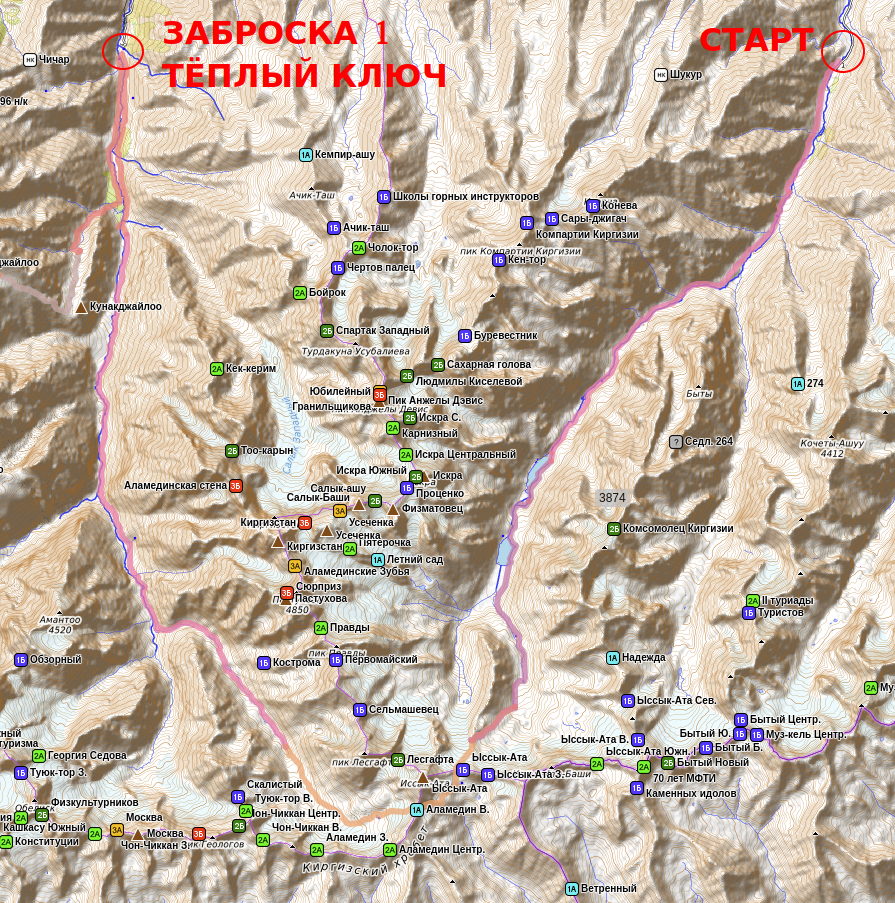

<!--@@BEGIN(MD)-->

# Сводная информация

- Сроки похода: 29 июня&nbsp;&mdash; 14 июля 2024 г
- Руководитель: Вельтищев Михаил Николаевич, 5ГУ, 3ГР ([dichlofos-mv@yandex.ru](mailto:dichlofos-mv@yandex.ru))
- Тип: горный
- Категория сложности: вторая
- Маршрутная книжка `11/3-204`, [фотокопия прилагается](TODO)
- Ходовых дней: 14
- Протяжённость маршрута: 99 км (GPS, без коэффициентов)
- Максимальная высота: TODO м
- Максимальная высота ночёвки: TODO
- Турклуб: [Горный Турклуб МГУ](https://www.geolink-group.com/tourclub)
- Шифр TLIB: TODO `/TLIB`
- Отчёт в [каталоге Вестры](https://westra.ru/passes/Reports/4315)
- Отчёт на сайте [Горного Турклуба МГУ](https://www.geolink-group.com/tourclub/trips/2024mv2/)
- Последнее обновление: 30.12.2024
- Версия: 1.01
- На Кубке Москвы 2025 года, согласно протоколам ФСТ-ОТМ, поход занял TODO [??? место](https://fst-otm.net/TODO_f9.pdf)
<!--@@END(MD)-->
<!--@@BEGIN(TEX)-->
\begin{center}
Федерация спортивного туризма России

Федерация спортивного туризма – объединение туристов Москвы

Горный турклуб МГУ им. М. В. Ломоносова
\end{center}

\vfill

\begin{center}
\Huge ОТЧЁТ
\end{center}

\vskip6pt

\begin{center}
\large
о прохождении горного спортивного туристского маршрута \\
второй (II) категории сложности \\
по Киргизскому хребту (Тянь-Шань) \\
в период с 29 июня по 14 июля 2024 года
\end{center}

\vskip24pt

\begin{center}
Маршрутная книжка № \textbf{11/3-204} \\
Руководитель группы \textbf{Вельтищев\,М.\,Н.} \\
E-mail: \texttt{dichlofos-mv@yandex.ru}
\end{center}

\vskip24pt

\hbox to \textwidth{\hfil\begin{minipage}{0.47\linewidth}
Маршрутно-квалификационная комиссия Горного турклуба МГУ им. М. В. Ломоносова
рассмотрела отчет и считает, что маршрут может быть зачтен
руководителю и всем участникам второй (II) категорией сложности.\par

\vskip12pt

Отчет использовать в библиотеке Горного турклуба МГУ им.\,М.\,В.\,Ломоносова.\par

\vskip12pt

\hbox to \textwidth{\hfil Председатель МКК \verb"_________________"}
\hbox to \textwidth{\hfil \phantom{Председатель МКК} (Зеленцов Д.\,Ю.)}

\end{minipage}}

\vskip24pt

\vskip24pt

\vfill
\vfill

\begin{center}
Москва, 2025 г.
\end{center}
\thispagestyle{empty}
\newpage
<!--@@END(TEX)-->

TODO TOC here

\newpage

# 1. Справочные сведения
## 1.1. Проводящая организация
Поход был организован и проведен группой туристов Горного турклуба МГУ им. М.В. Ломоносова

Адрес турклуба: г. Москва, Ленинские горы, д. 1, стр. 37

Сайт турклуба: [http://www.geolink-group.com/tourclub](http://www.geolink-group.com/tourclub)

Электронная почта руководителя: [dichlofos-mv@yandex.ru](mailto:dichlofos-mv@yandex.ru)

## 1.2. Географический регион пройденного маршрута
Административный:
Киргизская Республика, Чуйская область

Географический:
Тянь Шань – Киргизский хребет (Киргизский Ала-Тоо)

## 1.3. Общие справочные сведения о маршруте

| Характеристика | Значение         |
| -------------- | -----------------|
| Вид туризма | Горный |
| Категория маршрута | вторая |
| Количество участников | 8 |
| Сроки проведения | 29 июня — 14 июля |
| Продолжительность активной части | 14 дней |
| Протяженность | TODO км (GPS, без коэффициента) |
| Максимальная высота | TODO метров |
| Максимальная высота ночёвки | TODO метров (пер TODO) |

## 1.4. Нитка маршрута

**Заявленная:**
пос. Иссык-Ата — р.~Иссык-Ата — пер.~Иссык-Ата~(1Б) — пер.~В.Аламедин~(1А) — р.~Аламедин~—
б/о~Теплый Ключ~— пер. Ат-Джайлоо (1Б) — пер. Фрунзе~(1Б) — пер. Байчичикей (1Б) — а/л~Ала-Арча~—
пер.~Джаламыш (1Б) — р.~Джаламыш — пер.~Ашутор (н/к) — пер.~Малышка (1А) — пос.~Берюлю.

**Пройденная:**
пос. Иссык-Ата — р.~Иссык-Ата — пер.~Иссык-Ата~(1Б) — пер.~В.Аламедин~(1А) — р.~Аламедин~—
б/о~Теплый Ключ~— пер. Ат-Джайлоо (1Б) — пер. Фрунзе~(1Б) — пер. Байчичикей (1Б) — а/л~Ала-Арча~—
пер.~Джаламыш (1Б) — р.~Джаламыш — пер.~Ашутор (н/к) — пер.~Малышка (1А) — пос.~Берюлю.

**Отличия:**
Отсутствуют.

## 1.5. Обзорная карта района

### Сегмент 1 (от старта к заброске)

### Сегмент 2 (от заброски к финишу)

## 1.6. Высотный профиль маршрута

{height=10cm}

## 1.7. Определяющие препятствия

|Препятствие|Кат. тр.|Высота|Хар-ка|Путь и способ прохождения|Ссылка|
|-----|-|-|-|--------|-|
|пер. Сакашиль Нижний|1А|3075|тр-ос|Подъём и спуск по травянисто-осыпным склонам крутизной 20-25&deg;.|[p.o:3055](https://pereval.online/object/3055)
|пер. Красные Камни|1А|3500|ос|Подъём по травянистому в~нижней части и~мелкой или средней подвижной осыпи в~верхней части крутизной~до~30&deg;, спуск по мелко-осыпному склону крутизной до~25~&deg;.|[p.o:12984](https://pereval.online/object/12984)
|пер. Джилги Восточный~(рад)|1А|3570|ос|Со стороны пер. Джилги по осыпному гребню|[p.o:2045](https://pereval.online/object/2045)|
|в.~Кестантытау (рад) + пер.~Джилги|сумм. 1А|3750, 3600|ос|Подъем и спуск по осыпному склону крутизной до~30&deg;, в~верхней части подъема на~в.~Кестантытау 5м совсем простого лазания по разрушенным скалам.|[p.o.2363](https://pereval.online/object/2363) + [p.o:2044](https://pereval.online/object/2044)|
|пер. Сарынтау (Авиации) (рад)|1А|3800|ск-ос|Средняя осыпь на подъём, в~средней части пояс разрушенных скал крутизной до 40&deg; с~элементами простого лазания, на спуск конгломератно-осыпной склон крутизной до 35&deg;|[p.o:3088](https://pereval.online/object/3088)|
|пер. Тютюргу Западный|1А|3725|ос|Подъем и спуск по осыпному склону крутизной до 25&deg;|[p.o:3359](https://pereval.online/object/3359)|
|в. Булунгу (рад)|1А|3800|ос|Подъем с~седловины пер. Тютюргу по средне- и мелко-осыпному склону крутизной до 35&deg;. Спуск по пути подъёма|-|
|пер. Коргашиль (Каргашиль) Северный|1А|3417|тр-ос|На подъём осыпной склон крутизной до 20&deg;, на спуск осыпной склон крутизной до 25&deg;|[p.o:13023](https://pereval.online/object/13023)|
|пер. Ширман Северный (Самарский)|1А|3570|ос|На подъём: очень подвижная и неприятная средняя и мелкая осыпь крутизной до 35&deg;, на спуск~-- траверс осыпного склона и последующий спуск по средне- и мелко-осыпному склону, далее по травянисто-каменистому склону крутизной до 30&deg;|[p.o:3790](https://pereval.online/object/3790)|

\newpage

## 1.8. Состав группы

|№|Ф.И.О|Г.р.|Туристский опыт|Должность в~походе|
|-|-------|-|-----|-----|
|1|Вельтищев Михаил Николаевич|1984|4 с~эл. 5 ГУ (Кавказ), 2x4 ГУ (Горная Матча); 3ГР (Кавказ)|Руководитель, финансист|
|2|Гальперин Константин Юрьевич|1998|пвд|Газовик|
|3|Гащенко Ирина Дмитриевна|1990|пвд|Пом. эколога
|4|Егорова Ева Станиславовна|2003|1ГУ (Кавказ, Архыз)|Штурман
|5|Каракаш Александра Александровна|2001|1ГУ (Кавказ, Архыз)|Гитарист
|6|Клейменова Александра Евгеньевна|2004|пвд|Медик
|7|Константинов Евгений Геннадьевич|1992|1ПУ, 2ВелоУ|Фотограф
|8|Ларина Елизавета Алексеевна|1998|пвд|Реммастер
|9|Мартишина Ирина Сергеевна|2001|пвд|Зав. питанием
|10|Палатова Александра Андреевна|1997|пвд|Пом. реммастера
|11|Румянцев Иван Николаевич|1989|пвд|Штурман
|12|Шерварлы Ксения Григорьевна|1997|пвд|Снаряженец, хронометрист
|13|Янеева Юлия Владимировна|1983|4ГУ (Горная Матча)|Пом. руководителя, эколог

Сокращения: Г – горный, У – участие.

Все участники прошли маршрут полностью.

## 1.9. Ссылки на материалы отчета

- Мастер-версия отчёта для чтения: [github.com/dichlofos/kirgizsky-2024/blob/master/report_kirgizsky_2024.md](https://github.com/dichlofos/chegem-2023/blob/master/report_kirgizsky_2024.md), перегенерируется с~помощью скрипта `generate_all.sh`
- Исходный код отчёта: [github.com/dichlofos/chegem-2023/blob/master/source_report_kirgizsky_2024.md](https://github.com/dichlofos/chegem-2023/blob/master/source_report_kirgizsky_2024.md) (туда вносятся все исправления и дополнения, в~том числе после отправки отчёта в~МКК)
- Репозиторий на GitHub с~материалами отчёта: [github.com/dichlofos/kirgizsky-2024/](https://github.com/dichlofos/kirgizsky-2024/) (треки, фото, отчёты, использованные при подготовке, карты)

## 1.10. Сведения о выпускающей МКК
Группа выпущена на маршрут МКК Клуба туристов МГУ им. М.В. Ломоносова
в составе
- Зеленцов Дмитрий Юрьевич
- Мукаилов Сергей Ибрагимович
- Варгафтик Григорий Михайлович

Полномочия МКК по выпуску – до четвёртой к.с. включительно.

# 2. Описание туристско-спортивного маршрута

**Принятые в~тексте соглашения и сокращения**:

- Координаты точек даются в~системе координат `WGS84`
- ПХД &ndash; по ходу движения
- ЧХВ &ndash; чистое ходовое время
- ГХВ &ndash; грязное ходовое время (т.е. с~учётом привалов)
- ЛП &ndash; левый приток
- ПП &ndash; правый приток
- д.р. &ndash; долина реки
- в., вер. &ndash; вершина
- верх. &ndash; верховья (реки)
- Термины &laquo;левый&raquo; и &laquo;правый&raquo; означают
&laquo;орографически левый&raquo; и &laquo;орографически правый&raquo;, если не указано обратное

## 2.1. Идея проведения похода и подготовка к нему

Идея посетить Киргизский хребет у руководителя сидела в голове очень давно,
ещё с 2020 года. Но по разным причинам она откладывалась (то пандемия, то ещё какая-нибудь
неприятность). В этом году потребность посетить достаточно высокий район
в начале сезона была продиктована также желанием руководителя акклиматизироваться
перед длинным походом 5 к.с. по Памиру. Сроки похода определялись этим же обстоятельством:
нужно было успеть вернуться в Москву, немного разгрести дела по работе и снова улететь
в горы. Поэтому мы поставили себе задачу упаковать по возможности побольше интересных
препятствий в двухнедельный поход. А район Киргизского хребта для таких задач подходит
идеально: высокая транспортная доступность, не безумно дорого, да ещё и заброски
можно сделать две, а не одну, как обычно, таким образом, вес рюкзаков не будет большим.

Любовь руководителя к снежно-ледовым препятствиям определила нитку маршрута: если в описании
перевала фигурировали слова "снежный" или "ледовый", оно рассматривалось к планированию,
а если "скальный" или "осыпной", то приоритет данного препятствия резко понижался.

### Маршрут

Киргизский хребет, с одной стороны, прекрасен своей компактностью, с другой стороны, есть
достаточно протяжённые долины без подходящих "перемычек" между ними. Поэтому при рассмотрении
вариантов ниток сразу стало понятно, что будет выбрано либо глобальное движение с запада на восток,
либо в обратную сторону. Исходя из логики, что сначала в нитке должны присутствовать более
простые и более низкие препятствия (для упрощения акклиматизации), было выбрано направление
с востока на запад, начиная от пос. Иссык-Ата и заканчивая в районе пос. Берюлю или
его окрестностей. На пути, соответственно, было две точки забора заброски: база
отдыха Тёплый Ключ и район альплагеря Ала-Арча.

С аварийными выходами из районатоже не было проблем: по тропам
везде можно спуститься вниз по долинам в цивилизацию.

В отличие от маршрута прошлого года, нитку решено было собирать из нескольких
частей, вдохновляясь отчётам группы МФТИ под руководством Анны Берзовой,
МГТУ им. Баумана под руководством Игоря Болотина и группы Горного Турклуба МГУ под
руководством Екатерины Бирючевой.

В лучших традициях хороших маршрутов, радиальные части в маршруте полностью
отсутствуют (за исключением плана заноса части снаряжения по плану акклиматизации).

Сроки похода не оставляли много возможностей для большого количества дней запаса
или днёвок, поэтому мы предпочли отдых вынести за скобки маршрута, если дни
запаса не будут потрачены.

### Техническая и физическая подготовка

К походу второй категории сложности хотелось, чтобы ребята не только умели работать
с верёвками, но и личная техника присутствовала на каком-то разумном уровне.
Потому что нельзя рассчитывать на то, что везде можно провесить перила,
надо ещё научиться на ногах стоять.

Поэтому мы участвовали практически всем составом в соревнованиях "Лёд
и Мёрзлые Скалы", а также проводили довольно много технических тренировок
с интервалом 1 раз в 2 недели с таким запасом прочности,
чтобы в горных условиях провешивание 2-4 верёвок перил не вызвало бы
значимых трудностей.

Также в рационе продолжающих туристов присутствовали элементы тренировочных
спасработ и контрольные выходы для проверки выносливости.

Беговые тренировки были зачастую индивидуальными с отчётом руководителю
в виде ссылок на беговой трекер. Такой формат позволяет экономить время
и бегать в любимом районе, не тратя время на посещение МГУ (тем более,
что часть участников похода живут не в Москве).

Со всеми этими задачами коллектив справлялся неплохо и с энтузиазмом.
Команда заняла вполне достойное третье место на Кросс-походе в Полушкино
по классу Б+, что для первого раза выступления по данному классу вообще
неплохо. Это позволяло выпускаться на маршрут без дополнительных вопросов
со стороны МКК.

## 2.2. Характеристика района похода

TODO
Расположение, вершины, высоты, климат, основные реки - взять из описания Олеси

**Потенциально опасные участки**

Маршрут был спланирован таким образом, чтобы избежать больших бродов
рек по возможности. Мы предполагали, что погодные условия в наши сроки похода
могут быть не самыми благоприятными, а бродить реки "по уши" и потом сушиться
под снегом или дождём может быть не очень уютно. К счастью, низовья долин
обитаемы и поэтому там нет проблем с мостами.

Базовым источником опасности в любых горных районах являются осыпные
склоны. На нашем маршруте их было достаточно много, таким образом,
нужно было контролировать возможный сход камней с крутых участков, особенно
в дождливую плохую погоду. Во время снегопадов, напротив,
камни (как это ни удивительно) становились более смороженными и менее подвижными
(вплоть до полного сцементирования в монолит),
с другой стороны при движении без кошек возникала дополнительная опасность
выхода на обледенелые участки, присыпанные сверху мелкой крошкой. Такие участки
зондировались при спусках с помощью треккинговых палок и обходились
по более крупным камням, которые более качественно держатся.

Везде на участках, где движение могло вызывать сход камней из-под ног,
применялось движение плотной группой или двумя плотными группами
с разнесением по времени и в пространстве. В качестве средства
самостраховки использовались треккинговые палки или ледорубы
(на более крутых участках склонов). На особо крутых участках провешивали
перильные верёвки.

Что касается снежно-ледовых склонов, каковых на нашем маршруте было
в изобилии, то здесь основные опасности представлены ледовыми трещинами,
а также возможностью срыва на крутых участках. На закрытых ледниках
передвижение шло в связках, с самостраховкой ледорубом или треккинговыми палками,
а также с применением точек промежуточной страховки на бурах или станций,
в зависимости от ситуации.

Лавинная опасность потенциально была возможна с учётом того, что поход проходил
в самом начале сезона. Но на практике по нашей траектории следования
заметной лавинной опасности мы не наблюдали: или крутизна склона была недостаточной
для схода снега, или толщина свежего слоя недостаточна для схода. Крупных снегопадов
за время похода мы не встретили.

На перевалах дополнительную опасность могут представлять боковые кулуары,
откуда внезапно вылетают камни. В случае движения днём, а не ранним утром, есть вероятность
попадания под "обстрел" (в описаниях до нас подобная неприятность не упоминалась).
Поэтому приходилось устраивать ранние подъёмы и по возможности все технические участки
проходить утром, пока оно смёрзлось и никуда не сыплется.

В отличие от Кавказа, можно отметить, что крутые травяные склоны на нашем маршруте
практически отсутствовали, осыпей гораздо больше в процентном отношении.

## 2.3. Туристские возможности района

Район весьма популярен для альпинистов, в том числе благодаря наличию альплагеря.
Однако мы были удивлены тем, что не встретили ни одной туристической группы,
за исключением отдыхающих внизу в долинах.

С эстетической точки зрения это хорошо: чем меньше людей в горах, тем меньше там мусора
остаётся.

Что касается маршрутов, то здесь можно организовывать маршруты любой категории сложности,
вплоть до 6й, так как диапазон категорий перевалов колеблется от некатегорийных
до 3Б (а также много вершин, пригодных для альпинистских маршрутов, также разной
степени сложности).

## 2.4. Транспортная доступность

Транспортная доступность района очень хорошая. Подъезд производится
по асфальтированным дорогам, по которым проедет всё, что угодно. Время от
аэропорта Бишкека (Манас) до пос. Иссык-Ата составило порядка 3 часов
с учётом заезда по пути в супермаркет для закупки там бутылок, которые впоследствии
будут использоваться как фляжки для воды.

## 2.5. Возможности организации закупки и заброски

Мы не рекомендуем осуществлять закупку продуктов в Киргизии. По деньгам это будет
с большой вероятностью дороже, чем в Москве, а выбор продуктов меньше. К тому же,
возникает проблема упаковки: в Москве это можно делать спокойно и без суеты.

Что касается газа и организации заброски, то мы воспользовались услугами Юрия Траченко
и его фирмы [Kyrgyz Adventure](https://kyrgyzadvent.com/). С точки зрения продуманности
и организации - полный восторг. Наш турклуб регулярно пользуется услугами Юрия.
Приятно, что можно не просто заказать трансфер, а ещё и проконсультироваться по поводу
некоторых деталей маршрута, т.к. Юрий хорошо знает район.

Газ у Юры Траченко стоит порядка 900 р за баллон, организация заброски нашей группы,
завоз забросок в две промежуточных точки маршрута и выброска группы 8 человек нам обошлась
в 40.000 р.

TODO уточнить стоимость трансфера и забросок по отдельности.

\newpage

## 2.8. Запасные варианты и выходы с~маршрута

1. Аварийный выход до пер. Иссык-Ата~-- в пос. Иссык-Ата, до пер. Аламедин Восточный~--
на юг к автомобильной дороге вниз по долине, за пер. Аламедин Восточный\т вниз по
дол.р.Аламедин (по маршруту).
2. До пер. Ат-Джайлоо возврат на базу отдыха Тёплый Ключ, до пер. Байчичикей\т спуск
в дол.р.Чункурчак.
3. За пер. Байчичикей и до пер. Джаламыш\т спуск в альплагерь Ала-Арча.
4. За пер. Джаламыш спуск по р. Джаламыш.
5. За пер. Малышка спуск в пос. Берюлю.
6. При спуске с пер. Ашутор после 12:00 местного времени выход по пер. Кетензуме (н/к)
и пер. Скотский (н/к) согласно отчёту Игоря Болотина 2016~г.

## 2.9. Страховка
TODO уточнить у Костяна, где он делал

Страховку оформляли в~компании Альфа-Страхование, стоимость полиса составила
3000р на 1 человека.

В полисах АО «АльфаСтрахование», путешествующих по РФ, сервисная компания:
ООО~<<Балт Ассистанс сервис>>.

Согласно п 4.1.3 правил~-- спасение/медпомощь организуется доступным
транспортным средством в~конкретной ситуации: <<транспортировке автомашиной
«скорой помощи» или иным транспортным средством>>.

Выбор занятия повышенного риска~-- <<Спортивный туризм>>: предусматриваем Договором.
По п.5.8.30, расходы, связанные с~лечением травм, заболеваний, вызванных
занятиями авиаспортом, полетом на летательном аппарате, управлением им
(кроме случаев полета в~качестве пассажира на самолете гражданской
авиации, управляемом профессиональным пилотом), полетом на безмоторных
летательных аппаратах, моторных планерах, суперлегких летательных
аппаратах, прыжками с~парашютом, альпинизмом, ледолазанием,
скалолазанием, любыми видами активности на **высоте свыше 3500 метров**,
мото- и автогонками, с~занятием дайвингом, на глубине более 30 метров,
любые виды спорта, связанные с~животными, и иными опасными видами
спорта, мероприятиями, связанными с~повышенным риском,
если иное не предусмотрено Договором страхования,
что должно быть отражено в~Договоре страхования
и влечет за собой увеличение тарифа.

О движении по маршруту мы сообщали раз в~два дня куратору из числа
товарищей по Горному клубу МГУ. Куратор группы, в~свою очередь,
выкладывал сообщения группы на сайт турклуба, где с~ними могли ознакомиться
члены МКК, а также все желающие, в~том числе друзья и родственники участников.

Отправка СМС велась с~помощью спутникового телефона системы «Турайя»
с сим-картой МТС в~режиме международного роуминга. Были опасения, что Турайю
глушат в~районе гос. границы (в прошлом году были проблемы в~КЧР),
и они частично подтвердились: в~Минеральных Водах Турайя спутник так и не поймала
даже пролежав минут 10-15 под ясным открытым небом.

В качестве резервного варианта y~нас также был арендованный телефон системы <<Иридиум>>.
С Иридиума, однако же, не~удавалось отправлять СМС: при отправке телефон выдавал
какую-то не очень внятную ошибку. Звонить оператору и выяснять причину проблем
мы не стали, т.к. Турайя работала исправно (да ещё и дешевле).

\newpage

## 2.10. График движения (фактический)
|Дата|День|Участок маршрута|Км|H+|H-|H-макс|Н-сон|Способ передвижения|
|--|-|--------|--|--|--|--|--|--|
|29.06|1|г. Бишкек, аэропорт Манас – пос. Иссык-Ата (авто)|150|1000|0|1300|-|авто|
|29.06|1|пос. Иссык-Ата - дол. р. Иссык-Ата|150|1000|0|1300|-|авто|
|30.06|2|г. Минеральные Воды – пос. Тырныауз|150|1000|0|1300|-|авто|
|01.07|3|г. Минеральные Воды – пос. Тырныауз|150|1000|0|1300|-|авто|
|02.07|4|г. Минеральные Воды – пос. Тырныауз|150|1000|0|1300|-|авто|
|03.07|5|пос. Тырныауз – д.р. Уллуставатсу|8.3|980|80|2200|2200|пешком|
|04.07|6|м.н. – верх.р.Сакашильсу – напр.в.Тырныаузских Комсомольцев (рад) – верх.р. Сакашильсу|6.7|1080|500|3280|2780|пешком|
|05.07|7|м.н. – пер. Сакашиль Нижний (1А) – д.р. Кестанты|7.7|665|755|3075|2690|пешком|
|06.07|8|м.н. – верх. р. Кестанты (рад) – пер. Красные Камни (1А) – верх. р. Джилги-су|5.2|810|0|3500|3490|пешком|
|07.07|9|м.н. – в. З707 (рад) – в. Кестантытау (рад) – пер. Джилги Восточный (1А) (рад) – пер. Джилги (1А)- верх. р. Сарынсу|9.1|640|840|3750|3300|пешком|
|08.07|10|м.н. – пер. Сарынтау (1А) (рад) – д.р. Сарынсу|7.8|520|960|3820|2860|пешком|
|09.07|11|м.н. – пер. Турист (нк) – тб Башиль – слияние р. Башиль-Аузу-су и р. Гара-аузу-су – тб Чегем|18.5|280|1010|2860|2130|пешком|
|10.07|12|м.н. — д.р. Тютюргу – вер. р. Тютюргу|6.5|980|0|3110|3110|пешком|
|11.07|13|м.н. – пер. Тютюргу Западный (1А) – в. Булунгу (1А) (рад) – вер. р. Кору|5.5|710|640|3820|3180|пешком|
|12.07|14|м.н. — пер. Коргашиль Северный (1А) – вер. р. Ракит – пер. Илипсар (нк) – вер. р. Сылыксу|10.2|620|900|3420|2900|пешком|
|13.07|15|м.н. — пер. Ширман Северный (1А) – пос. Берюлю|7.4|680|1330|3580|2250|пешком|
|13.07|15|пос. Берюлю — г. Бишкек|7.4|680|1330|3580|2250|авто|

Итого активными способами передвижения (по&nbsp;GPS): 99.6&nbsp;км / 119.5&nbsp;км
(c учетом коэффициента&nbsp;1.2), набор высоты 7965&nbsp;м, сброс высоты 7835&nbsp;м.

\newpage

# 3. Техническое описание прохождения группой маршрута

## 3.1. Перевал Иссык-Ата (1Б)

TODO:
| Характеристика | Значение |
| ------------- | ------------------ |
| Категория трудности | 1Б |
| Высота | 3075 |
| Координаты | `N 43.32161 E 42.99423` GPS |
| Ориентация склонов | СЗ — ЮВ |
| Характер склонов | тр-ос |
| Расположение | Северные отроги ГКХ |
| Дата и направление | 05.07.2023 в~напр. р. Кестанты|
| Снята записка | ТК г. Минск, 1 к.с., С.~О.~Комаров, 11.08.2022 |

### День 1. 29 июня 2024 года.

*г. Москва, аэропорт Шереметьево\т г. Бишкек, аэропорт Манас\т пос. Иссык-Ата – дол.р.Иссык-Ата*

TODO
|День|Дата|ГХВ|Набор|Сброс|Расстояние|Погода|
|-|-|-|-|-|-|-|
|1|03.07|5:56|980|80|8.3|Солнечно, жарко|

Сегмент|ГХВ|ЧХВ|Характер участка
-----|-|-|-----
От Тырныауза до обеда|3:42|3:05|Дорога, четыре брода
От обеда до МН|2:14|1:44|Дорога
Итого|5:56|4:49|

Вылет из Москвы утренним рейсом из Шереметьево до Бишкека. В 15:05 местного времени
начинаем проходить погранконтроль и ждём багаж. Это не очень быстро происходит
и всего через каких-то 40 минут мы уже ищем нашу машину на парковке рядом
с выходом из аэропорта. В 16:00 успешно погрузились, выехали в сторону пос. Иссык-Ата.

В 16:30 делаем короткую остановку поменять немного местных денег и в 17:20 вторую остановку
рядом с крупным супермаркетом минут на 20.

В 19:00 выгружаемся в Иссык-Ате. Быстро потрошим рюкзаки и формируем сумки с забросками.
По рекомендации Юры Траченко для заброски используем ПВХ-мешки: они прочнее, чем клетчатые ПВХ-сумки.
Отзваниваемся Юре Траченко и в Центр о начале маршрута. Нам желают удачи, с этим напутствием
и накидываем рюкзаки.

План на сегодня очень простой: отойти немного от посёлка, встать и выспаться. Ибо в силу раннего вылета
и сдвига по времени уже чувствуется усталость.

В 19:18 группа выходит на маршрут и начинает подъём по ОЛ берегу р. Иссык-Ата, сначала по асфальту,
затем через 3 мин сворачиваем на хорошую набитую тропу вправо, идущую по пологому травянистому склону.
Через 30 мин ЧХВ делаем первый привал. Вокруг растёт чабрец. Считаем это добрым знаком.

Уходим с привала и через 20 минут ЧХВ упираемся в размытое глубокое русло притока Иссык-Аты.
В "лоб" перейти сложно и неприятно, делаем небольшой крюк вправо ПХД, где уже есть удобный переход по камням.

Далее тропа подходит ближе к реке, вокруг заросли арчи. Кое-где встречаются подтопленные участки,
но если специально не лезть в болото, можно пройти с сухими ногами.

В 20:44 (46 минут ЧХВ) встаём на ночёвку с левой ПХД стороны от тропы на травянистой поляне. Слева ПХД
видна одна из построек ГЭС, освещаемая фонарём на столбе. Поляна небольшая, но для наших двух палаток
удаётся найти два ровных местечка.

Варим чай, быстро перекусываем запасами еды из цивилизации и ложимся спать, чтобы не терять время.
Завтрашний день будет гораздо бодрее.

**Мини-карта, день 1**

**Высотный профиль, день 1**

{height=13cm}

{height=13cm}

### День 2. 30 июня 2024 года.

*м.н. – оз. Ортокуль Нижнее в дол. р. Иссык-Ата*

TODO

|День|Дата|ГХВ|Набор|Сброс|Расстояние|Погода|
|-|-|-|-|-|-|----|
|2|04.07|9:43|1080|500|6.7|Переменная облачность и туман ближе к концу дня, без осадков|

Сегмент|ГХВ|ЧХВ|Характер участка
-----|-|-|-----
Подъем по д.р. Сакашильсу|5:15|4:15|Тропа на пологом тр-кам склоне долины, есть крутой участок 35-40&deg;. Многочисленные неглубокие броды.
Подъем из д.р. Сакашильсу к в. Тырныаузских комсомольцев (радиально)|4:29|3:09|Подвижная и неподвижная мелкая и средняя осыпь
Итого|9:43|7:24|

**Мини-карта, день 2**

**Высотный профиль, день 2**

План дня прост и понятен: ломить вверх по долине р. Иссык-Ата до первого озера
(на карте оно никак не называется, для удобства будем называть его **Ортокуль Нижнее**).
Из долины деваться некуда, штурман скучает.

Позволяем себе в первый день не слишком жестить. Подъём дежурных в 5:00,
всей группы в 5:30.

Погода позволяет спокойно подсушить палатки и не спеша собраться, отбалансировать
рюкзаки по весу согласно раскладке снаряжения. Но нет причины волноваться,
так как мы всё равно не можем подниматься выше озера, а с нашей характерной скоростью
мы там будем к после обеда. Поэтому, опять же, можем себе позволить неспешность.

Итак, в 8:17 выходим от места ночёвки. Продолжаем движение по тропе вдоль ОЛ берега р. Иссык-Ата.
Через 40 мин ЧХВ достигаем очередного притока Иссык-Аты и чтобы его перейти, опять делаем
небольшой крюк вверх по его течению. Переход по камням, проблем не вызывает,
далее опять движемся по тропе.

В 10:26 встречаем развилку троп. Нижняя из троп идёт ближе к руслу реки через низменность,
но зато вроде бы без значимого набора высоты. Верхняя обходит эту низменность правее ПХД,
делая крюк поверху, но выше не особо просматривается из-за перепада высот. Мы решаем
пройти по нижней тропе и жалеем об этом: полуболото, крупные камни с дырками
между ними, множество мелких ручейков. Перемещение идёт медленно, а тропа теряется.
В общем, выглядит правильным обходить правой тропой, пусть и ценой небольшого набора высоты.

Через 15-20 минут ЧХВ выбираемся на более удобный рельеф. Далее продолжаем движение
по травянисто-каменистому склону. Тропа теряется, но идти в целом удобно и легко.

В 11:40 выходим к мосту через р. Иссык-Ата. Мост очень хороший и фундаментальный,
со стальной фермой и брёвнами. Нечасто в Азии такие мосты увидишь, но тут цивилизация
близка, людей ходит много, поэтому не удивляемся.

Сразу за мостом решаем, что пора бы и отобедать, тем более, что подъём идёт достаточно
бодро и по плану. Садимся обедать у больших камней рядом.

В 13:22 выходим с обеда. Продолжаем движение по ОП берегу р. Иссык-Ата. Через 8 мин ЧХВ
замечаем опасный участок: с осыпных склонов слева ПХД периодически сыплет камнями.
К счастью, большинство их попадает в карман и до тропы не доходит, но некоторые особо
борзые всё-таки долетают. Участок обстрела совсем небольшой, но бдительность не помешает.

Наблюдаем это безобразие некоторое время. Видим, что интервалы между падениями есть.
Накидываем каски, выдыхаем, сосредотачиваемся и плотной группой очень быстро проходим наиболее
опасный фрагмент длиной метров 40-50, дальше уже более спокойным темпом продолжаем движение
и через несколько минут делаем привал.

В 14:00 выходим далее вверх по долине, под ногами мелкоосыпной склон, сцементированный травой.
Идти комфортно. Встречаем большую группу туристов, совершающих радиальный выход к озеру без
снаряжения. Предупреждаем их о падающих камнях ниже по ходу их движения.

Постепенно открываются красивые виды. Трава, широкая долина, зелено и симпатично.
Погода тоже радует.

В 15:10 достигаем озера и встаём лагерем на левом ПХД берегу. Приходится немного поискать удобное место
для лагеря: у нижней оконечности озера берега сужаются и сильно дует, нам это не нравится.
Прогулявшись вдоль берега, находим более подходящее место, чуть менее ветренное, недалеко от берега.
Решаем, что оно достаточно сухое и что уровень воды в озере вряд ли поднимется существенно,
чтобы затопить лагерь (поскольку озеро большое).

Дневной план выполнен, с этими чувствами в 21:00 учиняем отбой.

{width=18cm}

{width=18cm}

{width=18cm}

{width=18cm}

{width=18cm}

{width=18cm}

### День 3. 1 июля 2024 года
*м.н. – верх. р. Иссык-Ата под пер. Иссык-Ата + радиально занос заброски
к пер. Иссык-Ата*

TODO

|День|Дата|ГХВ|Набор|Сброс|Расстояние|Погода|
|-|-|-|-|-|-|-|
|3|05.07|7:26|665|755|7.7|Тепло, переменная облачность|

Сегмент|ГХВ|ЧХВ|Характер участка
-----|-|-|-----
Подъем на пер. Сакашиль Нижний (1А, 3075)|1:16|1:06|Тр-кам склон крутизной 15-25&deg;
Спуск в~д.р. Кестанты|3:30|2:40|Тр-кам склон переменной крутизны, есть участок траверса
Подъем по ОЛ берегу р. Кестанты|1:10|0:51|Тропа в~кам-тр пологой долине реки
Брод р. Кестанты на ОП берег|0:32|0:20|Брод глубиной до 70 см, сильное течение
Подъем по ОП берегу р. Кестанты к МН|0:58|0:48|Тропа в~кам-тр пологой долине реки
Итого|7:26|5:45|

**Мини-карта, день 3**

**Высотный профиль, день 3**

Общий подъём 5:40, дежурных в 5:00.

План на сегодня состоит из двух частей: подход под пер. Иссык-Ата на высоту, на которой нас не будет
слишком сильно горняшить, а затем занести заброску, чтобы на следующий день идти быстрее.

Выходим из лагеря в 7:20. Двигаемся вверх вдоль озера по ОП берегу. Тропы нет, под ногами
малоподвижные камушки. У верхней оконечности озера пробираемся по стыку камней и воды
по большим камням вправо. Из-под оспыного завала вытекает вода. Завал обходим по низу,
двигаясь вправо ПХД.

https://disk.yandex.ru/client/disk/Фотографии%2006.29-07.13%20поход%20по%20Киргизскому%20Хребту/Ваня_фото/ВСЕ?idApp=client&dialog=slider&idDialog=%2Fdisk%2FФотографии%2006.29-07.13%20поход%20по%20Киргизскому%20Хребту%2FВаня_фото%2FВСЕ%2F2024-07-01%2007-54-05.jpeg

Далее заворачиваем левее в жёлоб, образованный руслом реки и двумя осыпными склонами.
Далее двигаться вдоль русла реки не очень удобно, вдали видны прижимы осыпного склона
(см. фото). Поэтому решаем, что надо выбраться повыше. Заворачиваем влево на мелко-осыпной
склон крутизной 30-35 градусов, двигаясь плотной группой. Далее, когда травы под ногами
становится больше, лезем "в лоб", набирая метров 20.

Так выбираемся на плоскость, заросшую травой, там делаем привал. Тут нас свистом встречают сурки.
Из пустоты возникает тропа, идём по ней, траверсируя склон без набора высоты не очень далеко от русла,
на холмы слева ПХД не лезем (да и выглядят они менее приятно, чем травянистый склон). Так подходим к нижней
оконечности оз. Ортокуль. Этот участок проходим близко к воде по большим камням, заросшим лишайником.

Озеро красивое, понятно, почему туда все ходят. Ещё бы погоду получше давали, а у нас облачно,
но хоть без дождя.

За озером набор плавный, под ногами трава и небольшие камушки. Несколько раз пересекаем
древние моренные валы, где-то тропа есть, где-то и без неё нормально.
Так продолжаем движение, пока опять не упираемся в очередной осыпной завал, из-под которого опять
вытекает вода (тут у читателя может возникнуть ощущение де жа вю). Точно так же преодолеваем его
прямо рядом с водой (тут нужно поглядывать наверх и надеть каску, потому что осыпной склон крутой
и с него может что-нибудь поехать).

Таким образом мы, не замочив ног, переходим на ОЛ берег р. Иссык-Ата. Правда, начиная с этого момента
ярко выраженного русла уже нет, основной поток течёт под землёй. Мы же следуем по линии падения воды,
поднимаясь по осыпному жёлобу, образованному мореной и основным склоном. В жёлобе, опять-таки, следует
поглядывать налево, а прижиматься ближе к правому краю, т.к. левый ПХД склон неприятный и камнеопасный.

https://disk.yandex.ru/client/disk/Фотографии%2006.29-07.13%20поход%20по%20Киргизскому%20Хребту/Ваня_фото/ВСЕ?idApp=client&dialog=slider&idDialog=%2Fdisk%2FФотографии%2006.29-07.13%20поход%20по%20Киргизскому%20Хребту%2FВаня_фото%2FВСЕ%2F2024-07-01%2011-27-46.jpeg

Здесь встречаем первый снежник. Выше по жёлобу он хорошо засыпан трухой, передвигаться по нему легко.
Как только выбираемся из жёлоба, начинают показывать горы: впереди ледники и симпатичные вершинки,
правда местами закрытые облаками.

По древним пологим моренным валам через 25 мин ЧХВ от перехода через завал подходим к относительно
ровной и безопасной площадке. Счётчик высоты показывает 3420, а значит, выше ночевать сегодня уже не стОит,
ведь мы хотели поход с хорошей и приятной акклиматизацией. Время прибытия в лагерь 11:40.

Здесь TODO точка ставим лагерь и обедаем. Зачем-то делаем это очень долго, целых 4 часа. Затем,
одев каски, взяв треккинговые палки и часть снаряжения и еды, отправляемся на акклиматизационный выход
выше по долине, чтобы занести всё это поближе к перевалу.

ФОТО: подъём к перевалу

Рюкзаки лёгкие, эпизодически делаем микро-привалы, чтобы группа собралась. Погода не очень, поэтому
растягиваться в условиях возможного нарушения прямой видимости не стоит.

Подъем представляет собой движение по мелкой и средней осыпи в сторону ледника Минджылки (Перевальный),
сначала по сухому руслу, затем, когда подъём становится ещё более пологим, движение идёт
придерживаясь правой части склона (на карте также отмечена альтернативная тропа левее ПХД,
но это небольшой крюк). Крутизна склона не превышает 25-30 градусов, чаще 15-20.

На подходе к точке разворота забираемся на правый гребень, ещё не засыпанный снегом (для этого
делаем незначительный, но резкий галс вправо метров на 180-200). Думаем, что с него
наиболее удобно выходить на ледник, ведущий к перевалу. Дальше заброску нести нельзя, связываться в связки
мы не хотим сегодня (это будет завтра), да и кто ж по леднику в такое время суток ходит без острой необходимости.
Перепад 400 метров - и так отличное подспорье, чтобы завтра забежать сюда побыстрее.

Из лагеря вышли в 15:40, в 17:20 достигли гребня. Делаем укрытие из камней для нашего барахла, обсуждаем тактику
прохождения перевала.

В 17:33 начинаем спуск, в 18:08 пришли в лагерь (спуск занял 35 минут ГХВ), ужинаем.
В 21:00 отбой, завтра перевал, надо выспаться.

### День 4. 2 июля 2024 года
*м.н. – пер. Иссык-Ата (1Б) - верх. р. Иссык-Ата Юж - пер. Аламедин Восточный (1А) - верх. р. Ашутор*

|День|Дата|ГХВ|Набор|Сброс|Расстояние|Погода|
|-|-|-|-|-|-|----|
|4|06.07|6:05|810|0|5.2|До обеда тепло, переменная облачность. После облачно, ветренно, холодно.|

Сегмент|ГХВ|ЧХВ|Характер участка
-----|-|-|-----
Пологий подъем в~верх. д.р. Кестанты|1:15|0:55|Тропа на тр-кам склоне
Подъем из д.р. Кестанты к пер. Красные Камни (1А) до места обеда|2:55|2:15|Тр-кам склон, курумник, снежники в~ручьях. Ср. крут. склона менее 20&deg;.
От обеда до седловины пер. Красные Камни (1А)|1:35|1:25|Осыпной склон крутизной 25-30&deg;. Подвижная и неподвижная мелкая и средняя осыпь.
С перевала до м.н.|0:20|0:15|Широкое осыпное выполаживание за перевалом
Итого|6:05|4:50|

Подъём в~5:30. В~6:40 выходим в направлении перевала по маршруту вчерашней радиалки.
Рельеф - мелкая и средняя осыпь, но теперь уже присыпанная снегом (за ночь выпало около 7 см).
Чтобы было проще подниматься, тропим, поочерёдно сменяя лидера. Странно, но от выпавшего снега
камни не становятся более скользкими, это радует.

Погода в основном облачная, но иногда проглядывает солнце.

Ориентировочно через ходку одного из участников начинает горняшить.
Решительно разгружаем ему рюкзак, несмотря на протесты. Это помогло.
В 7:05 продолжаем движение по ОЛ склону кулуара, не доходя метров 20 до его дна,
затем постепенно переходим на ОП его склон, в удобном месте делаем полноценный привал.

В 7:26 продолжаем движение, через 10 минут выходим на более пологий склон и в 8:24
достигаем высоты 3800 и подходим к сделанной вчера заброске (здесь проще было сделать
длинную ходку, т.к. разбор заброски всё равно займёт какое-то время и все успеют отдохнуть).

Тут связываемся в две связки по 4 человека.
Трещин на ледниках много не предвидится, распутывать особо нечего,
поэтому считаем это разумным.

В 9:02 выходим на штурм перевала. Идём по закрытому леднику. Глубина снега от 15 до 50 см.
Тропим без остановок, потому что движение идёт медленно и все, кроме тропящего, успевают отдохнуть.
Направление движения - строго под перевальный взлёт, практически по азимуту, благо склон пологий.
Слева ПХД на склоне видим что-то типа засыпанного почти везде снегом бергшрунда, поэтому под конец ходки
даём небольшой крюк вправо.

В 9:55 лидер первой связки подходит под перевальный взлёт. Седловина с этой точки видна не полностью,
но основная часть склона просматривается хорошо: снежный склон крутизной не более 30 градусов.
Трещин и разломов непосредственно на пути движения не видим.

В 10:12, через 12 минут ЧХВ, лидер выходит на перевал, через 6 минут вся группа собирается на перевале.
Записку класть особо некуда: седловина хоть и широкая, но всё настолько засыпано снегом,
что где искать тур, совершенно неясно. Погода делает нам подарок, выкатив солнце из-за облаков,
делаем перевальную фотку.

При необходимости на перевале можно поставить лагерь, вкопав палатки под скальный гребешок,
но с обратной стороны нужно делать ветрозащиту (стенку), ибо дует. Вода присутствует
только в твёрдом состоянии, зато, судя по количеству снега, круглогодично.

После этого, даже не распаковывая перевальную шоколадку. приступаем к спуску (потом съедим,
а пока погода хорошая - надо двигаться дальше). Спуск с перевала представляет собой осыпной склон,
изрядно заваленный снегом. Но назвать его снежным тоже язык не поворачивается, в более типичный сезон
здесь будет более классический скально-осыпной спуск.

По этой причине кошки не надеваем, а аккуратно начинаем в связках спускаться по неглубокому
жёлобу, наиболее засыпанному снегом: так совсем не скользко и безопасно. Вокруг всё хорошо
заморожено, поэтому камнеопасность отсутствует. Склон в верхней части крутоват, 30-35 градусов.
Для спуска используем треккинговые палки, а не ледорубы, крутизна позволяет.

Чтобы было ещё веселей, сразу за седловиной дует напористый ветер. У одного из участников
срывает накидку у рюкзака и уносит вдаль. "Очень жаль",\т проносится в мозгу у руководителя,
так как унесло её куда-то на скалы и вернуть без шансов.

В 10:37 обе связки спускаются на пологий склон под перевальным взлётом. Обедать ещё рано,
но съедаем шоколадки и перекусываем чем-то из обеда, а то ещё непонятно, когда будет удобное
место и время для него\т впереди ещё один перевал.

### Выводы по пер. Иссык-Ата (1Б)

Можем считать, что перевал соответствует категории 1Б по нижней границе сложности,
его можно рекомендовать для прохождения всем без исключения. Можем даже назвать его учебным:
специальной техники не требуется, а навыки хождения в связках (а в нашем случае и тропёжку) отработать
можно. В нашем случае большое количество снега позволило пройти его даже без кошек, но в более позднее
время летом ситуация может быть иной и требовать применения кошек.

Спуск с перевала в нашем случае упростился за счёт снега. Понижать категорию до 1А, на наш взгляд,
не стОит.

## 3.2. Перевал Аламедин Восточный (1А)

TODO:
| Характеристика | Значение |
| ------------- | ------------------ |
| Категория трудности | 1А |
| Высота | 3075 |
| Координаты | `N 43.32161 E 42.99423` GPS |
| Ориентация склонов | СЗ — ЮВ |
| Характер склонов | тр-ос |
| Расположение | Северные отроги ГКХ |
| Дата и направление | 05.07.2023 в~напр. р. Кестанты|
| Снята записка | ТК г. Минск, 1 к.с., С.~О.~Комаров, 11.08.2022 |

Описание даётся от истока р. Иссык-Ата Юж.

### День 4. 2 июля 2024 года (продолжение)

Из цирка пер. Иссык-Ата седловины следующего перевала ещё не видно, нужно траверсировать склон
или обходить ещё ниже (этот вариант следует считать предпочтительным, если хочется избежать
преодоления скальных поясов, пунктирная тропа на карте OSM соответствует этому обходу).
Но мы считаем, что траверсами тоже надо учиться ходить, поэтому выбираем траверс уровня 3800
в сторону пер. Аламедин Восточный.

В 10:50 начинаем движение траверсом средне-осыпного склона, пока что в связках. Впрочем,
особой надобности в них уже скорее нет: ледника с этой стороны нет, а значит, и трещин тоже.
Кошки не особо нужны, но лидер во избежание неприятностей идёт в кошках. Крутизна склона
на траверсе достигает 35 градусов, снег осыпной, но завален снегом. Топчем ступеньки,
дела идут хорошо.

Через час хода упираемся в скальный пояс, состоящий из скал и огромных камней.
Поначалу всё это кажется непроходимым, руководитель отправляется на разведку и через некоторое
время находит "пролаз", относительно безопасный для прохождения. Он представляет собой
10-метровый зигзагообразный участок с выходом в заснеженный кулуарчик. В нижней части
"ключа" пришлось кинуть палки и осторожно спрыгнуть в снег с высоты порядка полутора метров
(не самое приятное занятие, если делать это с рюкзаком, но для этого-то мы личную технику и
голеностоп и тренируем, чтоб в подобных ситуациях не печалиться). Для остальных участников
организуем гимнастическую страховку, принимая сначала рюкзак, затем участника.

Ещё через десяток метров нужно осторожно пройти траверсом по узкой полке, но тут уже каждый
проходит сам, придерживаясь правой рукой за стену.

Сразу после сложного участка под скалами имеется небольшая полочка, где можно перевести дух.
Кроме того, оттуда уже открывается вид на наш следующий перевал. Несмотря на то, что скалы,
засыпанные снегом, не самое лучшее место для лазания, участок очень понравился группе.
На разведку и преодоление участка ушло 50 мин ГХВ.

В 12:52 продолжаем движение траверсом по осыпному склону крутизной 25-30 градусов.
Через 8 минут взбираемся на ребро, с которого отчётливо виден путь на пер. Аламедин Восточный
до самой седловины. На пути видны небольшие выходы скал, но в основном\т свежезамороженная
осыпь, преимущественно мелкая (ФОТО).

В 13:42 делаем небольшой привал на склоне крутизной порядка 20 градусов, через 20 мин ЧХВ
выходим к перевальному взлёту, а ещё через 23 минуты группа собирается на седловине пер. Аламедин Восточный.

Седловина перевала достаточно узкая. При крайней необходимости можно поставить палатки,
ровные места найти можно. Однако практически нет ветровой защиты, а вода присутствует
только в твёрдом состоянии.

Спуск с перевального взлёта пер. Аламедин Восточный представляет собой мелко-осыпной склон,
в нашем случае присыпанный снегом, крутизной порядка 20-30 градусов. Спускаемся с треккинговыми
палками. Снег уже успел раскиснуть и стал ещё менее скользким, чем утром. Это радует.

Перевальный взлёт упирается в широченный ледник: выглядит он как огромное снежное поле с глубоким
снегом. Трещин не видно, но это не значит, что их точно нет, поэтому связываемся.
В 15:02 выходим вниз по леднику строго по линии падения воды в связках по 4. Снега до 30 см,
но идти не так сложно, потому что вниз.

В 15:35 ледник успешно пересекли, тут развязываемся и организуем перекус, доедаем остатки обеда.

В 16:03 выходим с привала по средне-осыпному склону крутизной до 15 градусов. На этом техническая
часть сегодняшнего дня заканчивается, но хорошо бы спуститься куда-то до травы, благо время есть.
Бодрячком бежим вниз по осыпи, присыпанной снегом. Осыпь практически неподвижная, поэтому спуск
идёт хорошо. Через 1 час 20 минут ЧХВ подходим к краю концевой морены, там
спускаемся с неё по склону крутизной до 30 градусов.

Здесь проходим ещё 15 минут вдоль ОП берега р. Ашутор и видим подходящее место, ставим лагерь
в 19:05.

TODO фото лагеря если есть

В 21:00 отбой. Ибо перевалы\т перевалами, а отбой\т по расписанию!

### Выводы по пер. Аламедин Восточный (1А)

Этот перевал, с учётом закрытого ледника на спуске, можно назвать необычной 1А, требующей организации связок
на коротком промежутке (30 мин ЧХВ).

В остальном всё достаточно типично: осыпные склоны на подъём, крутизна приемлемая. Но если кто-то желает
организовать поход 1 к.с., не беря с собой ни страховочных систем, ни верёвки, мы бы рекомендовали
не ходить данный перевал, несмотря на его категорию. Киргизский хребет не Архыз,
не надо такие перевалы ходить без снаряжения.

Глубина снега в нашем случае была приемлемой, но гамаши или бахилы не помешают, если рассматривать походы в июле.
В нашем случае раскисания снега было не избежать, так как это был уже второй перевал за день,
но при других вариантах маршрута было бы разумно проскочить ледниковую часть по холодку,
чтобы меньше проваливаться.

TODO фотки

{width=18cm}

{width=18cm}

{width=18cm}

{width=18cm}

{width=18cm}

### День 5. 3 июля 2024 года
*м.н.\т д.р. Ашутор\т д.р. Аламедин*

TODO
|День|Дата|ГХВ|Набор|Сброс|Расстояние|Погода|
|-|-|-|-|-|-|----|
|4|06.07|6:05|810|0|5.2|До обеда тепло, переменная облачность. После облачно, ветренно, холодно.|

Сегмент|ГХВ|ЧХВ|Характер участка
-----|-|-|-----
Пологий подъем в~верх. д.р. Кестанты|1:15|0:55|Тропа на тр-кам склоне
Подъем из д.р. Кестанты к пер. Красные Камни (1А) до места обеда|2:55|2:15|Тр-кам склон, курумник, снежники в~ручьях. Ср. крут. склона менее 20&deg;.
От обеда до седловины пер. Красные Камни (1А)|1:35|1:25|Осыпной склон крутизной 25-30&deg;. Подвижная и неподвижная мелкая и средняя осыпь.
С перевала до м.н.|0:20|0:15|Широкое осыпное выполаживание за перевалом
Итого|6:05|4:50|

Подъём в 5:45. Сегодня день ожидается "беговой".

Выходим из лагеря в 7:05, начинаем спуск по ОП берегу р. Ашутор. Погода на удивление сказочная:
ясное небо, ветра нет. Спуск проходит по пологому склону, местами засыпанному камнями и изрядно
заросшему травой. Двигаться преимущественно легко, изредка обходим россыпи камней.

Через пару ходок по 25 минут, ориентируясь на трек и карту, принимаем решение перебродить Ашутор
на ОЛ берег. Ниже по течению виднеется красивое озеро.

В 7:58 начинаем бродить реку, в 8:22 группа собирается на целевом берегу, в 8:26 продолжаем движение вниз
уже по ОЛ берегу.

Проходим два красивых озера, образовавшихся в углублениях морены. Выглядят красиво, но для купания,
пожалуй, рановато и ещё прохладно. Местами попадаются туры, отмечающие тропу.

В 9:04 проходим спуск с концевой морены, из-под неё вытекает Ашутор. Через этот завал
переходим на ОП берег Ашутора, продолжаем спуск далее по правому берегу по травяному склону
крутизной 10-25 градусов, перемежаемому вкраплениями каменных россыпей.

В 10:05 делаем привал в очень живописном месте с видом на слияние р. Аламедин и р. Ашутор,
далее продолжаем спуск по среднеосыпному склону, так делаем ещё пару ходок по 25-30 мин.

В 11:24 обстоятельства вынуждают нас сделать остановку. У одного из участников пошла кровь
из носа (похоже на какие-то спецэффекты от горняшки), общее его состояние тоже не самое лучшее,
несмотря на отличную физическую подготовку. Укладываем человека в тень арчи, ждём, пока отпустит.
Возможно, влияет резкий спуск.

На остановку потратили 32 минуты, в 11:56 продолжаем спуск. В 12:38 пересекаем селевую промоину,
которую следует пересекать поперёк без потери высоты. Качество тропы в этих местах
варьируется от набитой "магистрали" до полного её отсутствия в местах, где попадаются
селевые выносы.

В 12:42 делаем небольшой привал, чтобы собрать группу. Через 6 минут привала продолжаем движение
и ещё через 22 мин ЧХВ спустились к слиянию р. Алтынтор и р. Аламедин, здесь встаём на обед.
Место для обеда неплохое, плоское, погода отличная, можно сушить вещи, отдыхать, пережидать жару.

В 15:00 выходим с обеда и продолжаем спуск вдоль ОП берега р. Аламедин, идём преимущественно по тропе,
но в некоторых местах тропа ныряет в арчу. Приходится перепрыгивать ручьи, прижимающие путь спуска
слева. Довольно много колючего кустарника, но т.к. по этой траектории частенько ходят коровы,
проход в целом неплохой.

Ниже по течению тропа постепенно улучшается, в 15:35 идём уже по образцовой коровьей тропе
в 30 метрах от реки. Под ногами трава и вкрапления мелкой осыпи.

Делаем так ещё 3 ходки по 25-30 минут. В 17:20 думаем, не встать ли здесь, и есть ли смысл сегодня спускаться
ниже. Но решаем, что всё-таки ещё надо ходочку сделать, в итоге в 18:06 обнаруживаем неплохое место:
ровное, вокруг сосны,\т одним словом, красивое, правда есть небольшие нюансы по очистке поляны
от отходов коровьей жизнедеятельности.

TODO откуда воду брали? Из Аламедина?

В 21:00 отбой, как по расписанию.

**Мини-карта, день 4**

**Высотный профиль, день 4**

{width=18cm}

{width=18cm}

\newpage

### День 6. 4 июля 2024 года
*м.н. – д.р. Адамедин\т б/о Тёплый Ключ\т ОЛ берег р. Аламедин\т верх. ОЛ притока р. Аламедина*

TODO

|День|Дата|ГХВ|Набор|Сброс|Расстояние|Погода|
|-|-|-|-|-|-|-|
|5|07.07|8:15|640|840|9.1|Тепло, солнечно|

Сегмент|ГХВ|ЧХВ|Характер участка
-----|-|-|-----
Траверс от МН к пер. Джилги (1А)|1:00|0:38|Гряды средней и мелкой осыпи
Подъем-спуск на в. Кестантытау, радиально |2:23|1:40|Мелкая осыпь (лифт), снежник. Крутизна склона до 25&deg;.
Траверс на пер. Джилги Восточный (1А), радиально |2:07|1:40|Мелкая осыпь
Спуск с~пер. Джилги (1А) в~верх. р. Сарынсу к м.н. |2:45|2:07|Мелкая и средняя осыпь вверху, тропа на тр-кам склоне ниже
Итого|8:15|6:05|

**Мини-карта, день 5**

{height=10cm}

**Высотный профиль, день 5**

{height=5cm}

Сегодняшний день переключит нас с первого кольца на второе. Мы спустимся вниз, заберём заброску и начнём записывать второе
кольцо, более техническое.

Подъём в 5:30, в 7:04 выходим из лагеря по ровной тропе без камней.
Встречаем двух киргизов навстречу, рассказываем им про мёртвую лошадь у озера.
Те огорчаются, с этой мыслью мы их и оставляем, продолжаем спуск.

В 8:00 переходим приток Аламедина Салык. Удаётся перейти по камням, но это
требует некоторой ловкости, чтобы не намочить ноги, некоторые участники
не рискуют и переходят в бродильной обуви.

TODO фотку бы (не нашёл подходящей)

К 9:00 спускаемся в Тёплый ключ, видим нужную юрту, встречаем кого-то из хозяев,
нам показывают наши мешки с заброской, мы благодарим хозяев за хранение,
оставляем магарыч в виде кордалеты и конфеты для местных детишек.

В 9:20, быстренько раскидав мешки по рюкзакам, стартуем второе кольцо.
Переход Аламедина в этом месте прекрасен: большой стальной мост,
проплаченный местными металлургами, и даже табличка пояснительная имеется.
Также радуют плакаты про то, что в горах не надо мусорить, но, к сожалению,
не все это понимают.

Таки образом переходим на ОЛ берег р. Аламедин и далее нам нужно двигаться в направлении,
противоположном утреннему спуску.

Сегодняшний день объявляется днём расслабления и отдыха, тем более что погода хорошая
и вообще жарко. Поэтому в 9:35 останавливаемся под раскидистым деревом,
чтобы нормально перебалансировать вес рюкзаков, спокойно сварить кофе и немного выдохнуть
в междукольцевом пространственно-временном континууме. На эти процедуры тратим 1ч35м.

В 11:05 выдвигаемся по тропе вверх по р. Аламедин. Несмотря на новый вес рюкзаков, прём
вверх, как танки, даже привалы иногда забываем делать, но когда находим очень крутое
место для привала, не стесняемся посидеть там подольше. Таким образом через 1ч 20 мин ЧХВ
становимся на обед. Потому что подъём - подъёмом, а обед - по расписанию, сегодня можем
себе такое позволить.

Обедаем, опять же, в тени деревьев на берегу притока Аламедина. Очень красиво, солнце
светит и позволяет учинить стирку и прочие гигиенические процедуры по полной программе.
Отвисаем так 2 часа.

В 14:35 выходим с обеда, вскоре сворачиваем направо на тропу в сторону водопада Тикитор,
там фоткаемся минут 5-10 и в 15:06 уходим от водопада обратно по тропе и на развилке
троп поворачиваем направо. Тропа уходит круто вверх по ребру, формально идёт вдоль ручья,
но близко к воде не подойдёшь. Поэтому водой предусмотрительно заправились внизу у водопада,
тем более, что жара всё ещё ощущается.

Из-за крутого набора ходки делаем не по времени, а по набору высоты, ориентировочно каждые 100-120
метров набора приваливаемся. Тропа идёт по лесу, очень красиво. Проходим кладбище альпинистов,
вспоминаем о вечном и о технике безопасности. На этом кольце она нам пригодится по полной программе.

В 16:30 выбираемся из зоны леса в зону травы. Тут тропа начинает иметь разветвления,
стараемся выбирать наиболее торный вариант. Пересекаем овраг с ручьём, отмечаем, что
тут неплохое место для водозабора, но склоны крутые и стоять негде.
Делаем короткую разведку вперёд по тропе, обнаруживаем, что если подняться чуть выше,
то там место достаточно ровное и плоское, пригодное для лагеря.

В 17:30 ставимся лагерем, за водой обратно к ручью отправляем бригаду с рюкзаком бутылок,
от лагеря ходу метров 400, не больше.

В 21:00, как обычно, отбой. Завтра денёк будет посложнее, надо выспаться.

## 3.3. Вершина Кестантытау (1А), перевал Джилги (1А) и перевал Джилги Восточный (1А)

### День 5. 7 июля 2023 года
*м.н. – подход под пер. Джилги – в. Кестантытау (рад) – пер. Джилги (1А) –
пер. Джилги Восточный (1А, рад) – траверс склона г. Кестантытау в~направлении д.р.Сарынсу и в. Сарынтау*

|День|Дата|ГХВ|Набор|Сброс|Расстояние|Погода|
|-|-|-|-|-|-|-|
|5|07.07|8:15|640|840|9.1|Тепло, солнечно|

Сегмент|ГХВ|ЧХВ|Характер участка
-----|-|-|-----
Траверс от МН к пер. Джилги (1А)|1:00|0:38|Гряды средней и мелкой осыпи
Подъем-спуск на в. Кестантытау, радиально |2:23|1:40|Мелкая осыпь (лифт), снежник. Крутизна склона до 25&deg;.
Траверс на пер. Джилги Восточный (1А), радиально |2:07|1:40|Мелкая осыпь
Спуск с~пер. Джилги (1А) в~верх. р. Сарынсу к м.н. |2:45|2:07|Мелкая и средняя осыпь вверху, тропа на тр-кам склоне ниже
Итого|8:15|6:05|

**Мини-карта, день 5**

{height=10cm}

**Высотный профиль, день 5**

{height=5cm}

\newpage

### 3.3.1. Вершина Кестантытау (1А)
| Характеристика | Значение |
| ------------- | ------------------|
| Высота    | 3750 |
| Координаты|`N 43.26430 E 43.00699` GPS|
|Характер склонов| ск-ос |
| Расположение|хр. Адырсу|
|Дата и направление|07.07.2023 с~пер. Джилги радиально|
|Снята записка| До вершинного тура не ходили |

Подъём 5:00, выход из лагеря 7:00. Погода фантастическая: ясно, на небе ни облачка.
Выходим траверсом почти без потери высоты
в направлении правого обхода в. Кестантытау. Через 38 мин ЧХВ пересекаем ручей, останавливаемся y~него
(это будет наша точка обеда), оставляем тут рюкзаки и в~касках, с~треккинговыми палками,
выдвигаемся в~направлении в. Кестанты.

Подъём делается по мелко- и средне-осыпному склону крутизной порядка 25&deg;
в направлении своеобразной седловины,  делящей гору на две части.

Так как осыпь подвижная, идти по ней вверх не очень удобно, перемещаемся чуть левее, чтобы
подниматься по снежнику аналогичной крутизны. Снег плотный, глубоко не проваливаемся,
ступеньки получается делать, однако срыв на такой крутизне маловероятен,
в случае падения далеко не уедешь. Участники пробуют различные способы постановки ног
в снегу, делятся впечатлениями. Теоретически, можно тут устраивать тренировки по
самозадержанию ледорубами, но я бы предпочёл делать это на склоне бОльшей крутизны и меньшей
протяжённости.

В процессе подъёма одна из участниц (Саша) жалуется на головокружение от горняшки. Решаем, что на вершину
в таком состоянии лучше бы не ходить, её сопровождает вниз к рюкзакам опытная участница.
Так как видимость на склоне прямая, договорились, что нам будут сигнализировать взмахами палок,
если вдруг состояние начнёт ухудшаться. Это не потребовалось, после спуска к рюкзакам Саше
полегчало и остаток дня она чувствовала себя вполне хорошо.

Поднялись на седловину, оттуда прогулялись в~левую ПХД часть горы, откуда открывается красивый вид.
Затем вернулись к~точке выхода на седловину и оттуда стали искать удобный выход
на основную вершину, чтобы погулять между исполинскими каменными <<грибами>> на вершине горы.

Чтобы вылезти туда, нужно преодолеть небольшой пояс
разваленных скал правее основной оси горы: пролезть метров~5. Двое участников решают, что грибы на вершине
Кестантытау не стоят того, чтобы лезть по этим скалам и с~разрешения руководителя вдвоём
спускаются вниз. Оставшаяся более заинтересованная <<грибами>> часть группы успешно и без
особых трудностей пролезает эти 5 метров (при спуске на обратном пути на всякий случай
применяли гимнастическую страховку) и выходит на вершинное плато, где расположены <<грибы>> – огромные
результаты выветривания.

До конца плато ходить не стали, оттуда наш временный лагерь было плохо видно, да и время терять не хотелось,
а главные достопримечательности мы и так смогли посмотреть. Обнаруживаем, что фотографироваться не на что
(большая ошибка: оба фотографа ушли вниз), но не сильно печалимся этому факту и решаем, что фотографиями
<<грибов>> и так пестрит весь Интернет.

На посещение горы потратили 2 часа, из них ходового времени – ориентировочно 1ч 30м.

### 3.3.2. Перевал Джилги (1А)
| Характеристика | Значение |
| ------------- | ------------------ |
| Категория трудности | 1А |
| Высота | 3600 |
| Координаты| `N 43.25992 E 43.01165` GPS|
| Ориентация склонов | СВ — ЮЗ |
| Характер склонов | ос |
| Расположение| хр. Адырсу |
| Дата и направление | 07.07.2023 пер. Красные Камни (1А) — д.р. Сарынсу |
| Снята записка| <<Природа КБР>>, 1 к.с., рук. Ислам Метов, 05.07.2023 |

В 10:23 выходим во второй радиальный выход в~сторону пер. Джилги Восточный, при этом проходим через седловину
пер. Джилги. Далее начинаем подъём на осыпной гребень и движемся
по нему с~небольшими сбросами и набором высоты. Вид с~гребня весьма симпатичный, идти в~некоторых
местах очень комфортно, кое-где осыпь более крупная и движение замедляется. Примечательно, что наша
участница, подвернувшая ногу, бодро прыгает по осыпным склонам и вообще утверждает, что эта радиалка
вдохнула в~неё вторую жизнь и ради этого стоило идти в~поход. Компенсационно, другая участница
(тоже Ира) пожаловалась на небольшую боль в~голеностопе (предположительно из-за слишком туго зашнурованных
с утра ботинок) и сказала, что лучше посидит какое-то время и отдохнёт.
Убедившись, что медицинская помощь ей пока не требуется, оставили с~ней всё ту же
опытную участницу, и продолжили движение по гребню.

\newpage

### 3.3.3. Перевал Джилги Восточный (1А)
| Характеристика | Значение |
| ------------- | ------------------ |
| Категория трудности | 1А |
| Высота | 3570 |
| Координаты | `N 43.25631 E 43.03138` GPS |
| Ориентация склонов | СВ — ЮЗ |
| Характер склонов | ос |
| Расположение | хр. Адырсу |
| Дата и направление | 07.07.2023 со стороны пер. Джилги радиально |
| Снята записка | ТК ВШЭ (Москва), 2 к.с., рук. Анастасия Постовская, 09.08.2022 |

В 10:45 проходим безымянную вершину 3690, на ней в~туре находим записку туристов ГС МФТИ под руководством
Георгия Райсиха от 15.08.2022, затем продолжаем движение по гребню в~сторону пер. Джилги Восточный.
В 11:25 достигаем седловины перевала. Седловина перевала плоская, воды и снега нет. Оставляем записку в~туре.

В 12:30 возвращаемся к стоянке и устраиваем обед.

В 14:15 выдвигаемся через пер. Джилги в~сторону р. Сарынсу, справа от нас остаются отроги г. Кестантытау.
Поначалу придерживаемся трека группы Коробцева, однако нам очень не нравится
траверс осыпного склона крутизной до 30&deg;, содержащего скальные выступы.

Решаем, что имеет смысл немного сбросить высоту
(строго говоря, это можно было бы сделать раньше и тогда спуск был бы значительно проще).
Осыпь, к тому же, подвижная и скорость перемещения по ней невысокая. По дну долины двигаться
куда удобнее и проще, пусть даже ценой потери высоты метров 100-150.
Таким образом, мы рекомендуем этот участок проходить **ещё левее и ниже** нашей траектории движения,
ниже по долине.

Так делаем 5 ходок в~среднем по 25 минут и за 2ч7мин ЧХВ достигаем брода реки Сарынсу
в её верхнем течении. Видно было, что группа изрядно подустала от этого траверса, поэтому
в 16:55 мы приняли решение встать на ночёвку: денёк выдался не самый простой и по километражу,
и по характеру местности. Хотя набор и сброс высоты были невелики, практически вся наша траектория
состояла из траверсов. Место ночёвки `N 43.26230 E 42.98714` GPS.

Несмотря на усталось, решили также разведать выход в~сторону пер. Сарынтау и в. Сарынтау,
который мы собирались ходить на следующий день. Группой из 6 человек выдвинулись на разведку,
отфотографировали самый технически интересный перевал за весь наш поход до наступления темноты
и вернулись в~лагерь спустя 40 минут после выхода.

Подходы к перевалу Сарынтау показались несколько пугающими: крутые снежные склоны, плохо видимые
издали развалины скал. Однако, как мы узнаем из описания следующего дня, <<не так уж страшен чёрт,
как его малюют>>.

### Выводы по в. Кестанты и её окрестностям

Прекрасная обзорная точка района, особенно в~хорошую погоду, каковая нас баловала в~этот день.
Интересные с~геологической точки зрения объекты~-- <<грибы>> выветривания на вершине.

Что касается радиальных выходов на пер. Джилги Восточный, то тут можно отметить также
достаточно живописную панораму, открывающуюся с~вершины 3690, в~том числе оттуда неплохо
смотрится сама Кестатытау.

Ежели ощущается недостаток времени или погода не жалует, то вторую радиалку можно пропустить.
А вот гора, конечно, рекомендуется к посещению практически в~любую погоду, за исключением
проливного дождя и видимости менее 100 м. Делать это лучше в~утренние часы, что вполне согласуется
с характерным планом-графиком.

Устраивать лагерь на пер. Джилги в~<<узловой>> точке, мы, однако, не рекомендуем: место
весьма открытое и продуваемое ветром в~любом направлении. В~случае плохой погоды там,
предположительно, будет не очень комфортно. Хотя место под палатку найти можно, и вода
неподалёку также имеется.

{width=18cm}

{width=18cm}

{width=18cm}

\newpage

## 3.4. Перевал Сарынтау (Авиации) (1А)
| Характеристика | Значение |
| ------------- | ------------------ |
| Категория трудности | 1А |
| Высота | 3800 |
| Координаты| `N 43.26461 E 42.95749` GPS |
| Ориентация склонов | З — В |
| Характер склонов| сн-ос |
| Расположение|Северные отроги ГКХ |
| Дата и направление|08.07.2023 со стороны д.р. Сарынсу радиально |
| Снята записка| ТК Крокус (Краснодар), 2 к.с., рук. Елена Олешко, 23.08.2022 |

### День 6. 8 июля 2023 года
*м.н. – пер. Сарынтау (1А) (рад) – д.р. Сарынсу*

|День|Дата|ГХВ|Набор|Сброс|Расстояние|Погода|
|-|-|-|-|-|-|----|
|6|08.07|7:41|520|960|7.8|Облачно, ветренно, небольшой дождь до обеда. После обеда переменная облачность, тепло|

Сегмент|ГХВ|ЧХВ|Характер участка
-----|-|-|-----
Подъем на пер. Сарынтау (1А), радиально|3:55|3:08|Курумник. Средне- и мелкоосыпной склон крутизной 20&deg;., местами до 35&deg;. Снежники.
Спуск с~пер. Сарынтау (1А), радиально |2:31|1:50|Курумник. Средне- и мелкоосыпной склон крутизной 20&deg;., местами до 35&deg;. Снежники.
Спуск по д.р. Сарынсу к м.н. |1:30|1:10|Тр-кам долина, тропа в~нижней части.
Итого|7:56|6:08|

Ранний подъём был отменён по причине плохой погоды. Шёл дождь, а в~такую погоду идти
самый сложный и высокий перевал на маршруте было бы неверным тактическим решением. К тому же
по описаниям там предполагались элементы лазания по разрушенным скалам, а такая конструкция
в дождь и вовсе камнеопасна. Поэтому поспали ещё пару часов, дождавшись улучшения погоды.

В 7:30 проснулись второй раз, позавтракали. Видим, что погода переменчивая, и в~любой момент может
вновь испортиться. Принимаем решение отказаться от сквозного прохождения пер. Сарынтау,
заменяем радиальным. Тем более, что интересную техническую часть мы всё равно затронем.
А если дадут погоду, ещё и на в. Сарынтау успеем сходить.

Собираемся долго (увы), в~9:30 выходим из лагеря. С собой две пары кошек, две бухты верёвки,
а также каски, ледорубы, треккинговые палки и комплект страховочной системы с~карабинами.
Вероятность необходимости применения дюльфера или провешивания верёвки на подъём
была невелика, но всё-таки не равна нулю.

\newpage

**Мини-карта, день 6**

**Высотный профиль, день 6**

\newpage

От лагеря двигаемся, траверсируя склон в. 3796, примыкающей к в. Сарынтау. Рельеф преимущественно
представлен среднеосыпным склоном умеренной подвижности, крутизна небольшая. Примерно с~середины
пути начинаем постепенно набирать высоту. Подъём всё ещё пологий.

Наконец подходим к одному из ключевых участков маршрута. Выходы скал не дают возможность пройти
<<в лоб>>. Обходим правее, где их меньше. Скалы разрушенные, движемся нескольким плотными группами.

Выбираемся на плоскую заснеженную <<террасу>>, обходим её по правому краю. На всякий случай протыкиваем
снег палкой, чтобы не угодить в~какую-нибудь дыру. Классических ледниковых трещин здесь всё-таки нет.

Сразу за террасой начинается перевальный взлёт. В~основном он завален снегом. Но в~самой левой части
имеется узкое осыпное ребро, по которому также можно подниматься, если по каким-то причинам некомфортно
идти по снегу. Мы поднимались по снежному склону серпантином, постепенно приближаясь к осыпному
ребру, смещаясь влево ПХД. Примерно на второй трети подъёма на перевальный взлёт выходим на ребро. Остаток
подъема идём по нему до самого перевального гребня.

Выход на седловину проводится по узкому скально-осыпному гребню. От тура до выхода на гребень совсем немного,
не больше 70-100 м. В~туре находим записку группы Олешко из ТК Крокус. Координаты седловины `N 43.26461 E 42.95749` GPS.

Группа поднялась на перевал в~13:10, в~13:25 начинаем спуск. На подъём потратили 3ч 8м ЧХВ.

Радуемся, что залезли на перевал, для многих участников это новый преодолённый рубеж высоты (3800).
Делаем перевальное фото, оцениваем погодны условия и понимаем, что восхождение на Сарынтау придётся
отложить до лучших времён: погода начинает портиться.

Подъём на в. Сарынтау с~перевала незатейлив: по осыпному гребню до самой вершины,
порядка 250 метров набора. Кое-где завалено снегом, но карнизной опасности не прослеживается.

Также оценили спуск в~долину р. Джайлыксу. Мелко-осыпной склон крутизной порядка 30-35&deg;
в~верхней части перепадом порядка 70м, дальше по пологой долине ручья вниз без особых трудностей.
Уже немного начинаем жалеть, что не пошли сюда с~рюкзаками, вполне могли бы успеть по времени.

Дабы внести хоть какие-то элементы новизны в~маршрут, решаем разведать варианты спуска с~перевала.
Скальные выходы под плоской
террасой разделены неприятными осыпными кулуарами различной крутизны. Спускаться по пути подъёма нам
показалось не самой удачной идеей. Двое участников, которые хорошо держатся на ногах,
идут исследовать ближайший к седловине кулуар. Успешно его преодолевают, о чём сигнализируют руководителю.
Сообщают также, что <<спуск так себе, и есть смысл попробовать соседние кулуары>>.

Остальные спускаются двумя плотными группами по более восточному кулуару. Склон также
весьма неприятен, крутизна до 40&deg;, имеются выходы скальных плит. Нужно
быть очень осторожным, чтобы не накидать камней на голову ближнему своему. Каски **строго обязательны**,
но мест, откуда камни могут полететь самостоятельно при хорошей погоде, мы не заметили. В~дождь все
эти склоны, очевидно, камнеопасны: на скалах лежит достаточно <<трухи>>, которая поедет вниз, если её намочить.

После прохода по кулуару выходим на гораздо более пологий средне-осыпной склон умеренной подвижности,
по которому можно двигаться без особых преград. В~этот момент начинается дождь (как мы и предполагали,
погода скучать не даст). Делаем выводы, что сделали правильный выбор. Оперативно перемещаемся в~сторону лагеря,
аккуратно прыгая с~камня на камень.

От выполаживания, где мы на подъёме ушли направо, движемся примерно по пути подъёма.

На возвращение потратили 1ч 50м ЧХВ, из них примерно минут 5-10 ушло на анализ возможностей спуска
и разведку.

### Выводы по пер. Сарынтау

Перевал можно оценить как очень крепкую 1А, формально нет причин для повышения категории.
Но он был объективно сложнее всех предыдущих и требовал осторожности, а не просто умения
ходить по осыпным склонам. Очень хорошо, что мы включили его в~маршрут. Участники получили
массу полезного опыта.

Относительно вершины Сарынтау можем только сказать, что она рекомендуется
к посещению как супер-обзорный пункт района. При хорошей погоде сходить туда радиально
с перевала не сложно (как при сквозном, так и при радиальном прохождении).
Кроме того, современных отчётов по ней совсем немного.

{width=18cm}

{width=18cm}

\newpage

## 3.5. Перевал Турист (н/к)
| Характеристика | Значение |
| ------------- | ------------------|
| Категория трудности | н/к |
| Высота | 2680 |
| Координаты| `N 43.22096 E 42.98806` GPS |
| Ориентация склонов | З — В |
| Характер склонов | тр |
| Расположение | Северные отроги ГКХ |
| Дата и направление | 09.07.2023 д.р. Сарынсу – д.р. Джайлыксу |
| Снята записка | Тур не найден |

Вернувшись в~лагерь, быстро кипятим чай, чтобы немного согреться. Дождь к этому моменту
кончился, но всё ещё достаточно зябко. Параллельно с~этим сворачиваем лагерь,
чтобы продолжить спуск вниз по долине р. Сарынсу в~направлении пер. Турист.
Хотим выйти к турбазе Башиль, где y~нас лежит заброска.

Вышли из лагеря вниз в~16:55. Долина травянистая, кое-где даже имеется тропа.
При спуске придерживаемся линии падения воды и движемся практически строго в~южном
направлении. Пересекаем небольшое русло одного из рукавов р. Сарынсу, после чего
подсекаем скотопрогонную тропу. Дальше движемся со скоростью ветра вниз по долине.

Погода решила резко улучшиться, вновь засветило солнце, стало заметно теплее.
Делаем три ходки общей длительностью 1ч 10м ЧХВ и обнаруживаем подходящее
плоское место для стоянки прямо на тропе (точка `N 43.23988 E 42.99047` GPS).

Следует отметить, что долина достаточно
узкая, и плоских площадок, пригодных для установки лагеря выше указанной точки
или ниже неё, мы не встречали (так, чтобы ещё и вода была рядом). Воду из реки
следует кипятить, так как повсюду следы выпаса скота. Как, впрочем, и на самой
плоской площадке. Тут пришлось немного поработать над зачисткой местности.

{width=18cm}

\newpage

### День 7. 9 июля 2023 года

*м.н. – пер. Турист (н/к) – т/б Башиль – слияние р. Башиль-Аузу-су и р. Гара-аузу-су – т/б Чегем*

|День|Дата|ГХВ|Набор|Сброс|Расстояние|Погода|
|-|-|-|-|-|-|----|
|7|09.07|6:50|280|1010|18.5|Переменная облачность, тепло. Ближе к вечеру временами небольшой дождь.|

Сегмент|ГХВ|ЧХВ|Характер участка
-----|-|-|-----
Спуск по долине от м.н. до пер. Турист (н/к)|0:46|0:36|Тропа по тр-кам склону долины.
Спуск с~пер. Турист (н/к) к т/б Башиль |2:19|1:59|Тропа на тр-кам склоне крутизной до 30&deg; в~зону роста деревьев. Далее дорога через лес.
От т/б Башиль до т/б Чегем |3:45|2:31|Дорога
Итого|6:50|5:06|

День запомнился хорошей погодой и вкусной едой из заброски.
Также он оказался рекордным по пройденному расстоянию.

Властью руководителя подъём объявляется чуть позже обычного. Завтракаем в~6:00,
что в~обычный день непозволительная роскошь. Рациональ такого решения была ещё и в~том,
что нам в~этот день нужно было забирать заброску. А искать кого-либо на турбазе рано утром
может быть не самой хорошей идеей. Поэтому время рассчитали таким образом,
чтобы к турбазе Башиль подойти часам к 10 утра.

Выходим из лагеря в~7:45. Через 45 минут ЧХВ движения по тропе оказываемся на пер. Турист (н/к).
Седловина полностью травяная и не очень ровная, воды нет. Тура тоже нет (откровенно говоря,
его там не из чего складывать).

На перевале особо не задерживаемся, продолжаем движение вниз по ребру. Спуск
достаточно крутой. Несмотря на наличие тропы, нужно быть осторожным. Особенно
когда тропа идёт через сосновый лес. Хвойная подстилка на спуск может быть достаточно
скользкая. Одна из участниц поскальзывается на ней и падает. Приходится сделать небольшой
привал на обрабоку ссадины на колене, в~остальном всё в~порядке.

Двигаясь по тропе, в~10:06 (отклонившись, таким образом, на 6 минут от плана), выходим к мостику через реку Джайлык-су.
Там нас встречают два пограничника и проверяют наши пропуска и паспорта. Это занимает минут 20,
они интересуются маршрутом, неудобных вопросов не задают, а также указывают на направление к мосту через
Башиль-Аузу-Су. По нему выходим к турбазе. На дороге за мостом
сворачиваем налево и движемся, пока не встречаем вереницу домиков и сторожа.

Сторож поначалу был не очень дружелюбным и сетовал на то, что <<Саракуев не платит за заброску>>.
Оставленный магарыч в~размере 1 т.р. за <<сервис>> мгновенно изменил его настроение.
Он даже предложил нам остаться на турбазе, хотя поначалу был категорически против того,
чтобы мы сидели на траве на территории. Но мы пошли на принцип и, перекидав
наиболее тяжёлые части заброски в~рюкзаки, ретировались с~территории.
Ибо только тот достоин гостя, кто встречает его вежливо.

Из заброски откушали ананасов, провели инвентаризацию.
Отправили СМС Борису Саракуеву о том, что заброска взята.

В 11:55, торжественно провозгласив начало второго кольца похода,
двинулись по дороге в~сторону турбазы Чегем. Дорога местами немного пыльная.
Также следует отметить **полное отсутствие родниковой воды** (мутная вода из реки,
текущей вдоль дороги, не в~счёт). Первый подходящий
родник с~чистой водой мы обнаружили за ходку до точки обеда.

Через 1ч 45 м ЧХВ встречаем ручей через дорогу и встаём на обед.
Место выбирали недолго – отошли от дороги метров на 15. Местность
весьма холмистая. Зато удобно наблюдать, что происходит на дороге. `N 43.19434 E 43.05339` GPS.

Погода располагает к мытью голов, неторопливому приготовлению обеда и уничтожению
огромного мешка накопившегося мусора. Благо рядом лес и есть нормальные дрова, которые горят.
К тому же именно этот сегмент маршрута
**не является частью Высокогорного Кабардино-Балкарского заповедника**, поэтому разведение
костров если и карается, то, хочется верить, не так строго. Впрочем, на всём маршруте,
несмотря на то, что y~нас был оформлен пропуск в~заповедник, мы не встретили
ни одного егеря или лесника.

Во время обеда мимо нас проезжает вахтовка с~пограничниками. Они опять проверяют пропуска
и отпускают с~миром.

В 16:40 выходим с~обеда и продолжаем движение по дороге. Через 1ч10м ЧХВ проходим турбазу Чегем.
По дороге встречаем потрясающей красоты озерцо, но купаться уже прохладно и немного не в~тему.
Хочется дойти до места ночёвки.

За турбазой имеется плоская травянистая полянка `N 43.16209 E 43.02400` GPS, на которой можно бесплатно поставить палатки.
По крайней мере, никто с~нас денег за это не попросил. Незадолго до точки лагеря
дорогу пересекает ручей, в~нём достаточно чистая вода, и можно искупаться по пояс
(что многие и делают).

Вокруг очень красиво: разливы русел рек Шаурту и Тютюргу, сосново-еловый лес на склонах.
Швейцария, одним словом (эх!). Ужин варим под навесом, потому что временами идёт дождь.
В очередной раз разъедаем чей-то сюрприз из заброски. Начинает проявляться чувство, что
большая часть похода уже пройдена. От этого немного грустно.

**Мини-карта, день 7**

{width=18cm}

**Высотный профиль, день 7**

{height=5cm}

\newpage

### День 8. 10 июля 2023 года
*м.н. — д.р. Тютюргу – верх. р. Тютюргу*

|День|Дата|ГХВ|Набор|Сброс|Расстояние|Погода|
|-|-|-|-|-|-|-----|
|8|10.07|5:03|980|0|6.5|Тепло, переменная облачность|

Сегмент|ГХВ|ЧХВ|Характер участка
-----|-|-|-----
Подъем от МН до места обеда|3:30|2:30|Тропа в~зоне леса. Морены, поросшие травой.
Подъем от места обеда к м.н.|2:10|1:29|Осыпной склон переменной крутизной до 20&deg;
Итого|5:40|3:59|

**Мини-карта, день 8**

{width=18cm}

**Высотный профиль, день 8**

{height=5cm}

\newpage

Завтрак в~6:00. Собираемся дольше обычного, идёт дождь.
Выходим из лагеря в~8:50.

Дорога, по которой мы шли вчера, быстро заканчивается (ориентировочно через 20 мин ЧХВ).
Дальше нужно не пропустить поворот тропы налево ПХД.
Тропа в~этом месте уходит серпантином наверх по крутому склону, заросшему лесом.
Тропа набитая, но сам поворот достаточно незаметный.

Ещё через ходку (20м ЧХВ) тропа выходит на на плоское дно долины. Далее проходим
левым ПХД берегом реки до точки, где тропа раздваивается. Левая тропа – истинная,
правая тропа ложная. Левая тропа вновь делает крутой вираж наверх (см. фото)
по травянистому склону. Поначалу это кажется нелогичным. Но, выйдя наверх, мы понимаем,
что это обход скального прижима. Русло реки ниже находится в~крутом каньоне.

В этом месте приходится устроить небольшую перебалансировку рюкзаков. К этому приёму
мы достаточно часто прибегали, когда видели, что какие-либо участники отстают больше
(что интересно, состав отстающих постоянно менялся).

Затем тропа выходит на очередное плато и к руслу реки. Встречаем коров. Камней становится
больше, и вскоре сама тропа теряется. Подниматься всё ещё комфортно, набор высоты плавный.

К обеду достигаем точки, где р. Тютюргу разъединяется на множество притоков `N 43.13157° E 43.04805°` GPS.
Перед нами древний осыпной моренный вал. Набор высоты устраивает руководителя,
потрачено 2ч30м ЧХВ, можно и покушать. Тем более, что погода неплохая.

Воду берём из подходящего притока реки, который выглядит почище.
С обеда выходим в~14:10. Подъём продолжаем по травянисто-осыпному склону,
переходящему в~просто осыпной склон. Сначала уходим правее по
более пологой его части. Тут приходится перейти р. Тютюргу (прыжки по камням
в целом приводят к успеху). Продолжаем подъём, склон порядка 15-20&deg;.
Осыпь практически неподвижная, отвращения подъём не вызывает.

За 1ч 30м ЧХВ достигаем выполаживания, где расположенно моренное озеро `N 43.12669 E 43.05928`, GPS.
Здесь в~16:12 ставим лагерь. Воду из озера лучше не брать,
слева от лагеря ПХД имеется ручей с~более чистой водой.
Места под палатки приходится слегка расчищать от камней,
но без фанатизма: много площадок с~мелким песком.

Рядом с~озером пасутся яки, их удаётся пофотографировать.

{width=18cm}

{width=18cm}

\newpage

## 3.6. Перевал Тютюргу Западный (1А)
| Характеристика | Значение |
| ------------- | ------------------|
| Категория трудности | 1А |
| Высота | 3725 |
| Координаты| `N 43.13658 E 43.08040` GPS |
| Ориентация склонов | З — В |
| Характер склонов | сн-ос |
| Расположение | Северные отроги ГКХ |
| Дата и направление | 11.07.2023 со стороны д.р. Гара-Аузу-Су в~д.р. Кору |
| Снята записка | ТК Восхождение (Санкт-Петербург), 3 к.с., рук. Оксана Геннадиевна Курицына, 10.08.2022 |

### День 9. 11 июля 2023 года
*м.н. – пер. Тютюргу Западный (1А) – в. Булунгу (1А) (рад) – вер. р. Кору*

|День|Дата|ГХВ|Набор|Сброс|Расстояние|Погода|
|-|-|-|-|-|-|-----|
|9|11.07|7:33|710|640|5.5|Утром и к ночи снег. Переменная облачность, ветренно на подъем, безветренно на спуск|

Сегмент|ГХВ|ЧХВ|Характер участка
-----|-|-|-----
Подъем от МН на пер. Тютюргу Западный (1А)|3:58|2:38|Курумник, осыпь, снежник
Выход на в. Булунгу радиально|1:15|1:07|Сн-ос склон крутизной до 20&deg;
Спуск с~пер. Тютюргу Западный (1А) по ОЛ борту долины к м.н.|2:20|1:48|Мелкоосыпной склон крутизной 30&deg; в~верхней части, ниже пологий спуск по снежнику и тр-ос борту долины
Итого|7:33|5:33|

**Мини-карта, день 9**

**Высотный профиль, день 9**

## 3.7. Вершина Булунгу (1А)
| Характеристика | Значение |
| ------------- | ------------------ |
| Высота | 3800 |
| Координаты | `N 43.13471 E 43.08175` GPS |
| Характер склонов| сн-ос |
| Расположение | Северные отроги ГКХ |
| Дата и направление | 11.07.2023 с~пер. Тютюргу радиально |
| Снята записка| Не обнаружено |

Утренняя погода нас не очень порадовала: шёл снег. Это немного затянуло сборы лагеря,
впрочем, сегодняшний день не планировался супер-интенсивным, поэтому это было приемлемо.
Выходим в~8:32 в~направлении пер. Тютюргу Западный.

Делаем 4 ходки общей длиной 1ч 44 м ЧХВ, поднимаемся вверх по центру долины.
Снег не прекращается, и вообще достаточно холодно. Подъём очень плавный,
и если не считать погодных условий, то и вообще хорошо всё.

В 10:45, достигнув высоты порядка 3500 м, решаем, что пора бы немного подкрепиться.
Располагаться на полноценный обед смысла не видим. Быстро режем колбасу, закидываемся
печенькой и в~11:07 продолжаем движение на перевал.

Склон осыпной, камни местами покрыты льдом. Неприятно, но терпимо, благо крутизна
небольшая. Значительная часть склона покрыта недавно выпавшим снегом.
В 12:20 выходим на седловину перевала.

Всего до седловины перевала потратили около 2ч 38м ЧХВ.

К этому моменту погода слегка улучшилась и по крайней мере снег перестал идти. И даже изредка
проглядывало солнце. Решаем, что неплохо бы посетить вершину рядом с~перевалом. Вооружаемся
ледорубами и палками и в~касках без рюкзаков аккуратно начинаем подъём по ребру в~сторону вершины
справа ПХД. В~некоторых источниках эта вершина называется Булунгу, будем придерживаться этого названия.

Саша Каракаш решает, что ей лучше не ходить наверх, ссылаясь на усталость и общее не идеальное
самочувствие. Оставляем её вместе с~опытной участницей на перевале.

Подъём по осыпному склону в~обход небольших выходов скал. Осыпь засыпана 5см снега,
местами лёд на камнях, но его можно обойти. А снег даже наоборот чем-то помогает, т.к. он липкий
и отлично цементирует соседние камни. Камнеопасности на гребне не предвидится, но движемся
плотной группой, чтобы не накрошить на соседа снизу.

Через 35 минут вылезаем на одну из вершин, достигнув отметки чуть выше 3800.
До основной вершины решили не ходить. Видовой составляющей она не добавит, а время потеряется. Перепад высот y~них
ничтожен (порядка 20 м). Чуть дальше по ребру через микро-седловину видна ещё одна вершина 3863.
С неё уже возможен траверс до пер. Тютюргу Восточный Нижний.

Сфотографировав виды с~горы во всех направлениях, начинаем спуск. Потратили на него почти столько же
времени, сколько и на подъём, так как снег стал более скользким и торопиться было бы неправильно.
Срываться на этом ребре особо негде и некуда, но некоторым участникам подъём и спуск показался
страшноватым. Возможно, это общий страх высоты.

Спуск с~пер. Тютюргу заслуживает более детального аккуратного описания. Технически он не сложен:
мелко- и среднеосыпной склон, в~правой части засыпанный снегом. Но крутизна его достаточно велика
(как осыпной, так и снежной части), порядка 30-35&deg;.

От тура вначале смещаемся налево ПХД порядка 100 м, чтобы избежать снежного карниза на перевале.
Далее начинаем спуск по осыпному склону. Метров через 200 выходим на снег: по нему спускаться
чуть проще и слегка положе.

Спуск рекомендуется плотной группой, эту сторону перевала можно смело считать определяющей.
Осыпь на спуске достаточно подвижная, кое-где работает как <<лифт>>.
Спуск по снегу нужно вести аккуратно с~учетом крутизны, двигаясь серпантином и не делая слишком больших шагов.
Возможно, правильным будет спуск с~ледорубом вместо треккинговых палок. В~нашем случае снег
был уже раскисшим, и в~нём можно было натоптать ступенек.

По снегу приходится протоптать метров 400, кое-где он начинает проваливаться. Там выходим на осыпь
левее ПХД и продолжаем спуск по ней. Осыпь становится более пологой, спуск упрощается.

За 1ч 48м ЧХВ достигаем приятного места стоянки на высоте порядка 3200м. Травянистая площадка
рядом с~разливами р. Кору `N 43.14572 E 43.10251` GPS.

С прискорбием отмечаем, что площадка была изрядно замусорена предыдущими поколениями туристов.
Не в~силах наблюдать сие, учиняем костёр из всего, что горит. Ликвидируем большую часть
видимого мусора, а остатки прячем под камнями. Верим в~<<теорию разбитых окон>>.
Любопытно, что среди мусора находятся даже невскрытые банки консервов. Но на <<заброску>>
это уже не похоже, судя по состоянию. Радуемся, что после нас стало чуточку лучше, и с~этой
светлой мыслью ложимся спать. Ведь завтра ещё один перевал.

### Выводы по пер. Тютюргу Западный

Перевал соответствует своей категории. Интересен с~видовой точки зрения:
при прохождении перевала можно наблюдать ледник Тютюргу с~красивым ледопадом.

При наличии времени и хорошей погоды рекомендуется посещение вершины, которую
в некоторых отчётах называют в. Булунгу, соседствующей с~седловиной перевала.
Хорошая обзорная точка.

{height=17cm}

{width=18cm}

{width=18cm}

{width=18cm}

\newpage

## 3.8. Перевал Коргашиль Северный (1А)
| Характеристика | Значение |
| ------------- | ------------------ |
| Категория трудности | 1А |
| Высота | 3417 |
| Координаты | `N 43.15891 E 43.12744` GPS |
| Ориентация склонов | СВ — ЮЗ |
| Характер склонов| тр-ос |
| Расположение|Северные отроги ГКХ |
| Дата и направление | 12.07.2023 со стороны д.р. Кору в~д.р. Ракит |
| Снята записка | ВГОО Клуб Туристов (Волгоград), 2 к.с., рук. Е.~Н.~Сафонова, 26.07.2022 |

### День 10. 12 июля 2023 года
*м.н. — пер. Коргашиль Северный (1А) – вер. р. Ракит – пер. Илипсар (н/к) – вер. р. Сылыксу*

|День|Дата|ГХВ|Набор|Сброс|Расстояние|Погода|
|-|-|-|-|-|-|-----|
|10|12.07|7:40|620|900|10.2|Переменная облачность, тепло|

Сегмент|ГХВ|ЧХВ|Характер участка
-----|-|-|-----
Траверс по долине|1:52|1:22|Моренные гряды, ручьи
Подъем на пер. Коргашиль Северный (1А) |2:01|1:25|Тр-кам склон крутизной до 20&deg;
Спуск с~пер. Коргашиль Северный (1А) к месту обеда |0:47|0:37|Осыпной склон до 25&deg;в верхней части, тропа на тр-кам склоне ниже
От места обеда до брода р. Ракит |1:15|0:55|Пологий широкий тр-кам склон, брод
Подъем на пер. Илипсар (1А) |1:21|1:01|Тр-кам склон переменной крутизны
Спуск с~пер. Илипсар (1А) в~м.н.|0:24|0:24|Тропа на тр-кам склоне крутизной 20&deg;
Итого|7:40|5:44|

Завтрак задержался из-за того, что дежурные замочили с~вечера пшёнку, но она замёрзла в~клаве.
Мораль: если уж замачиваете крупу с~вечера – ставьте клаву в~палатку, где температура выше нуля.
Итого, выход из лагеря в~9:20, что непростительно поздно.

Подъём на пер. Коргашиль от нашего места ночёвки логически состоит из двух частей.
Сначала надо пересечь средне-осыпное плато (по виду похожее на древние моренные выносы,
когда-то выше него был ледник). Пересекаем его, сначала чуть-чуть уклонившись вправо
от азимута на перевал. Затем выходим практически на прямую траекторию в~направлении перевала.

Плато пересекаем за 3.5 ходки, порядка 1ч15мин чхв. Затем начинаем подъём по не очень крутому
склону (крутизна не более 20-25&deg;). В~нижней части камни хорошо закреплены травой,
в верхней части травы поменьше, но всё равно подниматься комфортно, ничего никуда не едет.

Суммарно до седловины потратили 2ч47мин ЧХВ.

На перевале некоторые участники решили сходить на вершинку рядом с~седловиной.
Через 15 минут начинаем спуск, причём делаем это весьма стремительно. Сначала спускаемся
по осыпному перевальному взлёту, сбрасывая метров 70, после чего движемся
по границе более крутого склона слева ПХД и более пологой морены справа ПХД.
Через ходку начинается тропа, натоптанная скотом.

Через полчаса ЧХВ выходим к очень красивому маленькому озерцу и единогласно принимаем решение
тут пообедать (а также позагорать и вообще отдохнуть).
Вокруг ковёр зелёной травы, красота.

\newpage

**Мини-карта, день 10**

**Высотный профиль, день 10**

{width=18cm}

## 3.9. Перевал Илипсар (н/к)
| Характеристика | Значение |
| ------------- | ------------------ |
| Категория трудности | н/к |
| Высота | 3015 |
| Координаты| `N 43.19864 E 43.15104` GPS |
| Ориентация склонов | СВ — ЮЗ |
| Характер склонов | тр-ос |
| Расположение | Северные отроги ГКХ |
| Дата и направление | 12.07.2023 со стороны  д.р. Ракит в~д.р. Сылык-Су |
| Снята записка| Не искали |

После обеда нас ждёт ещё один перевал – Илипсар (н/к).
Выходим в~15:30. Движемся по тропе по зелёной и весьма живописной долине вних по р. Ракит.
Местами тропа теряется, но это не столь важно, идти можно практически везде.

Примерно в~той точке, где река поворачивает на СЗ, решаем, что пора перестать
сбрасывать высоту и уже начать набирать её по противоположному склону. Переходим реку
без особых трудностей и начинаем подниматься по травянистому склону, в~нижней части достаточно крутому,
кое-где прорезанному горизонтальной ското-тропой.

Сначала движемся по одной из троп. Но она идёт практически без набора высоты, а нам надо наверх.
Очень жаль, придётся свернуть с~тропы и дальше продолжать подъём по травянистому склону <<в лоб>>.
Через полторы ходки склон выполаживается и подъём становится простым. Склон ровный, камней нет,
крутизна в~нижней части требует осторожности. Наверное, при очень большом желании можно укатиться вниз,
но мы решили не проверять, как это получается.

Итого, за 1ч56 мин ЧХВ достигли седловины пер. Илипсар. Воды нет, седловина травяная, можно поставить
палатки, но смысла в~этом никакого нет. Зато есть сотовая связь.

Спускаемся с~перевала по тропе и через 20 минут попадаем на потрясающую плоскую площадку на высоте 2900.
Зелёная трава, сколько угодно места под палатки, через поляну течёт несколько ручёв, дающих начало
р. Сылык-Су. Сама местность неплохо защищена от ветра.

Ставим лагерь `N 43.19787 E 43.15867` GPS и отсюда просматриваем наш завтрашний путь на пер. Ширман Северный.
Он обещает быть не очень простым. Отмечаем наличие еле заметной отсюда тропы от края
нашей поляны через скальные выходы, завтра она нам пригодится.

## 3.10. Перевал Ширман Северный (1А)
| Характеристика | Значение |
| ------------- | ------------------ |
| Категория трудности  | 1А |
| Высота | 3570 |
| Координаты | `N 43.19864 E 43.15104` GPS |
| Ориентация склонов | З — В |
| Характер склонов | ос |
| Расположение | Северные отроги ГКХ |
| Дата и направление | 13.07.2023 со стороны д.р. Сылык-Су к пос. Безенги |
| Снята записка | ТК ВШЭ (Москва), 1 к.с., рук. Анастасия Постовская, 05.07.2023 |

### День 11. 13 июля 2023 года
*м.н. — пер. Ширман Северный (1А) – д.р. Шекису*

|День|Дата|ГХВ|Набор|Сброс|Расстояние|Погода|
|-|-|-|-|-|-|-----|
|11|13.07|9:12|680|1330|7.4|Переменная облачность|

Сегмент|ГХВ|ЧХВ|Характер участка
-----|-|-|-----
Подъем на пер. Ширман Сев. (1А)|4:53|3:53|Тр-кам склон в~долине, подвижная осыпь крутизной 30-35&deg; на подъеме
Траверс по ребру |1:58|1:38|Осыпной склон крутизной 30&deg;, воды нет
Спуск к м.н. |2:21|1:41|Тр-кам осыпной склондо 30&deg;. В~верхней части, ниже много густой травы, воды нет
Итого|9:12|7:12|

**Мини-карта, день 11**

\newpage

**Высотный профиль, день 11**

Выходим из лагеря в~8:22. Первая ходка достаточно простая: движемся без потери высоты
по тропе, проходя через небольшой скальный пояс. Видно, что тут часто ходят животные.

Следующая ходка уже имеет набор высоты и проходит по пологому руслу притока р. Сылык-Су.
К сожалению, эта пологая часть довольно быстро заканчивается и переходит уже в
менее приятный осыпной склон крутизной 20-30&deg;, и чем дальше, тем крутизна
увеличивается и достигает 30-35&deg; (отдельные участки до 40&deg;).

Осыпь подвижная, подъём в~верхней части идёт медленно и мучительно. Приходится
подниматься плотной группой, во избежание прилёта камней в~ближнего своего.
Последние 200 м набора мы поднимались рядом с~разрушенными скалами справа ПХД.
Проку от них немного, но кое-где можно придержаться и это немного помогает.

Суммарно на подъём потратили почти 4 часа ЧХВ, изрядно устали.

На перевале в~13:45. Там снимаем записку Насти Постовской, которая прошла перевал
в обратном направлении несколько
дней назад. Следует отметить, что, возможно, в~обратном направлении перевал идти проще
за счёт того, что неприятная живая осыпь будет на спуске, а не на подъёме и можно
съехать по ней, как на лифте.

Спуск с~перевала также оказался не вполне тривиален в~наших условиях.
Когда мы начинали спускаться, натянуло такое количество тумана и облаков, что видимость
получилась порядка 100-200 м. В~таких условиях на спуске пришлось постоянно ориентироваться
по GPS и я до сих пор не уверен, возможен ли более оптимальный маршрут.

Мы спускались, в~верхней части склона придерживаясь левого ребра г. Мукалтебе,
всё время оставаясь справа от гребня. Возможно, тактически более правильным ходом
было бы двигаться непосредственно по верху гребня, но из-за крайне плохой видимости
было не совсем понятно, насколько там хорошо (или, наоборот, плохо).

Вместе с~тем, крутизна спуска по нашей траектории была вполне приемлемой.

На высоте порядка 3140, ещё раз сверившись с~курсом и треком предшественников,
приняли решение повернуть на СВ, перейдя через ребро, тем более что оно выглядело
в этом месте достаточно пологим. Перевалив через ребро, сбрасываемся по крутому
травянистому склону крутизной порядка 25-30&deg;. Травы немного, под ногами
она особо не мешается, и хорошо, что нет дождя.

У одной из участниц случается резкий упадок сил и впадение в~отчаяние. Кормим
её двойной порцией колбасы и сыра, это очень сильно восстанавливает её боевой дух
и она готова к новым свершениям.

В какой-то момент туман рассеивается
на несколько минут и мы видим дальнейшую траекторию спуска. Это было очень красиво
и внезапно. Однако, эту картинку нам дали посмотреть ненадолго, а дальше опять спрятали
её за туманом. Ну что ж, придётся напрягать память и вспоминать, как оно там было.

Следует отметить, что на протяжении всего спуска (равно как и на перевале),
не было найдено ни капли воды, даже внизу, где трава была густая. Это в~июле-то месяце,
на склоне северной экспозиции. Весьма нехарактерно, тем более для Кавказа.

Сбросив так метров 200, выходим на заросшие более высокой и густой травой склоны,
местами попадается низкорослый кустарник типа можжевельника. Продожаем спуск по
линии падения воды, сохраняя направление СВ.

Наконец, выходим на совсем пологую часть долины, видим внизу реку и это очень сильно
радует. Сухие русла мы пересекали несколько раз на спуске.

На спуск было потрачено 3ч 20 м ЧХВ.

На ночёвку становимся на травянистой площадке посередине долины, недалеко от реки.
Вода в~целом чистая, но кипятить надо: в~долине пасётся скот.

### Выводы по пер. Ширман Северный

Очень <<крепкая>> 1А, которую иногда хочется назвать <<1Ж>> за осыпь. Однозначно
не рекомендуется в~качестве первого перевала вследствие его большой высоты
(и, соответственно, недостаточной акклиматизации) и неприятных осыпных склонов.
Отметим также, что альтернатив этому перевалу при выходе в~пос. Безенги практически нет.

{height=15cm}

{width=18cm}

{width=18cm}

**Примечание**. Спусковые фото отсутствуют в связи с~отсутствием видимости,
так чтобы на фото можно было прорисовать маршрут.

\newpage

### День 12. 14 июля 2023 года
*м.н. – пос. Безенги*

|День|Дата|ГХВ|Набор|Сброс|Расстояние|Погода|
|-|-|-|-|-|-|-----|
|12|14.07|1:53|0|820|6.7|Переменная облачность, жарко|

Сегмент|ГХВ|ЧХВ|Характер участка
-----|-|-|-----
Спуск к д.р. Черек Безенгийский|1:10|0:50|Тр-кам пологая долина
От поворота к реке до пос. Безенги |1:23|1:03|Дорога
Итого|2:33|1:53|

**Мини-карта, день 12**

**Высотный профиль, день 12**

После вчерашнего ударного дня объявляется подъём в~произвольное время и полуднёвка.
Погода отличная, можно мыться и загорать. Вечером нужно будет всего лишь спуститься
в пос. Безенги, но уходить из гор не хочется, поэтому оттягиваем это время.

Выходим из лагеря в~14:42, когда жара уже начинает спадать.

Спускаемся по травяному склону, местами практически по уши в~траве, пересекая реку.

Возможно, более правильным вариантом спуска является спуск по противоположному борту
долины, там где на OSM отмечена тропа, но мы по каким-то причинам её не заметили
(на осеннем спутниковом фотоснимке она также просматривается), посему наш вариант
спуска до дороги возможно не следует считать референсным.

Через пару ходок выходим на старую дорогу, которая уже не используется для проезда
машин. Она выводит в~Безенги. В~настоящее время по этой дороге активно возят
камни для камнепилки, расположенной на берегу р. Черек Безенгийский, поэтому
дорога разгромлена следами от перевозки камней.

На спуск в~пос. Безенги потратили порядка 1 ч 53 мин ЧХВ.
В посёлке обнаруживаем кафе, в~котором имеются хычины (те самые, которые были обещаны
руководителем после похода) и на этом радостно завершаем активную часть маршрута
в 17 часов 15 минут.

Ночевать в~Безенгах в~палатке решительно негде (точнее, для этого нужно
куда-то выйти за пределы посёлка, чтобы найти ровное место, да ещё и с~водой).
Делать этого под вечер совершенно не хотелось, поэтому по OSM нашли гостевой дом,
позвонили хозяину и, получив утвердительный ответ, двинулись туда.

За ночлег пришлось заплатить порядка 1 тыс с~человека (немало!), в~домике
были кровати, кухня, душ с~горячей водой и несколько комнат, куда вся наша
шумная компания прекрасно влезла.

### День 13. 15 июля 2023 года

*м.н. – Пятигорск*

Утром согласно предварительной договорённости с~Борисом Саракуевым,
выезжаем из пос. Безенги на заказанном микроавтобусе в Пятигорск.

В Пятигорске заселяемся в две арендованные квартиры. В оставшиеся 1-2 дня
до вылета в Москву наслаждаемся прогулками по историческим местам,
где черпал вдохновение великий русский поэт М.~Ю.~Лермонтов.

\newpage

# 4. Материальное обеспечение группы
## 4.1. Снаряжение

**Специальное снаряжение**

Личное|Кол-во|Групповое|Кол-во
-|-|-|-
Каска|1|Веревка статическая 10мм, 60~м|2
Треккинговые палки |2|Станционная петля|3
Ледоруб с~темляком|1|Репшнур расходный, 15 м|1
Гамаши или бахилы|2|Репшнур 7 мм, 7 м|4
ИСС|1||
Спусковое устройство|1||
Жумар|1||
Карабин|4||

Из технического снаряжения нам пригодилась верёвка на переправе в~первый день.
Верёвку также использовали в~качестве дополнительного утепления пола палатки.

ИСС и <<железо>> не применялось (кроме треккинговых палок и ледорубов).

**Общетуристическое снаряжение**

Личное|Кол-во|Групповое|Кол-во
----|-|----|-
Рюкзак от 80 л с~самостраховкой и накидкой от дождя|1|Палатка MSR Elixir (4 места)|1
Пенопропиленовый коврик|1|Палатка Red Fox 4 (3 места)|1
Солнцезащитные очки (УФ-фактор 3-4)|1|Палатка MSR 2 (2 места)|1
Спальный мешок 0..-5|1|Палатка [n/a] (4 места)|1
Фонарь налобный|1|Тент 3х4 м|1
Посуда (комплект)|1|Горелка MSR Reactor 2,5 л|1
Аптечка личная и средства гигиены|1|Горелка Primus Easy Fuel Duo|2
Бутылка для воды|1-2|Экран для горелки |1
-|-|Базальтовая ткань|1
-|-|Автоклав 8 л|1
-|-|Лавинный лист|1
-|-|Хознабор|1
-|-|Ремнабор|1
-|-|Аптечка (общая и экстренная)|1
-|-|Спутниковый телефон Thuraya|1
-|-|Спутниковый телефон Iridium|1
-|-|GPS-навигатор|2
-|-|Фотоаппарат|1
-|-|Солнечная батарея с~аккумулятором 20 000 мА/ч|1
-|-|Газ в~баллоне на 450 г|15

Ходовая одежда состояла из футболки/футболки с~длинным рукавом, спортивных штанов/лосин,
треккинговых носков, ботинок и головного убора. В~качестве тепло- и влагозащиты – флисовая кофта,
пуховка/пуховой свитер и мембранная куртка. Также каждый участник брал спальный комплект термобелья,
сменное белье и сменную (бродную) обувь.

Газ рассчитывали исходя из 35 г/чел день, однако из 15 баллонов мы использовали 9,
что соответствует 27,5 г/чел день. Экономии удалось достичь за счет использования MSR-реактора
для кипячения воды и автоклава для приготовления круп и супов и за счет небольшого
количества приемов пищи с~топкой снега (около 6 раз за весь поход).

## 4.2. Ремнабор
В поход брали ремнабор стандартного состава: армированный скотч, обычный скотч,
пряжки и фастексы различного размера, наждачная бумага, нитки капроновые,
иголки, булавки английские, заплатки на клею, клей Секунда, шнур 3 мм, стропа,
проволока медная, проволока стальная, застежка-липучка (велкро), саморезы
различной длины. В~качестве набора инструментов использовали мультитул
Leatherman. Также брали запасную ложку и запасные солнечные очки.

**Случаи использования ремнабора**

- Ремонт подошвы ботинок с~помощью шурупов разной длины и толщины (стандартная уже практика).
- Применяли армированный скотч для заклеивания мембранных штанов

## 4.3. Аптечка
На 13 человек в~походе был 1 медик. Курсы оказания первой помощи в~полевых условиях,
проводимые <<Вершиной>>, проходли ещё несколько участников незадолго до похода.

Перед походом медиком были собраны сведения о состоянии здоровья участников,
наличии хронических заболеваний, аллергоанамнезе и внесены необходимы корректировки
в комплектацию аптечки. Аптечка была разделена на общую часть и экстренную.

Экстренную аптечку носили в~<<голове>> группы, основная часть ехала y~медика в~рюкзаке
в оперативном доступе.

### Общая аптечка

**Инструменты**

Наименование|Форма|Количество
-|-|-
Градусник электронный|шт|1
Перчатки |пара|2
Пинцет|шт|1
Ножницы маникюрные|шт|1
Шприц 2мл|шт|1
Шприц 5мл|шт|1

**Перевязочные материалы**

Наименование|Форма|Количество
-|-|-
Бинт 7х14|шт|4
Бинт 5х10|шт|4
Салфетки марлевые|шт|3
Эластичный бинт|шт|3
Тейп водостойкий в~рулоне|шт|2
Пластырь в~рулоне|шт|1
Спиртовые салфетки|шт|10
ГелеПран|упаковка|3

**Антисептики**

Наименование|Форма|Количество
-|-|-
Хлоргексидин водный|мл|100
Фурацилин|таб|20
Йод в~карандаше|шт|1
Спирт этиловый, 96%|мл|100

**Сердечно-сосудистые**

Наименование|Форма|Количество
-|-|-
Нитроглицерин|таб|10
Аспаркам|таб|10
Пентоксифиллин|таб|10

**Желудочно-кишечные**

Наименование|Форма|Количество
-|-|-
Полисорб|упаковка|1
Энтегнин|таб|10
Лоперамид|таб|10
Сенаде|таб|20
Рутацид|таб|20
Мезим|таб|20
Эспумизан|таб|10
Омепразол|таб|10
Регидрон|саше|5
Линекс форте|таб|20
Церукал|таб|5

**Антибиотики**

Наименование|Форма|Количество
-|-|-
Амоксиклав|таб|10
Таваник|таб|7

**Противовоспалительные и анальгетики**

Наименование|Форма|Количество
-|-|-
Спазмалгон|таб|10
Нурофен|таб|26
Парацетомол|таб|8
Кетанов|таб|9

**Антибактериальные**

Наименование|Форма|Количество
-|-|-
Лизобакт|таб|20
Доктор Мом|таб|20
АЦЦ|саше|9
Панатус|таб|10
Эресфурил|таб|10

**Противоаллергические**

Наименование|Форма|Количество
-|-|-
Лоратадин|таб|25
Супрастин|таб|10

**Капли**

Наименование|Форма|Количество
-|-|-
Визин|мл|4
Сульфацил натрия|мл|5
Отипакс|мл|16
Називин|мл|10

**Мази и крема**

Наименование|Форма|Количество
-|-|-
Д-пантенол|тюбик|1
Гепатромбин|тюбик|1
Диклофенак|тюбик|1
Левомеколь|тюбик|1
Ацикловир|тюбик|1
Тридерм|тюбик|1
Солнцезащитный крем SPF30|флакон|1
Солнцезащитный крем SPF50|флакон|1
Звездочка|упаковка|1

### Экстренная аптечка

**Инструменты**

Наименование|Форма|Количество
-|-|-
Хирургический набор|шт|1
Перчатки |пара|2
Шприц 2 мл|шт|3
Шприц 5 мл|шт|3
Английские булавки|шт|3
Маркер|шт|1

**Перевязочные материалы**

Наименование|Форма|Количество
-|-|-
Бинт 7х14|шт|2
Бинт 5х10|шт|2
Салфетки марлевые|шт|2
Гемостатическая губка|шт|1
Салфетки спиртовые|шт|10

**Ампулы**

Наименование|Форма|Количество
-|-|-
Дексаметазон|амп|3
Супрастин|амп|1
Адреналин|амп|1
Кеторол|амп|1
Преднизолон|амп|3
Церукал|амп|2
Анальгин|амп|2

Также каждый участник похода имел личную аптечку: бинт 2 шт, стерильная салфетка, перчатки 1 пара, пластырь, подходящее обезболивающее, эластичный бинт и индивидуальные лекарства при необходимости.

**Случаи недомогания в~походе и наши действия**

- Травма голеностопа (растяжение) y~участницы на спуске с~перевала. Применяли диклофенак на ночь,
эластичный бинт для фиксации голеностопа в~ботинке. Эвакуация не потребовалась, участница прошла
поход полностью.
- Ссадина на колене из-за падения на скользкой сосновой хвое на спуске к турбазе Башиль. Дезинфекция
раны, бактерицидный пластырь.
- Мелкие неприятности: кровотечение из носа, головная боль от горняшки,

## 4.4. Продуктовая раскладка

Схема продуктовой раскладки включает горячее питание 3 раза в~день (завтрак, обед, ужин).

||**Продукт**|**Количество**
-|-----|-
**Завтрак**|Крупа (гречка, рис, овсянка, пшенка), макароны|60 гр/чел
||Курага, цукаты, сгущенка|10 гр/чел
||Сыр|20 гр/чел
||Сладкое (печенье, вафли, мармелад)|30 гр/чел
||Чай, кофе|2 гр/чел
**Обед**|Суп сухая смесь|33 гр/чел
||Сушеное мясо, пеммикан|10 гр/чел
||Сыр|20 гр/чел
||Сухари, криспы|20 гр/чел
||Колбаса, бастурма, суджук|20 гр/чел
||Сладкое (печенье, вафли, мармелад, пастила, конфеты)|30 гр/чел
||Чай|2 гр/чел
**Ужин**|Крупа (гречка, рис, чечевица), макароны, кус-кус, картофельное пюре сухое|70 гр/чел
||Сушеное мясо, пеммикан|25 гр/чел
||Сухари, криспы|20 гр/чел
||Колбаса, сало|20 гр/чел
||Лук, чеснок|15 гр/чел
||Сладкое (печенье, вафли, конфеты, пряники)|30 гр/чел
||Чай|2 гр/чел
**Кар.пит.**|Орехи, сухофрукты, сладкое, а также сушёное мясо|50-100 гр/чел

**Средний вес раскладки** 520 гр/чел в~сутки (без учета карманного питания,
с учетом сахара, соли, специй, изотоника и перевального шоколада).

В дни с~большим количеством технической работы суповой обед заменялся на горячий чай
и бутерброды с~удвоенным количеством колбасы.

Сухое молоко было положено в~крупы для завтрака во время паковки перед походом.

Суповая смесь домашнего приготовления состояла из картофеля, моркови, кабачков,
лука, зелени, вермишели-паутинки.

Состав и вес карманного питания носит рекомендательный характер. На деле
каждый участник самостоятельно собрал легкий перекус на каждый день исходя
из собственных пищевых предпочтений.

Нагревали воду с~использованием каталитической горелки MSR Reactor,
запаривали супы и каши в~автоклаве для меньшего расхода газа.
Некоторые крупы на ночь замачивали, что сокращало время приготовления.

Еда была упакована по приемам пищи, и организована заброска,
продукты из которых забрали на 8-й день похода. Первое <<кольцо>> получилось
чуть длиннее.

Воду из явно выраженных родников пили без кипячения. Из рек и ручьёв в~долинах из-за выпаса скота кипятили.
Также брали таблетки <<Акватабс>> и аналоги для обеззараживания воды без кипячения,
эта практика очень хорошо себя зарекомендовала в~других районах (Фаны), решили перенести
её на Кавказ.

Для восполнения солевого баланса использовали таблетки изотоника.

## 4.5. Расчет веса рюкзака
Вес общественного снаряжения составил 5 кг для мужчин и 2,8 кг для девушек. За счет заброски
средний максимальный вес продуктов, переносимый одновременно составлял примерно 4,5 кг.
Учитывая, что вес личного снаряжения для такого похода находится в~пределах 10-15 кг,
получаем максимальный вес рюкзака для мужчин 28 кг, для девушек 21 кг.

Веса рюкзаков также балансировались исходя из физических способностей каждого участника.

# 5. Финансовые затраты

В июле 2023 года финансовые затраты в~расчете на одного участника составили:

Статья расхода|Стоимость, рублей
-|-:
Авиабилеты|16000-20000
Питание|6500
Страховка|4000
Трансфер и развоз забросок|2000
Спутниковая связь (за счёт аренды Иридиума)|1500
Ночёвка в~Безенги|1000
Газ|700
Закупка лекарств в~аптечку|500
Оформление погранпропусков|300
Оформление пропуска в~заповедник|300
Хранение забросок|100
**Итого**|**31000-35000**

В данной таблице не учтены расходы на проживание в~Минеральных водах и Кисловодске,
так как они не входят в~базовую часть маршрута. Ориентировочная стоимость 1 дня проживания
на съёмной квартире на 1 человека при размещении большой группой составила 1000р в~день.

# 6. Итоги, выводы и рекомендации

Несмотря на то, что незначительная часть маршрута не реализовалась по погодным условиям, считаем
поход вполне успешным.

- Посетили небанальный и достаточно безлюдный район Кавказа
- Прошли разумное количество определяющих препятствий за 11.5 ходовых дней, таким образом,
поход был достаточно интенсивным и спортивным
- Посетили достаточно высокие обзорные точки района (г. Кестантытау, г. Булунгу)
- Получили хороший опыт работы на осыпных и травянистых склонах
- Осознали, что даже в~июле на Кавказе могут быть проблемы с~водой в~некоторых местах

Мы рекомендуем данный маршрут в~целом как очень логичный и комфортный в~плане акклиматизации.
Однако следует обратить внимание на его интенсивность и при необходимости закладывать дни
запаса на днёвки для полноценного отдыха группы.

В нашем случае днёвки не требовались за счёт неплохой средней физической подготовки участников
и достаточного количества участников группы. Вес общественного снаряжения был хорошо сбалансирован
по силе участников, поэтому отставания от графика не наблюдалось.

По погоде считаем, что нам в~целом достаточно повезло. За исключением одного неприятного
дня с~сильным дождём во время выхода на пер. Сарынтау, погода была вполне приемлемой
для комфортного прохождения похода. Практически не было изнуряющей жары, и лютых морозов
или осадков тоже не было.

# 7. Использованные отчеты и материалы

1. Отчет о горном походе 1 к.с. под. рук. Коробцева А.С., ЦСТ МАИ, 2019 год.
[westra.ru/passes/Reports/3031](https://westra.ru/passes/Reports/3031).
2. Отчет о горном походе 3 к.с. под. рук. Новосёлова А.А., Горный Турклуб МГУ, 2013 год.
[Сайт Горного Турклуба МГУ](https://www.geolink-group.com/tourclub/trips/2013an3/)
3. Отчет о горном походе 2 к.с. под. рук. Амурского М.А., ТК МИФИ, 2017 год.
[westra.ru/passes/Reports/2996](https://westra.ru/passes/Reports/2996)
4. Каталог перевалов [pereval.online](https://pereval.online)
5. Каталог перевалов на сайте [westra.ru](https://westra.ru)
6. Материалы сайта [caucatalog.ru](https://caucatalog.ru)

# Приложение 1. Перевальные записки

Фотокопии перевальных записок, снятых нашей группой:
- [Репозиторий github.com/dichlofos/chegem-2023](https://github.com/dichlofos/chegem-2023/tree/main/images/zapiski)

# Приложение 2. Инструментарий

- [github.com](https://github.com): средство хранения материалов отчёта
- [nakarte.me](https://nakarte.me): инструмент визуализации GPX-треков
- [gpx_tools](https://github.com/dichlofos/gpx_tools): инструменты для обработки GPX-треков
- [gpx.studio](https://gpx.studio): онлайн-редактор треков
- [communism.dmvn.tech](https://communism.dmvn.tech): Финансовый коммунизм: инструмент для расчёта финансов после похода

\newpage

# Приложение 3. Координаты точек GPS

Высоты округлены от исходных данных с точностью до метра.
Время приводим по Гринвичу, прибавлять 3 часа для получения
реального времени. Координатная сетка в системе WGS84.

| Широта | Долгота | Высота, м | Время, GMT  | Имя точки |
-|-|-|-|-
| 43.387162 | 42.930513 | 1433 | 2023-07-03 07:46:07 GMT | П1 |
| 43.386193 | 42.931860 | 1448 | 2023-07-03 08:01:28 GMT | БРОД-1 |
| 43.380280 | 42.928602 | 1499 | 2023-07-03 08:20:16 GMT | П2 |
| 43.379408 | 42.928700 | 1516 | 2023-07-03 09:01:13 GMT | ПОВОРОТ |
| 43.377059 | 42.929092 | 1528 | 2023-07-03 09:50:29 GMT | БРОД-2 |
| 43.373187 | 42.931035 | 1630 | 2023-07-03 10:14:53 GMT | П3 |
| 43.368748 | 42.935656 | 1693 | 2023-07-03 10:46:06 GMT | БРОД-3 |
| 43.368395 | 42.937139 | 1713 | 2023-07-03 10:56:59 GMT | БРОД-4 |
| 43.369240 | 42.937363 | 1747 | 2023-07-03 11:14:42 GMT | ПО4 |
| 43.365226 | 42.941519 | 1873 | 2023-07-03 13:11:30 GMT | П4 |
| 43.362939 | 42.948562 | 1994 | 2023-07-03 13:50:55 GMT | П5 |
| 43.360744 | 42.956482 | 2146 | 2023-07-03 14:39:55 GMT | П6 |
| 43.358683 | 42.961160 | 2204 | 2023-07-03 15:05:56 GMT | МН-1 |
| 43.358708 | 42.961278 | 2202 | 2023-07-03 17:44:00 GMT | П7 |
| 43.355199 | 42.960255 | 2183 | 2023-07-04 04:34:00 GMT | БРОД-5 |
| 43.352882 | 42.961739 | 2249 | 2023-07-04 04:52:16 GMT | П8 |
| 43.350794 | 42.964463 | 2337 | 2023-07-04 05:33:54 GMT | П9 |
| 43.349280 | 42.967149 | 2417 | 2023-07-04 06:09:50 GMT | П10 |
| 43.345552 | 42.969656 | 2467 | 2023-07-04 06:44:59 GMT | БРОД-6 |
| 43.343820 | 42.970786 | 2488 | 2023-07-04 06:56:50 GMT | БРОДЫ-7, П10 |
| 43.337667 | 42.975918 | 2578 | 2023-07-04 07:48:14 GMT | П11 |
| 43.331491 | 42.979210 | 2666 | 2023-07-04 08:47:06 GMT | П12 |
| 43.330525 | 42.980949 | 2694 | 2023-07-04 08:57:06 GMT | БРОД-8 |
| 43.326229 | 42.984747 | 2784 | 2023-07-04 09:33:20 GMT | МН-2, ОБЕД-2 |
| 43.314292 | 42.989272 | 3278 | 2023-07-04 13:36:47 GMT | КОНЕЦ-РАДИАЛКИ |
| 43.324683 | 42.989195 | 2938 | 2023-07-05 05:31:59 GMT | П13 |
| 43.321548 | 42.994239 | 3079 | 2023-07-05 06:15:25 GMT | ПЕР. САКАШИЛЬ НИЖНИЙ |
| 43.320019 | 42.999065 | 2840 | 2023-07-05 07:13:14 GMT | П14 |
| 43.319371 | 43.006465 | 2689 | 2023-07-05 08:01:39 GMT | П15 |
| 43.317046 | 43.011120 | 2621 | 2023-07-05 08:33:11 GMT | П16 |
| 43.315352 | 43.015970 | 2453 | 2023-07-05 09:00:29 GMT | П17 |
| 43.310426 | 43.016337 | 2407 | 2023-07-05 09:53:54 GMT | П18 |
| 43.308763 | 43.018840 | 2328 | 2023-07-05 10:24:55 GMT | ПО19 |
| 43.307986 | 43.018519 | 2329 | 2023-07-05 12:46:56 GMT | ПРИЖИМ |
| 43.303849 | 43.014875 | 2413 | 2023-07-05 13:08:47 GMT | П19 |
| 43.297605 | 43.012237 | 2521 | 2023-07-05 14:18:58 GMT | БРОД-9 |
| 43.292214 | 43.007080 | 2671 | 2023-07-05 15:00:03 GMT | П20 |
| 43.290795 | 43.004806 | 2689 | 2023-07-05 15:20:58 GMT | МН-3 |
| 43.284706 | 42.998752 | 2799 | 2023-07-06 05:00:53 GMT | П21 |
| 43.278490 | 42.993447 | 2933 | 2023-07-06 05:31:27 GMT | П22 |
| 43.278671 | 43.003059 | 3034 | 2023-07-06 06:42:53 GMT | П23 |
| 43.277464 | 43.004906 | 3108 | 2023-07-06 07:17:52 GMT | П24 |
| 43.276162 | 43.009038 | 3220 | 2023-07-06 08:05:05 GMT | П25 |
| 43.275268 | 43.012223 | 3288 | 2023-07-06 08:35:54 GMT | ПО26 |
| 43.274391 | 43.014524 | 3388 | 2023-07-06 10:23:12 GMT | П26 |
| 43.273499 | 43.016403 | 3506 | 2023-07-06 11:32:35 GMT | ПЕР. КРАСНЫЕ КАМНИ |
| 43.270319 | 43.014711 | 3487 | 2023-07-06 12:06:22 GMT | МН-4 |
| 43.264682 | 43.013512 | 3558 | 2023-07-07 04:27:04 GMT | П27 |
| 43.263358 | 43.011313 | 3596 | 2023-07-07 04:51:07 GMT | П28 |
| 43.263321 | 43.011423 | 3583 | 2023-07-07 10:07:50 GMT | ОБЕД-4 |
| 43.258317 | 43.006682 | 3539 | 2023-07-07 11:40:13 GMT | П29 |
| 43.257908 | 43.002168 | 3456 | 2023-07-07 12:25:24 GMT | П30 |
| 43.256485 | 43.000912 | 3337 | 2023-07-07 12:44:31 GMT | П31 |
| 43.255991 | 42.991873 | 3250 | 2023-07-07 13:28:30 GMT | П32 |
| 43.262296 | 42.987138 | 3306 | 2023-07-07 13:57:38 GMT | МН-5 |
| 43.264611 | 42.957490 | 3821 | 2023-07-08 10:10:25 GMT | ПЕР. САРЫНТАУ |
| 43.260943 | 42.972554 | 3401 | 2023-07-08 12:12:01 GMT | П33 |
| 43.239826 | 42.990501 | 2860 | 2023-07-08 15:24:21 GMT | МН-6 |
| 43.230118 | 42.989387 | 2690 | 2023-07-09 05:07:33 GMT | П34 |
| 43.194340 | 43.053387 | 1965 | 2023-07-09 11:20:23 GMT | ОБЕД-5 |
| 43.179752 | 43.040103 | 2065 | 2023-07-09 14:26:16 GMT | П35 |
| 43.162109 | 43.024004 | 2133 | 2023-07-09 15:19:20 GMT | МН-7 |
| 43.152249 | 43.021808 | 2176 | 2023-07-10 06:11:49 GMT | П36 |
| 43.139387 | 43.031586 | 2462 | 2023-07-10 07:47:03 GMT | П37 |
| 43.136821 | 43.035969 | 2567 | 2023-07-10 08:18:35 GMT | П38 |
| 43.133859 | 43.043397 | 2651 | 2023-07-10 08:50:41 GMT | П39 |
| 43.131531 | 43.048055 | 2745 | 2023-07-10 09:20:57 GMT | ОБЕД-8 |
| 43.131230 | 43.048712 | 2747 | 2023-07-10 11:16:30 GMT | БРОД-10 |
| 43.129447 | 43.050417 | 2808 | 2023-07-10 11:33:32 GMT | П40 |
| 43.127473 | 43.053484 | 2934 | 2023-07-10 12:06:56 GMT | П41 |
| 43.126706 | 43.056900 | 3044 | 2023-07-10 12:51:50 GMT | П42 |
| 43.126559 | 43.059606 | 3112 | 2023-07-10 13:25:14 GMT | МН-8 |
| 43.127676 | 43.064012 | 3224 | 2023-07-11 05:55:27 GMT | П43 |
| 43.128868 | 43.066288 | 3324 | 2023-07-11 06:33:27 GMT | П44 |
| 43.131996 | 43.068650 | 3380 | 2023-07-11 07:12:38 GMT | П45 |
| 43.134132 | 43.072765 | 3464 | 2023-07-11 07:47:52 GMT | ПЕРЕКУС-1 |
| 43.135374 | 43.077136 | 3595 | 2023-07-11 08:31:23 GMT | П46 |
| 43.136581 | 43.080401 | 3735 | 2023-07-11 09:14:07 GMT | ПЕР. ТЮТЮРГУ ЗАПАДНЫЙ |
| 43.135248 | 43.081510 | 3822 | 2023-07-11 09:55:22 GMT | П47 |
| 43.134853 | 43.081536 | 3854 | 2023-07-11 10:14:36 GMT | П48 |
| 43.139828 | 43.089675 | 3453 | 2023-07-11 12:22:00 GMT | ОБЕД-9 |
| 43.143505 | 43.097257 | 3296 | 2023-07-11 13:05:36 GMT | П49 |
| 43.145704 | 43.102517 | 3177 | 2023-07-11 13:29:15 GMT | МН-9 |
| 43.146267 | 43.108799 | 3178 | 2023-07-12 06:43:44 GMT | П50 |
| 43.148809 | 43.114700 | 3096 | 2023-07-12 07:20:43 GMT | П51 |
| 43.151985 | 43.117915 | 3117 | 2023-07-12 08:02:38 GMT | П52 |
| 43.155034 | 43.120888 | 3185 | 2023-07-12 08:33:23 GMT | П53 |
| 43.156602 | 43.123301 | 3302 | 2023-07-12 09:13:14 GMT | П54 |
| 43.158915 | 43.127445 | 3425 | 2023-07-12 09:46:17 GMT | ПЕР. КОРГАШИЛЬ СЕВЕРНЫЙ |
| 43.169404 | 43.130725 | 3167 | 2023-07-12 10:57:29 GMT | ОБЕД-10 |
| 43.177373 | 43.136471 | 3014 | 2023-07-12 13:00:04 GMT | П56 |
| 43.187685 | 43.141382 | 2739 | 2023-07-12 13:30:42 GMT | П57 |
| 43.191990 | 43.141600 | 2811 | 2023-07-12 14:09:30 GMT | П58 |
| 43.195436 | 43.144585 | 2923 | 2023-07-12 14:43:55 GMT | П59 |
| 43.197879 | 43.158679 | 2904 | 2023-07-12 15:32:28 GMT | МН-10 |
| 43.201423 | 43.163275 | 2998 | 2023-07-13 05:48:12 GMT | П60 |
| 43.199479 | 43.169506 | 3113 | 2023-07-13 06:28:26 GMT | П61 |
| 43.197480 | 43.175907 | 3370 | 2023-07-13 07:52:16 GMT | П62 |
| 43.196823 | 43.177034 | 3448 | 2023-07-13 08:32:15 GMT | П63 |
| 43.196206 | 43.177737 | 3520 | 2023-07-13 09:37:14 GMT | ПЕРЕКУС-2 |
| 43.196381 | 43.179500 | 3580 | 2023-07-13 10:13:35 GMT | ПЕР. ШИРМАН СЕВЕРНЫЙ |
| 43.204512 | 43.221046 | 2265 | 2023-07-13 15:55:18 GMT | МН-11 |
